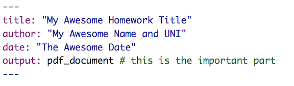
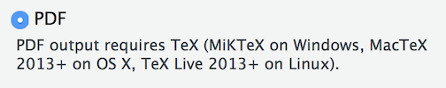
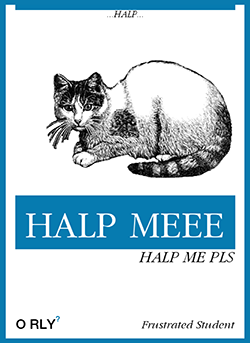

# Les bases de R {#basics} 


```{r, echo = FALSE}
package_num <- dim(available.packages(repos = "http://cloud.r-project.org/"))[1]
numpack <- floor(package_num / 100) * 100
```

Donc... Il y a tellement de choses qui peuplent le monde de R. Des livres, des astuces, des exercices, et plus d'autres buzzwords plein de ressources que vous pouvez parcourir. Il y a plus de `r format(numpack, scientific=FALSE)` packages sur [CRAN](https://cran.r-project.org){target="_blank"}, le réseau au travers duquel le code R et ses packages sont distribués. Cela peut sembler écrasant mais pour autant, gardez à l'esprit que R est utilisé pour beaucoup de chose, et toutes ne sont pas nécessaires dans le cadre de EDAV. 

Dans un effort de garder tout le monde au même niveau, voici une liste d'éléments essentiels de sorte que vous serez paré pour ce cours. Les meilleures ressources sont disséminées en différents endroits, en ligne, donc parcourez les liens des divers sites web en fonction des sujets.

## Top 10

(*r4ds* = [R for Data Science](https://r4ds.had.co.nz/) par Garrett Grolemund et Hadley Wickham, disponible gratuitement en ligne)


```{r, echo=FALSE, warning=FALSE, message=FALSE}
library(dplyr)
r_latest_version <- xml2::read_html("https://cran.r-project.org/bin/macosx/") %>% 
    rvest::html_node("body") %>% 
    rvest::html_node("h2") %>% 
    rvest::html_text()

rstudio_latest_version <- 
    xml2::read_html("https://www.rstudio.com/products/rstudio/download/") %>% 
    rvest::html_node("h3") %>% 
    rvest::html_text() %>% 
    stringr::str_extract_all("[0-9].") %>% 
    unlist() %>% 
    paste(collapse = "")
```


1. [Installez R](https://r4ds.had.co.nz/introduction.html#r2){target="_blank"} (*r4ds*) -- Vous devez installer ceci, mais vous n'aurez pas à ouvrir l'application puisque vous travaillerez avec RStudio. Si vous avez déjà installé R, vérifiez que vous êtes à jour! La dernière version (à ce jour  `r Sys.Date()`) est `r r_latest_version`.

2. [Installez RStudio](https://r4ds.had.co.nz/introduction.html#rstudio3){target="_blank"} (*r4ds*) -- Téléchargez la version gratuite, Desktop pour votre système d'exploitation. Travailler avec cet environnement rendra R beaucoup plus agréable. Comme avec R, restez à jour. RStudio ajoute en permanence de nouvelles fonctionnalités. La dernière version (à ce jour `r Sys.Date()`) est `r rstudio_latest_version`. 

3. [Devenez à l'aise avec RStudio](https://b-rodrigues.github.io/modern_R/getting-to-know-rstudio.html){target="_blank"} -- Dans ce chapitre du livre de Bruno Rodriquez *Modern R with the Tidyverse*, vous apprendrez comment utiliser des panneaux, les options, comment demander de l'aide, les raccourcis clavier, les projets, les ajouts, et les packages. Essayez:

    - De faire des maths dans la console
    - De créer un fichier R Markdown (`.Rmd`) et affichez le en `.html`
    - Installez des packages comme `tidyverse` ou `MASS`  
    
    
    Une autre bonne ressource pour apprendre à maîtriser l'environnement (IDE): Regardez [Ecrire du code avec RStudio](https://www.rstudio.com/resources/webinars/rstudio-essentials-webinar-series-part-1/){target="_blank"} (*RStudio webinar*)

4. Apprenez ["R Nuts and Bolts"](https://bookdown.org/rdpeng/rprogdatascience/r-nuts-and-bolts.html){target="_blank"} -- Le chapitre du livre de Roger Peng *R Programming* vous donnera des bases solides avec les concepts fondamentaux de R. Ca vaut le coup de prendre le temps de maîtriser les objets R et comprendre comment ils fonctionnent maintenant, ça vous évitera des erreurs plus tard. Concentrez-vous sur les  **vecteurs** et particulièrement les **data frames**; les matrices et listes n'apparaîssent pas souvent en data visualization.  Familiarisez-vous avec les classes R: **integer, numeric, character,** et **logical**. Comprenez comment les **factors** fonctionnent; ils seront important pour vos futurs graphiques.

5. [Apprenez le RMarkdown](https://rmarkdown.rstudio.com/articles_intro.html){target="_blank"} -- Pour ce cours, vous rendrez des devoirs sous format R Markdown (enregistrés en tant que fichiers `.Rmd`) et vous les afficherez sous format pdf pour la soumission. Vous pouvez essayer dès maintenant d'ouvrir un nouveau fichier R Markdown (*File > New File > R Markdown...*), et laissez le `Default Output Format` en `HTML`. Vous aurez un template R Markdown avec lequel vous pourrez faire joujou. Cliquez sur le bouton "knit" et voyez ce qui se passe. Pour plus de détails, regardez le webinar RStudio [Getting Started with R Markdown](https://resources.rstudio.com/the-essentials-of-data-science/getting-started-with-r-markdown-60-02) 

6. [Nettoyez](https://r4ds.had.co.nz/introduction.html#the-tidyverse){target=_blank} (*r4ds*) -- Installez le tidyverse, et familiarisez-vous avec. *Nous expliquerons les différences entre R de base et le tidyverse en cours.* 

7. [Apprenez les bases de ggplot2](https://r4ds.had.co.nz/data-visualisation.html){target="_blank"} (*r4ds*) -- En classe nous étudierons la grammaire des graphiques sur laquelle est fondée **ggplot2**, mais cela vous aidera à vous familiariser avec la syntaxe en avance. Préparez-vous avec la fiche "Data Visualization with ggplot2" en cliquant sur "Help" puis "Cheatsheets..." dans RStudio.

8. [Utilisez les projets RStudio](https://r4ds.had.co.nz/workflow-projects.html){target="_blank"} (*r4ds*) -- Si vous ne l'avez pas déjà fait, sirotez un verre de grenadine. Faites un projet pour chaque problème différent. Vous n'aurez jamais à vous soucier avec `getwd()` ou `setwd()` puisque tout sera déjà au bon endroit.

    Ou regardez le webinar: ["Projects in RStudio"](https://resources.rstudio.com/wistia-rstudio-essentials-2/rstudioessentialsmanagingpart1-2){target="_blank"}

9. [Apprenez les verbes élémentaires de dplyr](https://r4ds.had.co.nz/transform.html){target="_blank"} pour la manipulation de données (*r4ds*) -- Concentrez-vous sur les verbes principaux: **`filter()`** (lignes), **`select()`** (colonnes), **`mutate()`**, **`arrange()`** (lignes), **`group_by()`**, et **`summarize()`**. Apprenez à utiliser l'opérateur pipe **`%>%`**.

10. Sachez comment [nettoyer vos données](https://github.com/jtr13/codehelp/blob/master/R/gather.md){target="_blank"} -- La fonction **`gather()`** du package **tidyr** vous aidera à formatter vos données pour les graphiques. Nous en reparlerons en cours. Regardez ces [annimations super cool](https://github.com/gadenbuie/tidyexplain){target="_blank"}, qui suivent la transformation d'un data frame par les fonctions de `tidyr`.

**Conseils généraux**: ne vous souciez pas des détails. Gardez une liste de questions et avancez.

## Dépannage

### Mon document ne se visualise pas correctement quand j'utilise "knit"

Cliquez sur "Session" "Restart R" puis exécutez les blocs un par un jusqu'à ce que vous trouviez l'erreur.

### Les fonctions ne marchent plus

Le comportement étrange de fonctions qui fonctionnaient bien avant sont souvent causés par des conflits de fonctions. Ceci peut se passer quand vous avez deux packages chargés avec les mêmes noms de fonctions. Pour indiquer le bon package, utilisez *namespace*. Les conflits ont souvent lieu avec `select`, `filter` et `map`. Si vous voulez utiliser les fonctions tidyverse, utilisez:

`dplyr::select`, `dplyr::filter` and `purrr::map`. 

Vous avez d'autres conflits ou problèmes? Publiez une [issue](https://github.com/jtr13/edav/issues){target="_blank"}.

## Astuces et tours de passe-passe

### Knitr

Montez en puissance avec vos options de bloc: vérifiez la [liste officielle des options](https://yihui.name/knitr/options/){target="_blank"} -- and annotez-là!

Quelques classiques:

`warning=FALSE`  

`message=FALSE` -- utile quand vous chargez des packages  

`cache=TRUE` -- évaluera uniquement les blocs modifiés, mais faîtes attention, les changements de dependencies ne seront plus détectées.

`fig.`... options, [voir ci-dessous](#sizing-figures-and-more)

### Raccourcis clavier RStudio

- **option-command-i**  ("Insérez un bloc R")

```{r, echo = FALSE, comment=""}
cat("```{r}\n```")
```

- **shift-command-M**  `%>%`   ("pipe") 

### Taille des figures (et bien plus encore)

Utilisez toujours les paramètres de blocs pour les tailles de graphiques. Vous pouvez définir une taille par défaut dans le YAML au début du fichier .Rmd comme ci-dessous:

```
output: 
  pdf_document: 
    fig_height: 3
    fig_width: 5
```

Une autre méthode consiste à cliquer sur l'engrenage `r emo::ji("gear")` à côté du bouton Knit, puis  **Output Options...**, et finalement l'onglet **Figures**.

Puis outrepassez les paramètres par défaut de blocs particuliers:

`{r, fig.width=4, fig.height=2}`


Les options de blocs liées aux figures (graphiques) sont `fig.width`, `fig.height`, `fig.asp`, et `fig.align`; il y en a [beaucoup d'autres](https://yihui.name/knitr/options/#plots){target="_blank"}.

### Visualiser des graphiques dans des fenêtres pour graphique

Vous souhaitez que vos graphiques apparaîssent dans la fenêtre d'affichage plutôt que sous chaque bloc du fichier `.Rmd` ? Cliquez sur `r emo::ji("gear")` puis  <i class="fas fa-check"></i> **Chunk Output in Console**. 


```{r, echo = FALSE, eval = FALSE}
Add this back later:
    * **Don't know about Knitr?** Here's [the specific section on Knitr](https://campus.datacamp.com/courses/reporting-with-r-markdown/chapter-two-embedding-code?ex=1){target="_blank"} from the DataCamp course cited above. With this package, you can embed code directly into your R Markdown files and generate output documents. Make sure to go through the later exercises to learn about [code chunks](https://rmarkdown.rstudio.com/lesson-3.html){target="_blank"} and [chunk options](http://yihui.name/knitr/options/){target="_blank"} so you can fine-tune your final output document with ease.

* **Wondering what chunk options are?** Have you ever wanted to align graphs in your output PDF differently? Or re-size a plot in your output document? Or suppress an annoying message a package raises? Chunk options address this. We have made [an R Markdown file showing off different chunk options](https://github.com/jtr13/EDAV/blob/master/data/chunk_option_showcase.Rmd){target="_blank"} that you can download from our github repo and play around with. Also make sure to checkout [the documentation on chunk and package options](http://yihui.name/knitr/options/){target="_blank"} for a full list of what's possible.

```


## Rendu de devoirs

Voici un petit topo sur comment soumettre vos devoirs en utilisant [R Markdown et Knitr](#r-markdown-knitr).

- **Creez un fichier R Markdown avec en sortie un format PDF**: Nous vous donnerons souvent un template, libre à vous de le modifier directement, mais **assurez-vous que le format de sortie est bien `pdf_document`**. Ecrivez toutes vos explications puis ajoutez des blocs de code pour répondre aux questions. Si vous voulez faire un nouveau fichier, allez dans *File > New File > R Markdown...* et définissez le `Default Output Format` comme `PDF`. Quoi qu'il en soit, l'en-tête d'un fichier `.Rmd` doit ressembler à ceci:



- **Ajoutez des dépendances PDF**: Comme indiqué quand vous commencez un nouveau fichier R Markdown, le PDF de sortie nécessite TeX:



- Assurez-vous d'avoir téléchargé Tex pour votre machine. Voici quelques articles Medium sur comment créer des rapports en PDF:
    + [**Mac OS**](https://medium.com/@sorenlind/create-pdf-reports-using-r-r-markdown-latex-and-knitr-on-macos-high-sierra-e7b5705c9fd){target="_blank"}
    + [**Windows**](https://medium.com/@sorenlind/create-pdf-reports-using-r-r-markdown-latex-and-knitr-on-windows-10-952b0c48bfa9){target="_blank"}

C'est un peu compliqué, mais cela fera en sorte que le bouton Knit en haut de l'IDE génerera un PDF comme par magie.

Si vous êtes débordé et souhaitez un raccourci, vous pouvez définir le `Default Output Format` comme `HTML`. Quand vous ouvrez le fichier dans votre navigateur, vous pouvez l'enregistrer en PDF. Il ne sera pas aussi bien formaté, mais ça devrait marcher.

## Demander de l'aide


*via [https://dev.to/rly](https://dev.to/rly){target="_blank"}*

Déjà ...caaaaaalme. On peut réparer ça. Il y a un tas de ressources à votre disposition.


### Choses à essayer

* Souvenez-vous: Aidez-vous vous-même! [Cet article](https://www.r-project.org/help.html){target="_blank"} a une bonne liste d'outils pour vous aider à en apprendre plus sur quelquechose que vous ne comprenez pas. Ceci inclut l'apprentissage des fonctions et packages, tout comme la recherche d'informations sur une fonction/package/problème/etc. C'est l'endroit idéal pour apprendre à trouver l'info que vous cherchez.


* Le menu Help de RStudio (dans la barre d'outils du haut) est un outil fantastique pour  comprendre/réparer n'importe quel problème. Il y a des liens vers la documentation et des manuels ainsi que des fiches et une belle collection de raccourcis clavier.


* Les vignettes sont un super moyen d'en apprendre plus sur les packages et leur fonctionnement. Le vignettes sont comme des des manuels stylisés qui illustrent mieux le contenu d'un package. Par exemple, `ggplot2` a une vignette sur les aesthetics appellée `ggplot2-specs` qui parle des différentes façons d'afficher les données sous différents formats.
    + Taper `browseVignettes()` dans la console vous montrera toutes les vignettes pour tous les packages que vous avez installés.
    + Vous pouvez aussi voir des vignettes par package en tapant `vignette(package = "<package_name>")` dans la console.
    + Pour exécuter une vignette spécifique, utilisez `vignette("<vignette_name>")`. Si cela ne fonctionne pas, incluez le nom de package aussi : `vignette("<vignette_name", package = "<package_name>")`
    
* N'ignorez pas les erreurs. Elles vous en disent beaucoup! Si vous abandonnez dès que du texte rouge apparaît dans votre console, prenez le temps de voir ce que le texte rouge *dit* . Apprenez [Comment lire des erreurs](http://www.dummies.com/programming/r/how-to-read-errors-and-warnings-in-r/){target="_blank"} et [ce qu'elles vous disent](https://campus.datacamp.com/courses/working-with-the-rstudio-ide-part-1/programming?ex=18){target="_blank"}. En général elles incluent le lieu d'apparition et la source du problème.

*Plus avancé*: Apprenez à aimer le mode deboggage. Il y a une grande courbe d'apprentissage, mais ça vaut le coup. Regardez ces vidéos sur [debogger avec R](https://campus.datacamp.com/courses/working-with-the-rstudio-ide-part-1/programming?ex=20){target="_blank"}. Les thèmes incluent l'exécution du deboggueur, la mise en place de breakpoints, la customization des preferences, et plus encore. **Note**: Les fichiers R Markdown sont limités en terme de deboggage, comme expliqué dans [cet article](https://support.rstudio.com/hc/en-us/articles/205612627-Debugging-with-RStudio#debugging-in-r-markdown-documents){target="_blank"}. Vous pouvez aussi considérer de travailler dans un fichier `.R` avant de l'inclure dans votre devoir en R Markdown .

### A l'aide!

Du calme. Il y a un tas de personnes qui utilisent les mêmes outils que vous.

* Vos camarades sont un bon point de départ! Postez vos questions sur [Piazza](https://piazza.com/){target="_blank"} pour voir comment ils pourraient vous aider.

* Il y a beaucoup de bonnes documentations sur R et ses fonctions/packages/etc. Devenez pro avec la [Documentation R](https://www.rdocumentation.org/){target="_blank"}.

* Il y a une communauté vivante! [RStudio Community page](https://community.rstudio.com/){target="_blank"}. Aussi, R aime twitter. Regardez [#rstats](https://twitter.com/search?q=%23rstats){target="_blank"} ou encore [Prevenez Hadley Wickham quand vous recevez un message d'erreur bizarre](https://twitter.com/hadleywickham/status/952259891342794752){target="_blank"}.


