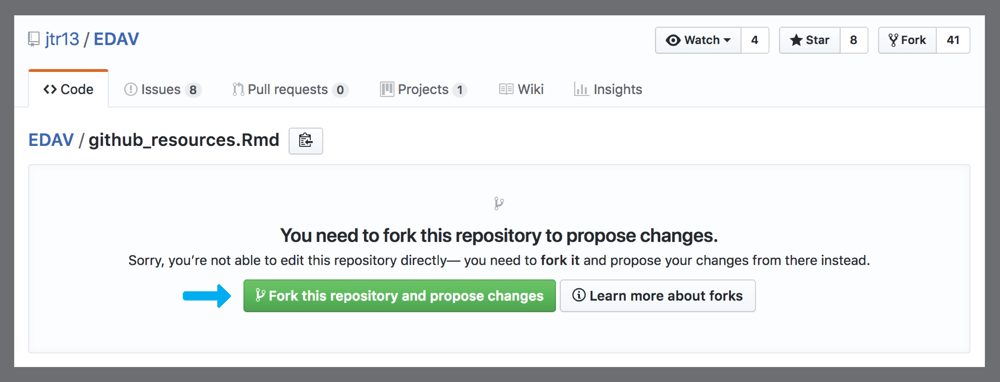
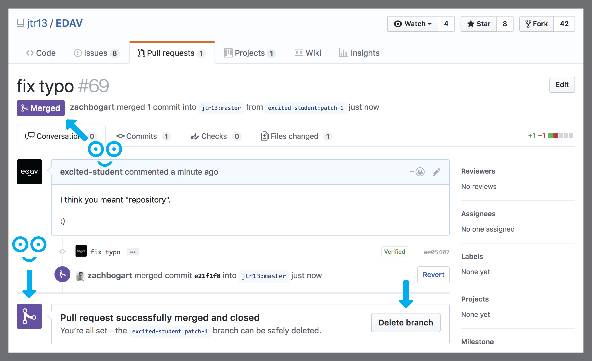
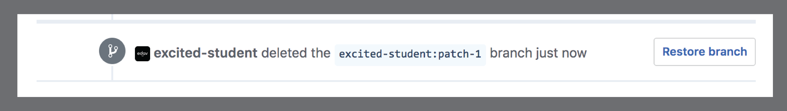

# Contribuez à cette ressour e {#contribute}

## Pourquoi contribuer?

Nous ne voulons pas qu'*edav.info/* devienne juste une autre ressource. Nous voulons qu'edav.info devienne *votre* ressource. Si vous bloquez sur quelquechose, il y a de grandes chances que vous ne soyez pas seul.  Tout le monde commence ce cours avec un parcours et des compétences différentes. L'objectif de cette ressource est de collecter toutes ces connaissances et de les regrouper au même endroit, et vous pouvez nous aider à réaliser cette mission.

## Que contribuer?

L'intérêt premier de edav.info est d'étudier l'aspect "programmation" de la data visualization avec R. Edav.info n'a pas vocation à être un substitut pour le cours, ou d'étudier la théorie de l'analyse de données et la visualisation. Nous voulons tout simplement permettre aux étudiants de trouver ce qu'ils cherchent quand ils veulent créer un certain type de graphique vite. Nous sommes ouvert à différents types de contributions, mais nous avons quelques règles:

* Nous acceptons volontiers des *travaux originaux* qui aideront les élèves. Par exemple, si vous avez compris comment utiliser une fonction mal documentée, ou que vous avez maîtrisé un certain type de graphique difficile à comprendre, partagez ces informations! Néanmoins, si un bon manuel existe quelque part, ça ne sert à rien de répéter le travail. Donnez-nous juste un lien vers la ressource avec une petite description.

* Et bien entendu, n'oubliez jamais de citer vos sources en donnant des liens.

## Comment contribuer

Il y a beaucoup de manières de contribuer:

- <i class="fas fa-exclamation-circle"></i> Pour **des grandes ou petites idées, sans écrire de code** <i class="fas fa-arrow-right"></i> [**Soumettez une "issue"**](#submit-an-issue) (très simple, bien apprécié)

- <i class="fas fa-edit"></i> Pour **des changements simples** <i class="fas fa-arrow-right"></i> [**contribuez sur GitHub**](#github-only-walkthrough) (ceci peut être fait sur **GitHub.com**... nous avons un tutoriel qui explique comment faire)

- <i class="fas fa-code-branch"></i> Pour **des changements plus complexes** <i class="fas fa-arrow-right"></i> installez Git et travaillez localement. Des instructions détaillées sont sur notre [Git/GitHub chapitre Ressources](github.html) (le niveau au-dessus, aussi bien apprécié) -- les utilisateurs les plus aventureux pourront résoudre [**une "issue" non-resolue**](https://github.com/jtr13/EDAV/issues) (plus avancé/ouvert)

## Soumettez une "issue"

Si le changement que vous voulez faire est compliqué, prévenez-nous en **soumettant une "issue"** . Vous avez peut-être une super idée pour un nouveau chapitre, quelquechose que nous n'avons pas couvert, mais que vous aimeriez voir présent ici dans cette ressource (une nouvelle page sur un graphique; un tutoriel pour utiliser un outil/package particulier). Il peut être un peu trop compliqué de [contribuer directement](#contribute-directly). La solution? Soumettez une "issue" bien entendu! 

[Les "issues"](https://guides.github.com/features/issues/){target="_blank"} sont des tâches que vous pouvez poster sur un dépôt GitHub et que d'autres personnes peuvent tenter de résoudre? Elles peuvent être petites ("ce lien est cassé"/"ajoutez cette ressource") ou complexes ("J'aimerais proposer un chapitre sur ..." / "Il faut reformater ce bloc de code de cette façon"). Une fois postée l'issue peut être traitée par n'importe qui.

Vous n'avez *pas* à savoir coder pour soumettre votre issue; corriger un bug tout comme proposer une nouvelle ressource que nous devrions mentionnes, nous apprécions tout retour que vous puissiez avoir.

**Comment soumetre des "issues"**:

1. Allez sur [notre dépôt GitHub](https://github.com/jtr13/EDAV){target="_blank"} et cliquez sur [l'onglet Issues](https://github.com/jtr13/EDAV/issues){target="_blank"}
2. Cliquez sur "[New Issue](https://github.com/jtr13/EDAV/issues/new){target="_blank"}"
3. Proposez votre Issue et cliquez "Submit new issue"
4. Ca y est! Nous apprécions votre aide, et prendrons en compte votre issue en améliorant *edav.info/* <i class="far fa-smile"></i>

**Notes sur la soumission d'Issues**:

- Vérifiez que vos changement ne sont pas déjà dans une issue existante (évitons les redondances)
- Veuillez explique le changement que vous proposez au moment de poster une issue
- Pensez à [utiliser des étiquettes (labels)](https://help.github.com/articles/applying-labels-to-issues-and-pull-requests/){target="_blank"} pour spécifier le type d'issue, telle qu'un "beug", "une amélioration", "un appel à l'aide", "une question", ou [créez votre propre étiquette (label)](https://help.github.com/articles/creating-a-label/){target="_blank"}.
- Pour plus d'infos, veuillez lire [le Guide Open Source](https://opensource.guide/how-to-contribute/){target="_blank"} sur comment contribuer.

## Tutoriel GitHub 

*Vous devrez créer un compte github si vous n'en avez pas encore, mais vous n'aurez pas à installer Git localement.*

**Note**: Voici un tutoriel complet qui aide un étudiant hypothétique qui vient de voir une faute et utilise une requête pull pour la corriger. Même si ces instructions sont pour le cas où vous souhaitez proposer un changement sur *edav.info*, elles valent pour tout changement sur n'importe quel dépôt. Naviguez sur le fichier que vous aimeriez changer, et cliquez sur le bouton stylo:

**Ne cliquez pas sur le bouton fork sur la page d'accueil du dépôt.** Suivez l'étape 4 ci-dessous.

Une manière de contribuer à *edav.info* est de contribuer directement en modifiant un chapitre. En haut de chaque page de cette ressource, vous trouverez une icône qui ressemble à ceci: <i class="fas fa-edit"></i>. Cliquer dessus ouvrira un nouvel onglet ou vous pourrez editer le markdown pour cette page sur notre [dépôt GitHub](https://github.com/jtr13/EDAV){target="_blank"} et soumettre votre changement avec une requête pull. En gros, vous copiez une version de notre repo, vous faites vos changements, et vous nous suggérez de les inclure. Si nous approuvons vos changements, ils apparaîtront sur edav.info .

La meilleure approche pour les petits changements (faute d'orthographe, phrase peu claire) est de suivre la méthode détaillée ci-dessus. En général, changer directement le code sur GitHub ne marche pas très bien.

Ok, on est bons. Préparez vous à cliquer sur beaucoup de grous bouttons verts! Unde dernière chose: n'oubliez pas que vous ne pouvez pas modifier le dépoôt de quelqu'un sans soumettre une requête pull *et* que le propriétaire la merge. N'ayez pas peur de faire comme si vous étiez le propriétaire et modifiez les fichiers comme vous le souhaitez. Vous éditez juste une copie des fichiers; c'est permis!

### Etape 1: Trouver quelquechose à changer {-}

Je suis assez sûr qu'ils voulaient écrire "repository" ici. Oups. On va corriger ça pour eux!

*C'est pas comme ça qu'on écrit "repository"! Corrigeons cela.*

### Etape 2: Cliquez sur le bouton edit {-}

Pour faire ce changement, on **clique sur l'icône edit**, <i class="fas fa-edit"></i>, en haut de la page. Ceci vous amènera sur leur dépôt GitHub, où on trouve tout le code pour cette ressource.   **Note**: Vous devez avoir un compte GitHub valide pour contribuer. Dans ce cas, on utilise un faux compte appellé **excited-student** donc si vous voulez voir une capture d'écran, sachez que le compte serait remplacé par votre propre nom d'utilisateur.

*Cliquez ce bouton pour aller sur GitHub.*

### Etape 3: Forkez le dépôt {-}

C'est notre première modification sur le dépôt, donc GitHub nous montre une page comme celle ci-dessous. Aucun soucis! On clique juste sur  **le gros bouton vert** étiquetté **<i class="fas fa-code-branch"></i> Fork this repository and propose changes** et on sera bons (les gros boutons verts sont nos amis). **Note**: vous n'aurez pas à forker à chaque fois. Si vous proposez un autre changement à l'avenir, cliquez sur l'icône edit, <i class="fas fa-edit"></i>, vous amènera directement à cette étape du tutoriel.

*Vous n'avez pas encore forké le dépôt? Pas de soucis; le gros bouton vert va tout résoudre.*

Maintenant que nous avons forké le dépôt, nous pouvons **voir le code** pour la page que nous voulons éditer.  **Note**: La petite bulle bleue en haut écrit ce qui se passe/va se passer: nous avons fait une copie du dépôt car nous n'avons pas de droit d'accès. Une fois qu'on aura fait nchangement sur cette page, nous informerons le propriétaire du dépôt quant à nos modifications en utilisant une requête Pull. GitHub peut être super troublant, mais au moins il essaie vraiment de vous informer de ce qui se passe au fur et à mesure.

*Prêt à modifier le code. Lisez la petite bulle bleue.*

### Step 4: Corrigez l'erreur {-}

Corrigeons cette erreur embarrassante! Nous **mettons à jour le code** directement dans l'éditeur, **incluez une explication** de ce qu'on a changé/pourquoi on a fait ce changement, puis **cliquez sur le gros bouton vert** étiquetté **Propose file change**. J'adore ces boutons!

*Faîtes vos changements, incluez une petite explication, et cliquez sur le gros bouton vert.*

### Etape 5: Comparer des changements {-}

GitHub nous aide à nouveau en nous laissant observer les changements que l'on a fait. Sur cette page on peut **voir les changements proposés** en allant en bas de page et regardant les [diffs](https://git-scm.com/docs/git-diff){target="_blank"}. Notre correction est très simple donc il n'y a pas grand chose à voir. Encore une fois, on va **cliquer sur le gros bouton vert**, cette fois appellé **Create pull request**. Ceci commencera le processus qui prévient les gens d' *edav.info/* qu'on aimerait qu'ils incluent nos changements (en parler-git, on émet une  *requête* que les gens d' *edav.info/* fasse un `git merge` pour mettre à jour leur fichiers avec nos changements proposés.) Notez que les changements proposés sont dans une branche appellée **patch-1** sur notre dépôt; nous leur demandons de merger dans la branche **master** de leur dépôt.

*L'occasion de voir vos changements. Une fois satisfait, cliquez sur le gros bouton vert pour soumettre une requête Pull.*

### Etape 6: Ouvrez une requête pull  {-}

Nous sommes ici en haut de la page de la requête pull. Remarquez la coche verte étiquettée "*Able to merge*" (un bon signe que tout marche bien). Maintenant nous **expliquons notre requête pull** avec quelques commentaires, et une fois de plus,  **cliquez sur le gros bouton vert** étiquetté **Create pull request**.  **Note**: Vous vous demandez peut-être, "Pourquoi est-ce que je dois encore expliquer ce que j'ai changé?". C'est parce que l'explication écrite à l'étape 5 (où on a modifié le fichier) est un *commit*. Nous pouvons avoir *plusieurs* commits à la fois une fois que nous avons tout groupé en *une* requête pull. Cette étape est un moyen d'expliquer la requête pull dans sa totalité. C'est ici redondant puisque nos changements sont si petits et qu'il y a un seul commit. Toujours perdu? Ce [guide GitHub pour Comrendre GitHub](https://guides.github.com/introduction/flow/){target="_blank"} est vraiment utile. Notre page de [Ressources GitHub](github.html) contient auddi beaucoup de liens utiles.

*Expliquez votre requête pull et cliquez sur le gros bouton vert.*

### Et maintenant? {-}

**Félicitations** ! Nous avons **ouvert une requête pull sur un dépôt GitHub!** Maintenant, un des propriétaires du dépôt (comme une des personnes qui écrit ce tutoriel, par exemple <i class="far fa-smile-beam"></i>) doit décider de si il/elle veut incorporer votre requête pull ou pas. Dans ce cas ils l'approuveront certainement, mais peut-être qu'ils choisissent de ne pas rajouter vos changements. Pour plus d'informations, lisez la section du Guide Open Source sur [ce qui se passe quand vous soumettez une contribution](https://opensource.guide/how-to-contribute/#what-happens-after-you-submit-a-contribution){target="_blank"}.  **Note**: Ayez en tête que l'icône ci-dessous peut être jaune pour indiquer que des changements sont en cours pour vérifier d'éventuels conflits avec votre proposition initiale. Il devrait devenir vert si tout se passe bien.

*On l'a fait! Maintenant les propriétaires vont voir nos changements et nous répondre...*

Et maintenant, on attend...

<iframe src="https://giphy.com/embed/l2Jej6O5fbzxQ9PO0" width="480" height="366" frameBorder="0" class="giphy-embed" allowFullScreen></iframe>
<a href="https://giphy.com/gifs/thesimpsons-the-simpsons-3x23-l2Jej6O5fbzxQ9PO0">via GIPHY</a>

 

Qu'est-ce donc!? Nous avons reçu **un email d'un des propriétaires du dépôt**, Zach Bogart. Il dit qu'ils ont mergé le changement! Huzzah! On **clique sur le numéro** pour rouvrir la requête pull qu'on avait ouverte.

*On a eu un email! Et il dit qu'ils ont mergé ! Cliquez ce chiffre pour voir la requête pull mise à jour.*

Nous sommes ici sur la page mise à jour de la requête pull. Remarquez que **tout est devenu violet**. Le violet est la meilleure couleur à voir sur GitHub; c'est la couleur de la victoire. Ca indique que notre pull a été mergé avec le dépôt, ce qui signifie que nos changements font partie du dépôt! Aussi, remarquez le bouton annoté **Delete branch**. Puisque tout le travail de notre branche est sur le dépôt, on peut l supprimer sans soucis.

*Tout est violet! Woot!*

*On peut supprimer notre branche sans danger*

Retournons maintenant sur la page principale du dépôt. On peut **voir que notre merge** est l'addition la plus récente. Et si on descend, on voit que le document que nous avons édité, `github_resources.Rmd`, a été mis à jour récemment et montre notre messaget de commit "fix typo". On l'a fait! Vérifions le site pour voir si nos changements on été publiés devant tout internet!

*Regarde! Notre requête pull a été mergé!*

*Et nos modifications sont sur github_resources.Rmd!*

Ca y est! On retourne sur la page modifiée maintenant et **notre correction a été inclue!** **Note**: Les changements mettront quelques minutes à apparaître après la notification de merge résussi. C'est parce que nous utilisons [Travis CI](https://travis-ci.org/){target="_blank"} en backend de notre dépôt et que ça met un peu de temps pour republier toutes les pages du site. Si vous voulez en apprendre plus, vous pouvez utiliser Travis CI pout auto auto-magiquement générer votre travail, regardez [notre section surl'utilisation de Travis avec un livre bookdown GitHub](publish.html#hooking-up-travis) dans la [page Publishing Resources](publish.html).

*Regardez ça! C'est publié! Tellement de points d'exclamation!!!*

Nous avons contribué à un dépôt Git! Chapeau! Ca se fête!

<iframe src="https://giphy.com/embed/nxscd2YGVf6xi" width="480" height="369" frameBorder="0" class="giphy-embed" allowFullScreen></iframe> 
<a href="https://giphy.com/gifs/reaction-food-simpsons-nxscd2YGVf6xi" target="_blank">via GIPHY</a>

 

### Soyons prévoyants: la prochaine modification {-}

Si vous avez un second changement à proposer, il suffit de suivre à nouveau ces instructions. Comme noté ci-dessus, la deuxième fois il ne faudra plus forker le dépôt. Si vous regardez bien la requête pull pour la deuxième modification, la branche mergée sera renommée **patch-2** au lieu de **patch-1**. Même si GitHub parle de "votre" fork, ce n'est pas vraiment quelquechose qui vous concerne. En fait, ne vous souciez pas avec ça. Restez loin de votre fork -- c'est à dire, votre copie du dépôt EDAV dans *votre* compte GitHub. Elle sera inevitablement en retard sur la version principale, et ça risque de causer des problèmes si vous réessayez de lancer une requête pull. Donc, chaque fois que vous avez un changement à proposer, allez directement sur `edav.info` ou `https://github.com/jtr13/EDAV` et commencez le processus d'édition là, *pas sur votre fork!*

## Ressources

- [Notre dépôt GitHub](https://github.com/jtr13/EDAV){target="_blank"}: Lien vers le dépôt GitHub d' *edav.info/*
- [Guide Open Source](https://opensource.guide/how-to-contribute/){target="_blank"}: Un guide génial sur comment contribuer aux projets comme celui-ci
