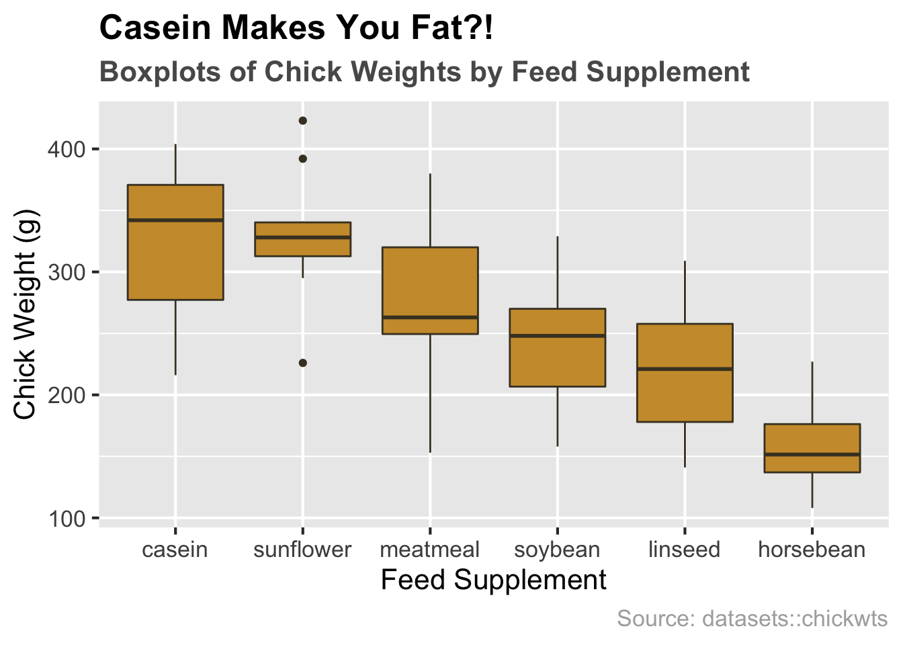
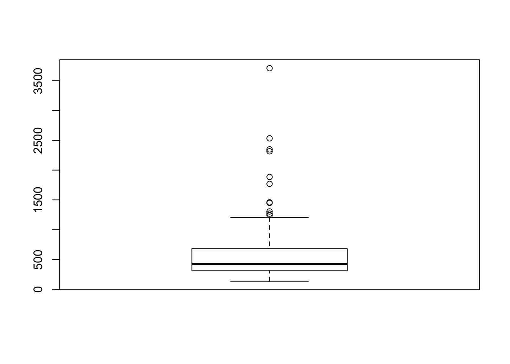
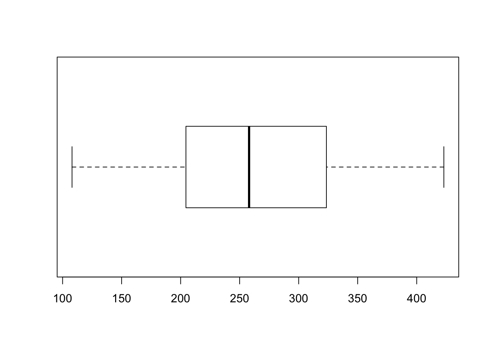
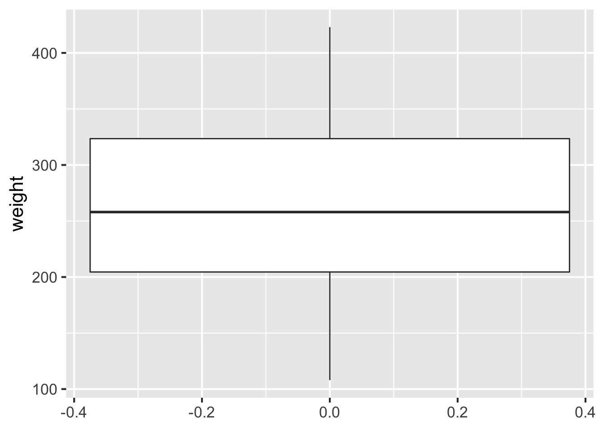
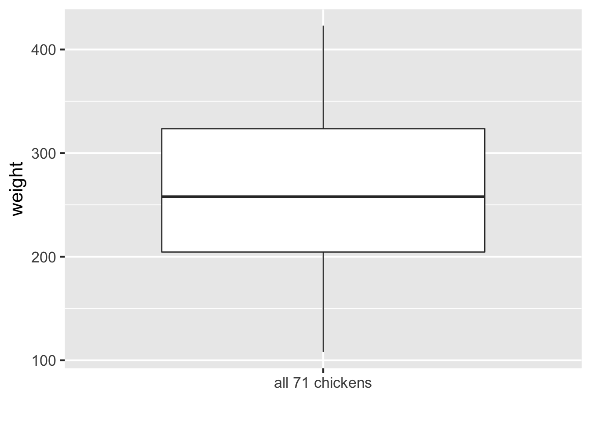
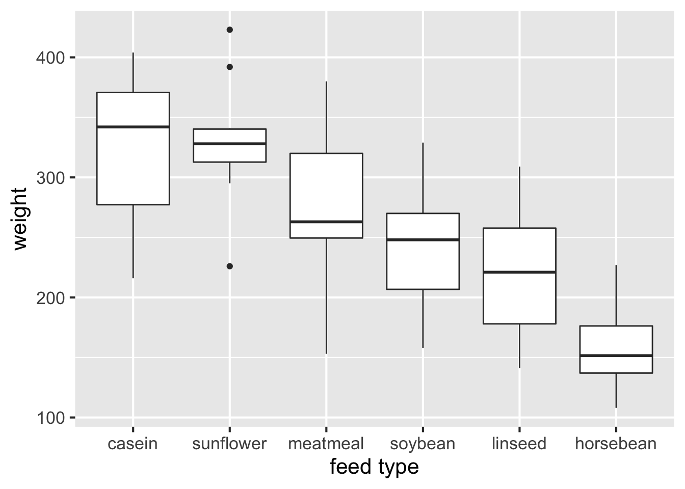
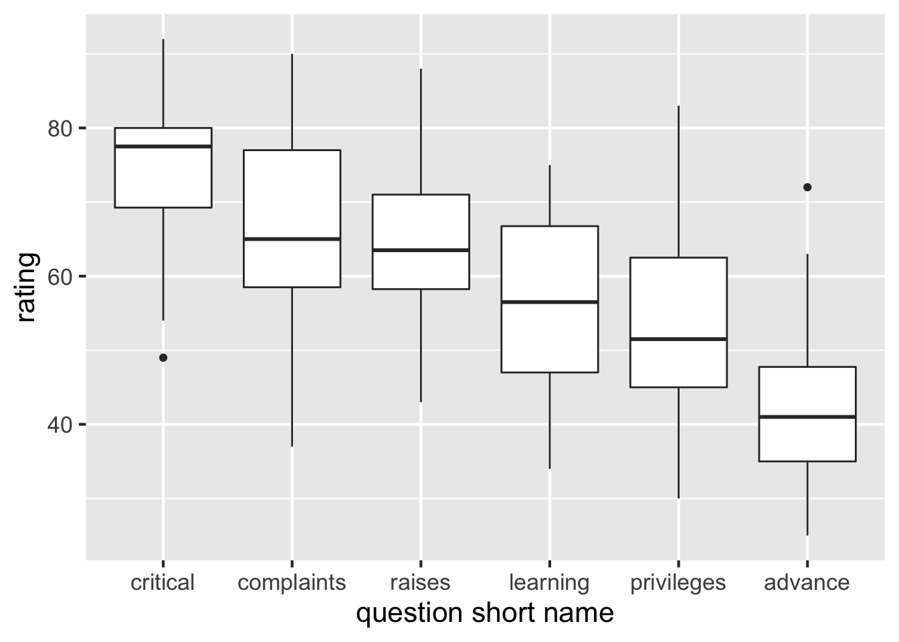
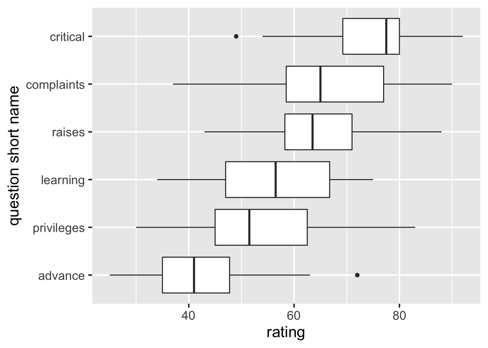
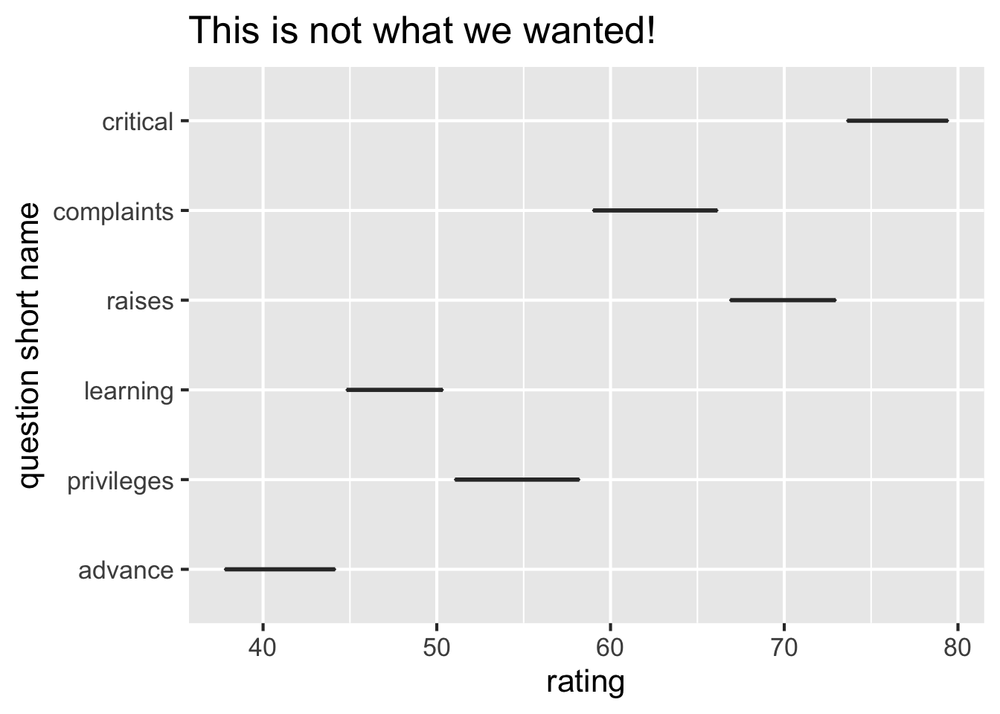
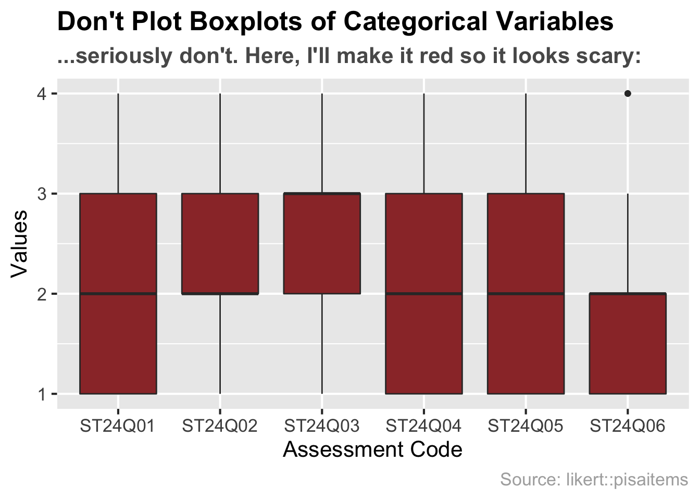

# Chart: Boxplot {#box}


## tl;dr

Je veux un exemple sympa et je le veux MAINTENANT !

Voici un aperçu d'une répartition des poids des poussins selon le supplément de nourriture qu'ils ont reçus :



Et en voici le code :

```r
library(ggplot2)

# boxplot by feed supplement 
ggplot(chickwts, aes(x = reorder(feed, -weight, median), y = weight)) + 
  # plotting
  geom_boxplot(fill = "#cc9a38", color = "#473e2c") + 
  # formatting
  ggtitle("Casein Makes You Fat?!",
          subtitle = "Boxplots of Chick Weights by Feed Supplement") +
  labs(x = "Feed Supplement", y = "Chick Weight (g)", caption = "Source: datasets::chickwts") +
  theme_grey(16) +
  theme(plot.title = element_text(face = "bold")) +
  theme(plot.subtitle = element_text(face = "bold", color = "grey35")) +
  theme(plot.caption = element_text(color = "grey68"))
```

Pour plus d'informations sur le jeu de données, tapez `?datasets::chickwts` au sein du terminal.

## Exemples simples

D'accord... *Réellement* plus simple s'il-vous-plaît.

### Boxplots unique

R vous donne de base un rapide "boxplot" (littéralement *boite à moustache* en français) d'un vecteur ou d'une colonne unique basée sur une trame de données, et cela avec très peu de code :


```r
# vector
boxplot(rivers) 
```



Ou bien sa version horizontale :


```r
# single column of a data frame
boxplot(chickwts$weight, horizontal = TRUE) 
```



Créer un boxplot unique avec **ggplot2** est quelque peu problématique. (La blague est que c'est la manière de l'auteur du package de vous dire que si vous avez un groupe, faites plutôt un histogramme !)

Si vous n'incluez qu'une correspondance esthétique, la variable `x` (en tant que groupe) sera supposée et vous aurez une erreur :


```r
ggplot(chickwts, aes(weight)) + geom_boxplot()
```

```
Error: stat_boxplot requires the following missing aesthetics: y
```

Cela peut être corrigé par `y = ` pour indiquer que `weight` est la variable numérique, mais vous aurez malgré tout un axe *x* dénué de sens :


```r
ggplot(chickwts, aes(y = weight)) + 
  geom_boxplot() +
  theme_grey(16) # make all font sizes larger (default is 11)
```



Une approche plus propre consiste à créer un nom pour le groupe unique, l'esthétique `x` et à supprimer le libellé de l'axe *x* :


```r
ggplot(chickwts, aes(x = "all 71 chickens", y = weight)) + 
  geom_boxplot() + xlab("") + theme_grey(16)
```



### Boxplots multiples utilisant ggplot2

Pour créer des boxplots multiples avec **ggplot2**, votre trame de données nécessite d'être ordonnée ; formulé autrement, vous avez besoin d'une colonne avec des niveaux de la variable de groupement. Cela peut être une classe de facteurs, de caractères ou de chiffres.


```r
str(chickwts)
```

```
## 'data.frame':	71 obs. of  2 variables:
##  $ weight: num  179 160 136 227 217 168 108 124 143 140 ...
##  $ feed  : Factor w/ 6 levels "casein","horsebean",..: 2 2 2 2 2 2 2 2 2 2 ...
```

Nous voyons que `chickwts` a la bonne apparence: Nous avons une colonne `feed` avec 6 niveaux de facteurs, de sorte que nous pouvons définir l'esthétique `x` à `feed`. Nous ordonnons également les boxplots en *diminuant le poids médian* :


```r
ggplot(chickwts, aes(x = reorder(feed, -weight, median), y = weight)) +
  geom_boxplot() +
  xlab("feed type") +
  theme_grey(16)
```



Les trames de données qui contiennent une colonne séparée de valeurs pour chaque boxplot désiré doivent être ordonnées d'abord. (Pour plus de détails sur l'utilisation de `tidy::gather()`, voir [ce tutoriel](https://github.com/jtr13/codehelp/blob/master/R/gather.md){target="_blank"}.)


```r
library(tidyverse)
head(attitude)
```

```
##   rating complaints privileges learning raises critical advance
## 1     43         51         30       39     61       92      45
## 2     63         64         51       54     63       73      47
## 3     71         70         68       69     76       86      48
## 4     61         63         45       47     54       84      35
## 5     81         78         56       66     71       83      47
## 6     43         55         49       44     54       49      34
```

```r
tidyattitude <- attitude %>% gather(key = "question", value = "rating")
head(tidyattitude)
```

```
##     question rating
## 1 complaints     51
## 2 complaints     64
## 3 complaints     70
## 4 complaints     63
## 5 complaints     78
## 6 complaints     55
```

Maintenant nous sommes prêts à tracer :


```r
ggplot(tidyattitude, aes(reorder(question, -rating, median), rating)) + 
  geom_boxplot() +
  xlab("question short name") +
  theme_grey(16)
```



## Théorie

Voici une citation de Hadley Wickham qui résume les boxplots plutôt bien :

>Un boxplot est un résumé de distribution compacte, affichant moins de détails qu'un histogramme ou que la densité d'un noyau, mais qui prend également moins d'espace. Les boxplots utilisent des statistiques récapitulatives robustes qui sont constamment localisées à des points de données actuels, qui sont rapidement calculables (à l'origine, à la main), et qui n'ont aucun paramètre d'optimisation. Ils sont particulièrement utiles pour comparer les distributions au travers de groupes. - Hadley Wickham
>

Un autre usage important du boxplot est l'affichage de valeurs abérrantes. Un boxplot révèle combien abérrante un point de données peut être avec des quartiles et des clôtures. Utilisez le boxplot lorsque vous avez des données avec des valeurs abérrantes de sorte qu'elles soient exposées. Ce qui lui manque en spécificité, il le contre-balance avec sa capacité à résumer clairement de larges jeux de données.

* Pour plus d'informations sur les boxplots et les variables continues, jetez un coup d'oeil au [Chapitre 3](http://www.gradaanwr.net/content/03-examining-continuous-variables/){target="_blank"} du livre. 

## Quand l'utiliser

Les boxplots devraient être utilisés pour afficher des *variables continues*. Ils sont particulièrement utiles pour identifier les valeurs abérrantes et comparer différents groupes. 

*Note* : Les boxplots peuvent même parfois vous aider [à convaincre quelqu'un que vous êtes leur valeur abérrante](https://xkcd.com/539/){target="_blank"} (Si vous aimez quand les gens détaillent leurs blagues, [voici pourquoi cette BD est drôle](https://www.explainxkcd.com/wiki/index.php/539:_Boyfriend){target="_blank"}.). 

## Considérations

### Orientation retournée

La plupart du temps, vous souhaiterez des boxplots horizontaux. C'est super facile avec **ggplot2** : faites juste un `+ coord_flip()` et supprimez le `-` du réordonnement de sorte que le niveau de facteur avec la plus haute médiane soit au-dessus :


```r
ggplot(tidyattitude, aes(reorder(question, rating, median), rating)) + 
  geom_boxplot() +
  coord_flip() +
  xlab("question short name") +
  theme_grey(16)
```



Notez que permuter `x` et `y` plutôt que d'utiliser `coord_flip()` ne marche pas !


```r
ggplot(tidyattitude, aes(rating, reorder(question, rating, median))) + 
  geom_boxplot() +
  ggtitle("This is not what we wanted!") +
  ylab("question short name") +
  theme_grey(16)
```



### PAS pour des données catégorielles

Les boxplots sont super, mais ils ne marchent pas avec les données catégorielles. Vérifiez que votre variable est continue avant d'utiliser les boxplots.

Les données dans l'exemple suivant sont des variables du jeu de données `pisaitems` au sein du package **likert** avec des taux de 1, 2, 3 ou 4:


```r
head(pisa, 4)
```

```
##   ST24Q01 ST24Q02 ST24Q03 ST24Q04 ST24Q05 ST24Q06
## 1       2       4       4       1       4       1
## 2       3       1       1       4       1       3
## 3       4       1       1       3       1       4
## 4       2       2       3       1       2       2
```

Créer un boxplot à partir de ces données est un bon exemple de ce qu'il ne faut *pas* faire :



## Ressources externes

- Tukey, John W. 1977. [*Exploratory Data Analysis.*](https://clio.columbia.edu/catalog/136422){target="_blank"} Addison-Wesley. (Chapter 2): the primary source in which boxplots are first presented. 
- [Article on boxplots with ggplot2](http://t-redactyl.io/blog/2016/04/creating-plots-in-r-using-ggplot2-part-10-boxplots.html){target="_blank"}: Une excellente collection d'exemples de code sur comment réaliser des boxplots avec `ggplot2`. Cela couvre notamment le layering, les legendes, le faceting, le formatage , et plus encore. Si vous voulez votre boxplot d'une certaine manière cette page vous aidera certainement.
- [Boxplots with plotly package](https://plot.ly/ggplot2/box-plots/){target="_blank"}: Un exemple de boxplot en utilisant le package `plotly`. En passant cela apporte par son interactivité un meilleur moyen de mettre en evidence les propriétés statistiques de votre graphique.
- [ggplot2 Boxplot: Quick Start Guide](http://www.sthda.com/english/wiki/ggplot2-box-plot-quick-start-guide-r-software-and-data-visualization){target="_blank"}: Article de [STHDA](http://www.sthda.com/english/){target="_blank"} sur comment réaliser des boxplots avec ggplot2. Excellent point de départ avec résultat immédiat dans la personalisation et le formatage.
- [ggplot2 cheatsheet](https://www.rstudio.com/wp-content/uploads/2015/03/ggplot2-cheatsheet.pdf){target="_blank"}: Toujours bon d'y jeter un oeil.
- [Hadley Wickhan and Lisa Stryjewski on boxplots](http://vita.had.co.nz/papers/boxplots.pdf){target="_blank"}: Bon pour comprendre les boxplots basiques comme plsu complexes ainsi que leur histoire.
