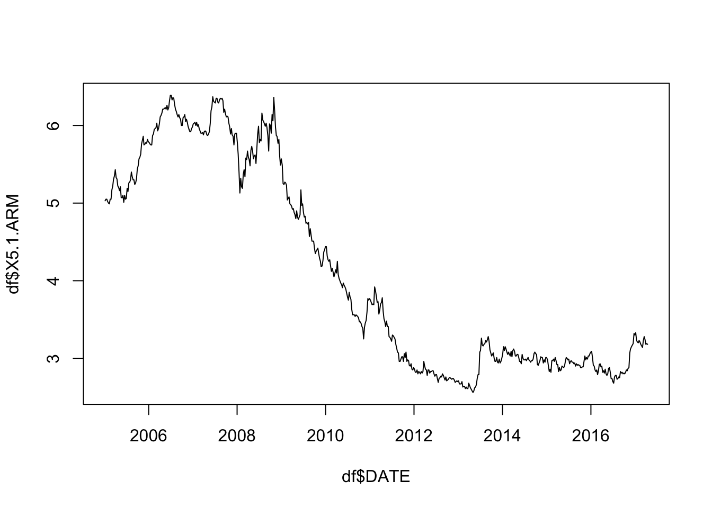
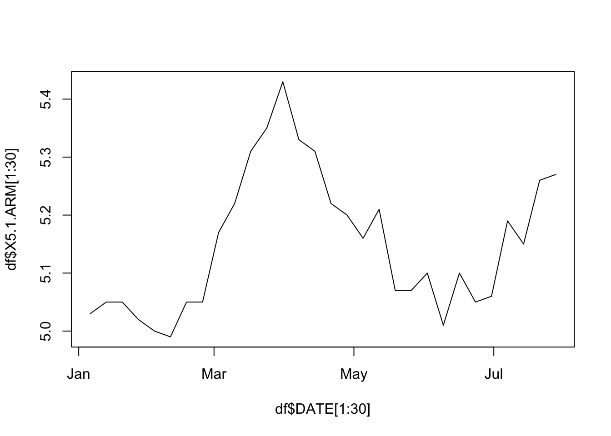
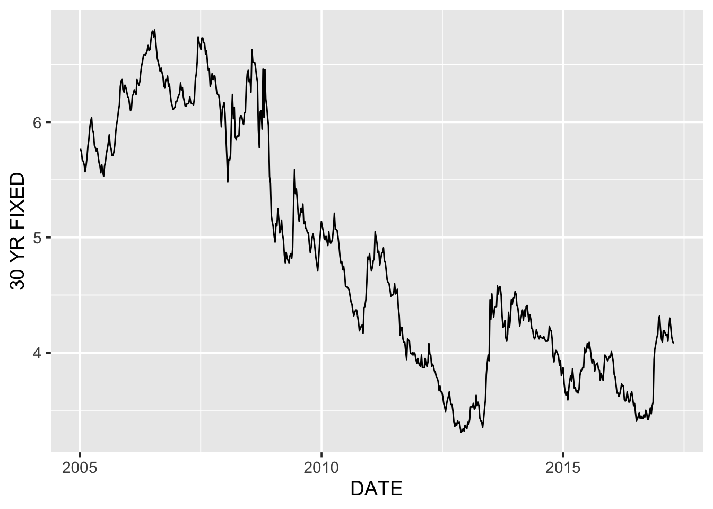
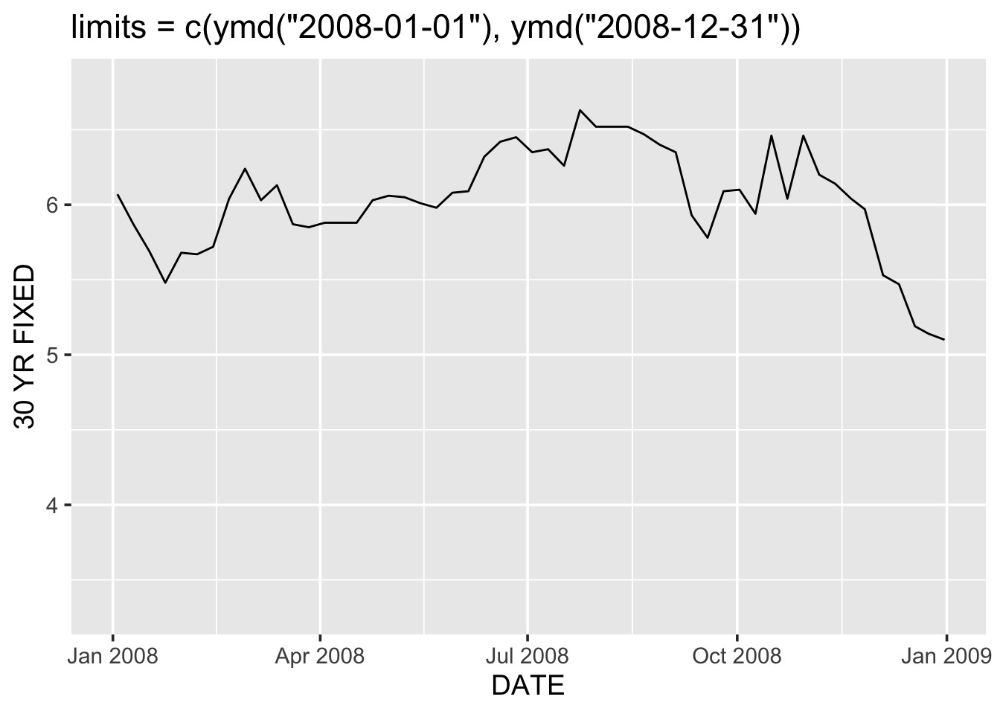
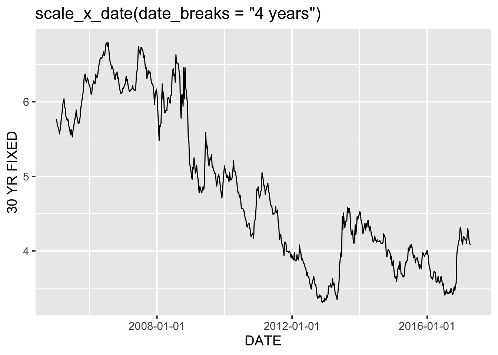
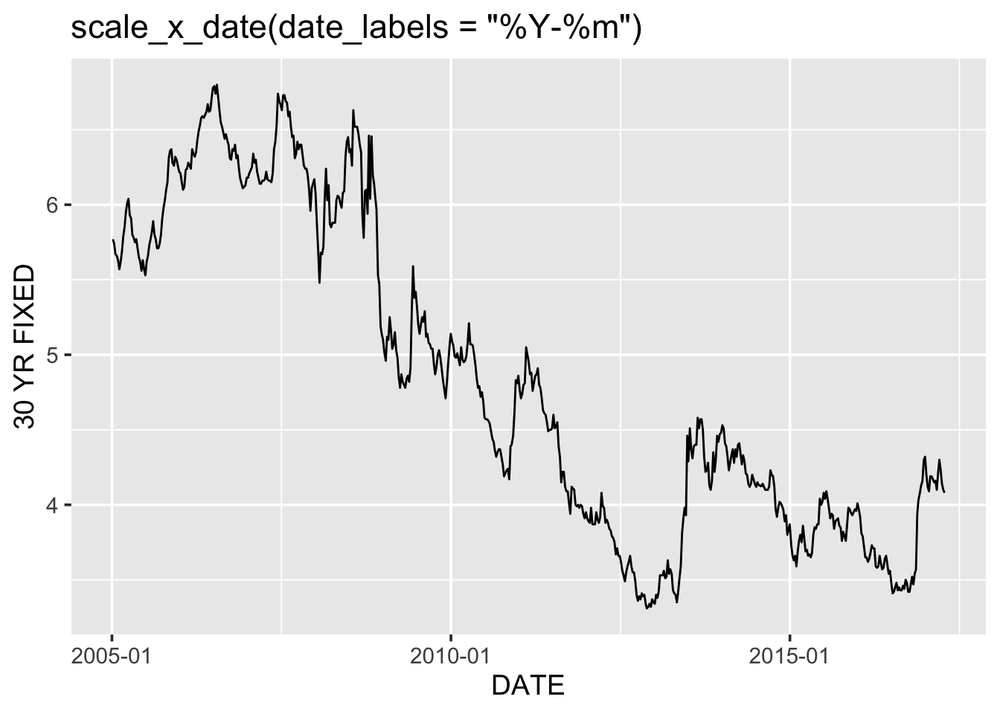
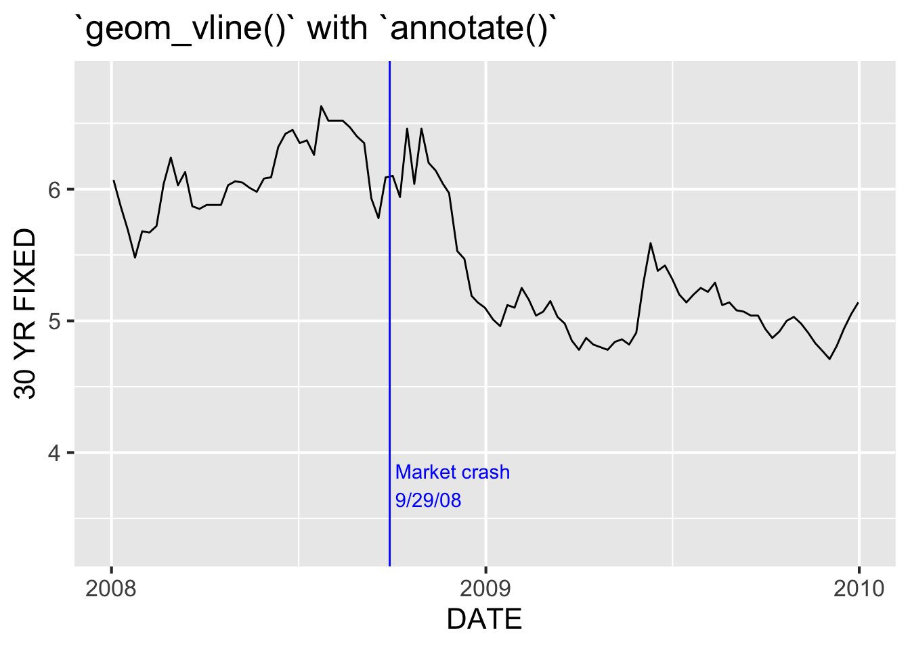

# Dates dans R {#dates}


## Introduction

Travailler avec des dates peut être très frustrant. En général, le mieux est de travailler avec la classe de données la plus facile. Cela signifie par exemple que si la variable avec laquelle on travaille est en *années*, le mieux est d'en faire un integer; il n'y a pas de raison d'en faire une variable de la classe date ou date-time. Si par contre, ce n'est pas possible d'utiliser une de ces classes simplifiées, on peut utiliser la classe `Date` dans R. 

## Convertir en la classe `Date` 

 On peut convertir une variable de classe character en une variable de classe `Date`en utilisant `as.Date()`:  


```r
dchar <- "2018-10-12"
ddate <- as.Date(dchar)
```

Notez que les deux apparaissent de la même manière, même si leur classe est différente. 


```r
dchar
```

```
## [1] "2018-10-12"
```

```r
ddate
```

```
## [1] "2018-10-12"
```

```r
class(dchar)
```

```
## [1] "character"
```

```r
class(ddate)
```

```
## [1] "Date"
```

Si la date n'a pas le format YYYY-MM-DD ou YYYY/MM/DD, il faudra spécifier le format dans lequel on souhaite convertir la nouvelle variable de classe `Date` en utilisant le symbole `%` de la façon suivante:


```r
as.Date("Thursday, January 6, 2005", format = "%A, %B %d, %Y")
```

```
## [1] "2005-01-06"
```

Pour une liste de toutes les spécifications possibles dans R, voir `?strptime`.

Tidyverse **lubridate** rend la conversion de dates qui ne sont pas dans un format standard très facile grâce aux fonctions `ymd()`, `ydm()`, `mdy()`, `myd()`, `dmy()`, `dym()` et autres.


```r
lubridate::mdy("April 13, 1907")
```

```
## [1] "1907-04-13"
```

Essayez `as.Date("April 13, 1907")` et vous verrez les avantages d'utiliser une fonction **lubridate**.

## Travaillez avec la classe `Date`

Cela vaut clairement la peine de convertir des variables en la classe `Date` car on peut faire beaucoup de choses avec ce genre de variable qu'on ne pourrait pas faire si on les avait laissés en character. 

Nombre de jours entre deux dates:


```r
as.Date("2017-11-02") - as.Date("2017-01-01")
```

```
## Time difference of 305 days
```

Comparer deux dates:

```r
as.Date("2017-11-12") > as.Date("2017-3-3")
```

```
## [1] TRUE
```

Notez que `Sys.Date()` renvoie la date d'aujourd'hui en une variable de classe `Date`:

```r
Sys.Date()
```

```
## [1] "2019-10-31"
```

```r
class(Sys.Date())
```

```
## [1] "Date"
```
R a des fonctions pour extraire des informations particulières à partir d'une date:

```r
today <- Sys.Date()
weekdays(today)
```

```
## [1] "Thursday"
```

```r
weekdays(today, abbreviate = TRUE)
```

```
## [1] "Thu"
```

```r
months(today)
```

```
## [1] "October"
```

```r
months(today, abbreviate = TRUE)
```

```
## [1] "Oct"
```

```r
quarters(today)
```

```
## [1] "Q4"
```

Le package **lubridate** procure des fonctions additionnelles pour extraire plus d'information à partir d'une date de classe `Date`:


```r
today <- Sys.Date()
lubridate::year(today)
```

```
## [1] 2019
```

```r
lubridate::yday(today)
```

```
## [1] 304
```

```r
lubridate::month(today)
```

```
## [1] 10
```

```r
lubridate::month(today, label = TRUE)
```

```
## [1] Oct
## 12 Levels: Jan < Feb < Mar < Apr < May < Jun < Jul < Aug < Sep < ... < Dec
```

```r
lubridate::mday(today)
```

```
## [1] 31
```

```r
lubridate::week(today)
```

```
## [1] 44
```

```r
lubridate::wday(today)
```

```
## [1] 5
```

## Tracez des graphes avec une variable de classe `Date` 

On peut travailler avec base R graphics et **ggplot2**, les deux peuvent travailler avec une variable de la classe `Date` et nommer les axes correctement:

### base R


```r
df <- read.csv("data/mortgage.csv")
df$DATE <- as.Date(df$DATE)
plot(df$DATE, df$X5.1.ARM, type = "l") # on the order of years
```



```r
plot(df$DATE[1:30], df$X5.1.ARM[1:30], type = "l") # switch to months
```



Notez le changement des labels de l'axe x dans le deuxième graphe. 

### ggplot2


```r
# readr 
library(tidyverse)
```

Notez que contrairement à `read.csv()` de base R, `readr::read_csv()` lit automatiquement DATE comme une variable de classe `Date` par ce que cette variable est déjà sous la forme YYYY-MM-DD:

```r
df <- readr::read_csv("data/mortgage.csv")
```

```
## Parsed with column specification:
## cols(
##   DATE = col_date(format = ""),
##   `5/1 ARM` = col_double(),
##   `15 YR FIXED` = col_double(),
##   `30 YR FIXED` = col_double()
## )
```

```r
g <- ggplot(df, aes(DATE, `30 YR FIXED`)) + 
  geom_line() + 
  theme_grey(14)

g
```



```r
ggplot(df %>% filter(DATE < as.Date("2006-01-01")), 
       aes(DATE, `30 YR FIXED`)) + 
  geom_line() + 
  theme_grey(14)
```


A nouveau, lorsque les données sont filtrées, les labels de l'axe x changent de years à months. 

#### Breaks, limits, labels

On peut contrôler les breaks, limits et labels de l'axe x grâce à `scale_x_date()`:


```r
library(lubridate)
g + scale_x_date(limits = c(ymd("2008-01-01"), ymd("2008-12-31"))) +
  ggtitle("limits = c(ymd(\"2008-01-01\"), ymd(\"2008-12-31\"))")
```



```r
g + scale_x_date(date_breaks = "4 years") +
  ggtitle("scale_x_date(date_breaks = \"4 years\")")
```



```r
g + scale_x_date(date_labels = "%Y-%m") +
  ggtitle("scale_x_date(date_labels = \"%Y-%m\")")
```



(Oui, même dans le package tidyverse on ne peut pas complètement échapper à l'utilisation de `%` pour convertir les formats des dates. Pour rappel, `?strptime` si besoin d'aide). 

#### Annotations

On peut utiliser `geom_vline()` et `annotate() pour marquer des événements spécifiques dans une série temporelle: 


```r
ggplot(df, aes(DATE, `30 YR FIXED`)) + 
  geom_line() +
  geom_vline(xintercept = ymd("2008-09-29"), color = "blue") +
  annotate("text", x = ymd("2008-09-29"), y = 3.75, 
           label = " Market crash\n 9/29/08", color = "blue", 
           hjust = 0) +
  scale_x_date(limits = c(ymd("2008-01-01"), ymd("2009-12-31")),
               date_breaks = "1 year", 
               date_labels = "%Y") + 
  theme_grey(16) +
  ggtitle("`geom_vline()` with `annotate()`")
```



## Date and time classes


```r
Sys.time()
```

```
## [1] "2019-10-31 07:53:54 EDT"
```

