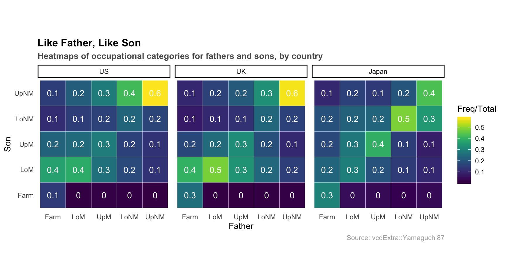
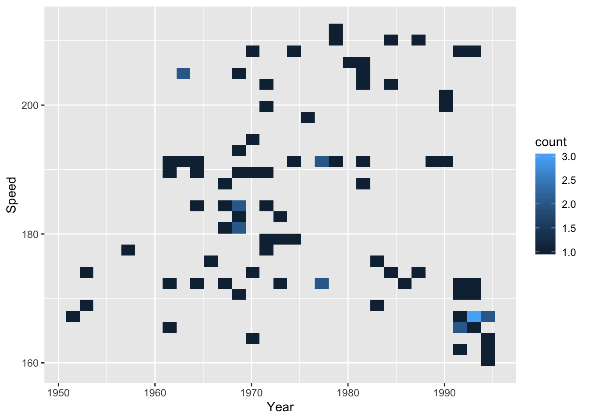
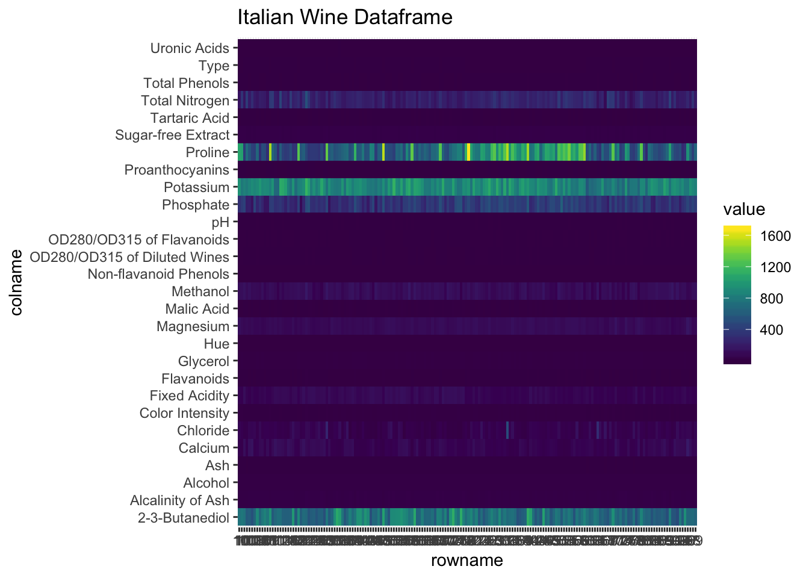
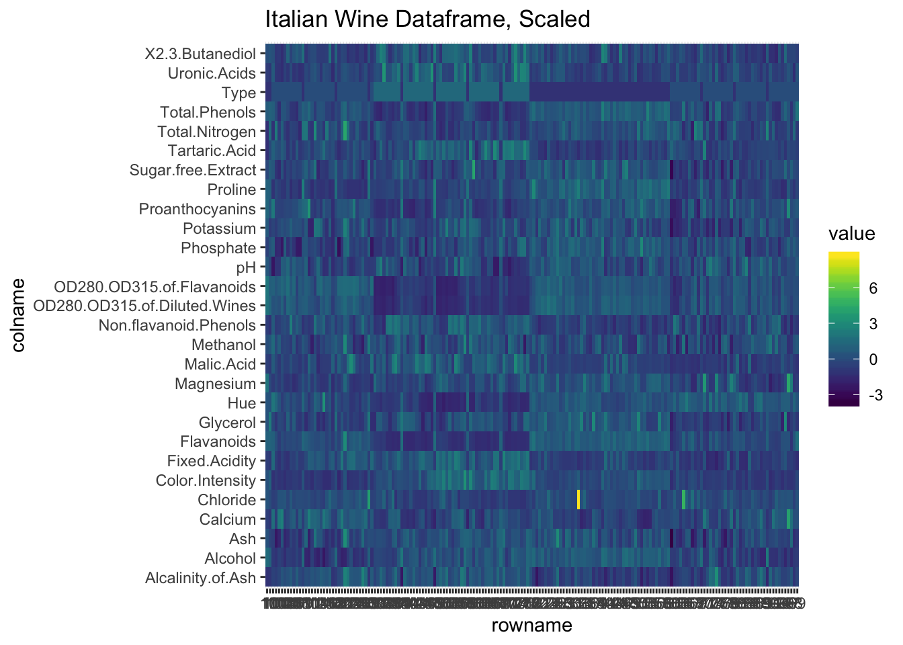
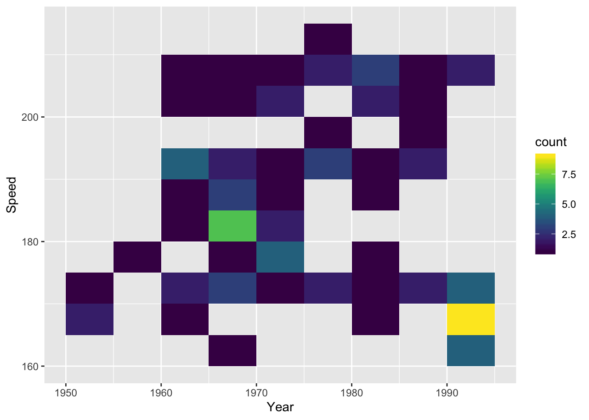
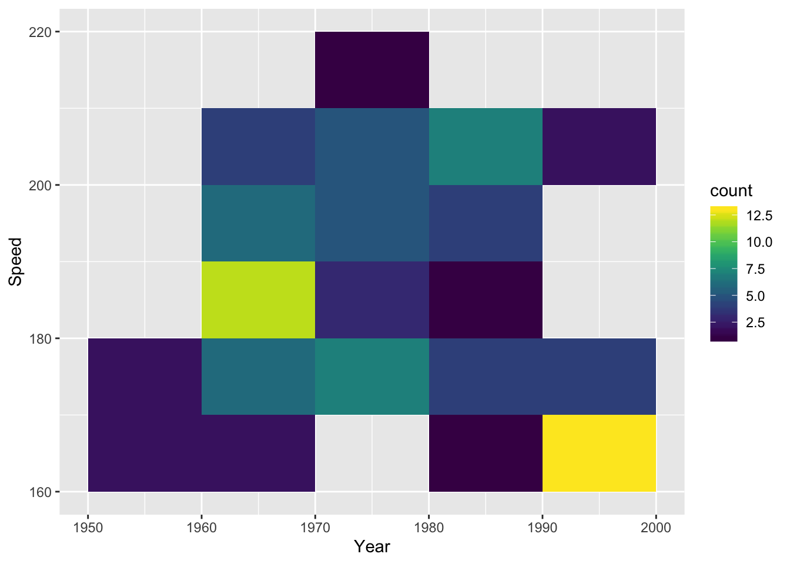
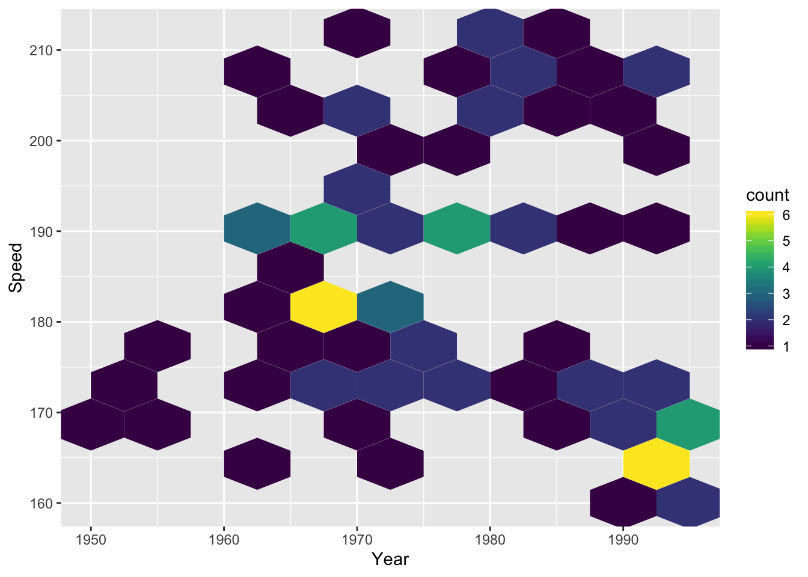
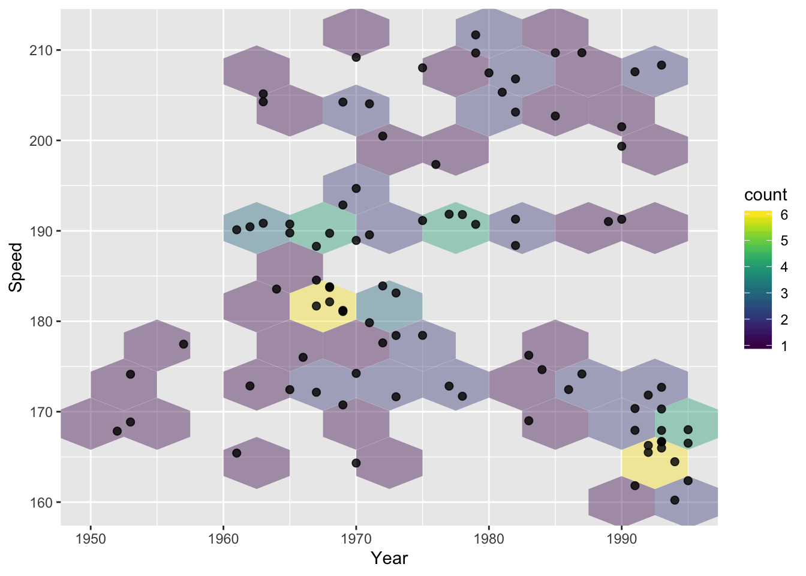
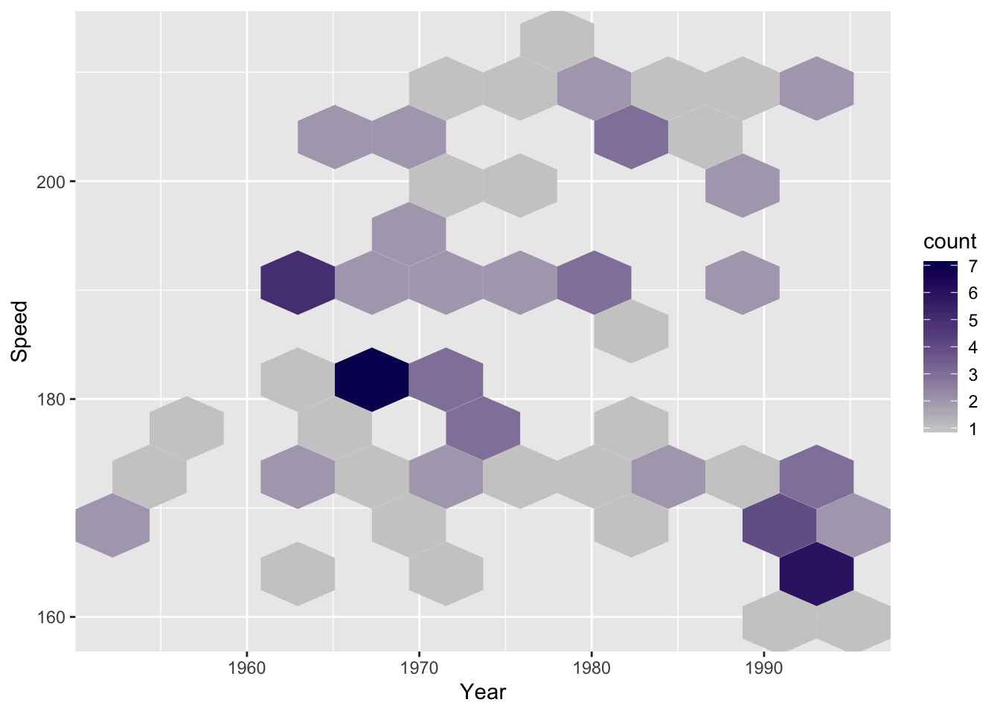

# Diagramme: Carte Thermique {#heatmap}

<!-- Chapter Banner -->


## Vue d'ensemble

Cette section explique comment faire des cartes thermiques.

## tl;dr

J'en ai assez de ces exemples trop faciles! Je veux [un exemple compliqué](https://www.youtube.com/watch?v=tl8WjoE79Wo){target="_blank"}!

Voici une carte thermique des catégories sociales des fils et pères aux Etat-Unis, au Royaume-Uni, et au Japon:


Et voici le code:

```r
library(vcdExtra) # dataset
library(dplyr) # manipulation
library(ggplot2) # plotting
library(viridis) # color palette

# format data
orderedclasses <- c("Farm", "LoM", "UpM", "LoNM", "UpNM")
mydata <- Yamaguchi87
mydata$Son <- factor(mydata$Son, levels = orderedclasses)
mydata$Father <- factor(mydata$Father,
                        levels = orderedclasses)
japan <- mydata %>% filter(Country == "Japan")
uk <- mydata %>% filter(Country == "UK")
us <- mydata %>% filter(Country == "US")

# convert to % of country and class total
mydata_new <- mydata %>% group_by(Country, Father) %>% 
  mutate(Total = sum(Freq)) %>% ungroup()

# make custom theme
theme_heat <- theme_classic() +
  theme(axis.line = element_blank(),
        axis.ticks = element_blank())

# basic plot
plot <- ggplot(mydata_new, aes(x = Father, y = Son)) +
  geom_tile(aes(fill = Freq/Total), color = "white") +
  coord_fixed() + facet_wrap(~Country) + theme_heat

# plot with text overlay and viridis color palette
plot + geom_text(aes(label = round(Freq/Total, 1)), 
                 color = "white") +
      scale_fill_viridis() +
      # formatting
      ggtitle("Like Father, Like Son",
              subtitle = "Heatmaps of occupational categories for fathers and sons, by country") +
      labs(caption = "Source: vcdExtra::Yamaguchi87") +
      theme(plot.title = element_text(face = "bold")) +
      theme(plot.subtitle = element_text(face = "bold", color = "grey35")) +
      theme(plot.caption = element_text(color = "grey68"))
```

Pour plus d'informations sur ce jeu de données, tapez `?vcdExtra::Yamaguchi87` dans la console.

## Exemples simples

Trop compliqué! [Simplifie, mon pote!](https://www.youtube.com/watch?v=PlsW2hd06R0){target="_blank"}

### Carte thermique de compartiments d'histogrammes en 2D (bin count)

Pour cette carte thermique, nous utiliserons le jeu de données `SpeedSki`.

Seulement deux variables, `x` et `y` sont nécessaires pour des cartes thermiques de bin count en 2D. La troisième variable--i.e., la couleur--represente le bin count de points dans la région qu'elle recouvre. Imaginez un histogramme en 2D.

Pour créer une carte thermique, il suffit ed remplacer `geom_point()` par `geom_bin2d()`:

```r
library(ggplot2) # plotting 
library(GDAdata) # data (SpeedSki)

ggplot(SpeedSki, aes(Year, Speed)) + 
  geom_bin2d()
```



### Carte thermique d'un Dataframe

On peut utiliser une carte thermique pour visualiser le dataframe. Vous pouvez aussi chercher comment You can also look into [mettre à l'échelle les colonnes](https://stackoverflow.com/questions/15215457/standardize-data-columns-in-r){target="_blank"} pour visualiser vos données sur une échelle commune. Dans cet example, nous utilisons `geom_tile` pour représenter toutes les cellules du dataframe et les colorier selon leur valeur:

```r
library(pgmm) # data
library(tidyverse) # processing/graphing
library(viridis) # color palette

data(wine)

# convert to column, value
wine_new <- wine %>%
  rownames_to_column() %>%
  gather(colname, value, -rowname)

ggplot(wine_new, aes(x = rowname, y = colname, fill = value)) +
  geom_tile() + scale_fill_viridis() +
  ggtitle("Italian Wine Dataframe")
```




```r
# only difference from above is scaling
wine_scaled <- data.frame(scale(wine)) %>%
  rownames_to_column() %>%
  gather(colname, value, -rowname)

ggplot(wine_scaled, aes(x = rowname, y = colname, fill = value)) +
  geom_tile() + scale_fill_viridis() +
  ggtitle("Italian Wine Dataframe, Scaled")
```



### Modifications

Vous pouvez changer la palette de couleur en l'indiquant explicitement dans vos appels de fonction `ggplot`. L'épaisseur des comptiments peut aussi être ajoutée via l'appel de fonction `geom_bin2d()`:

```r
library(viridis) # viridis color palette

# create plot
g1 <- ggplot(SpeedSki, aes(Year, Speed)) + 
  scale_fill_viridis() # modify color

# show plot
g1 + geom_bin2d(binwidth = c(5, 5)) # modify bin width
```


Voici quelques autres examples:

```r
# larger bin width
g1 + geom_bin2d(binwidth = c(10, 10)) 
```




```r
# hexagonal bins
g1 + geom_hex(binwidth = c(5, 5))
```




```r
# hexagonal bins + scatterplot layer
g1 + geom_hex(binwidth = c(5, 5), alpha = .4) + 
  geom_point(size = 2, alpha = 0.8)
```




```r
# hexagonal bins with custom color gradient/bin count
ggplot(SpeedSki, aes(Year, Speed)) + 
  scale_fill_gradient(low = "#cccccc", high = "#09005F") + # color
  geom_hex(bins = 10) # number of bins horizontally/vertically
```



## Theorie

Les cartes thermiques sont comme une sorte de combinaiso de [nuage de points](scatter.html) et [histogrammes](histo.html): ils vous permettent de comparer différents paramètres tout en voyant leurs distributions respectives.

*   Même si les cartes thermiques sont visuellement  esthétiques, il y a souvent des meilleures façons de représenter les données. Pour plus d'informations, suivez ce [DataCamp sur les cartes thermiques et des alternatives](https://campus.datacamp.com/courses/data-visualization-with-ggplot2-2/chapter-4-best-practices?ex=10){target="_blank"}.

## Ressources Externes
- [R Graph Gallery: Heatmaps](https://www.r-graph-gallery.com/heatmap/){target="_blank"}: Has examples of creating heatmaps with the `heatmap()` function.
- [Comment faire une carte thermique simple avec ggplot2](https://www.r-bloggers.com/how-to-make-a-simple-heatmap-in-ggplot2/){target="_blank"}: Créez une carte thermique avec `geom_tile()`.


