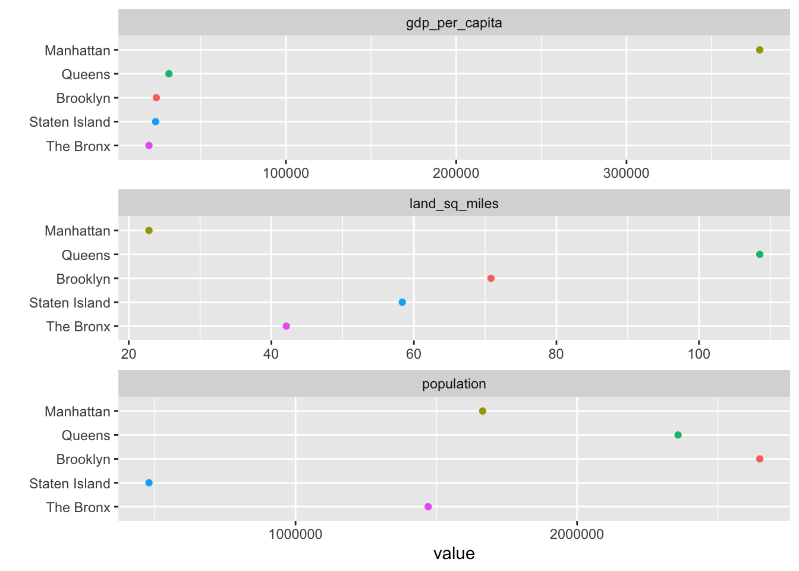

# (PART) Travailler avec des données {-}

# Importer des données {#import}


*Ce chapitre a été réalisé dans le cadre d'une collaboration communautaire créée par [ZhangZhida](https://github.com/ZhangZhida){target="_blank"}*

*Cette page est un travail en cours. Nous apprécions tout commentaire ou feedback. Si vous souhaitez améliorer cette page, vous pouvez [contribuer à notre repo](contribute.html).*

## Vue d'ensemble

Cette section explique comment importer des données à partir de sources déjà implémentées dans R, de fichiers locaux, sites internet et bases de données. 

## Importer des datasets déjà implémentés dans R

R contient beaucoup de datasets avec lesquels les utilisateurs peuvent jouer. Vous êtes probablement déjà familier avec plusieurs de ces datasets comme `iris`, `mtcars`, `beavers`, `dataset`, etc. Comme ces datasets sont déjà "préloadé", on peut les manipuler directement. Pour une liste complète des datasets déjà présents dans R, se référer [aux packages Datasets de R](https://stat.ethz.ch/R-manual/R-devel/library/datasets/html/00Index.html){target="_blank"} On peut aussi taper `data()` dans la console pour voir toute la liste.

L'option la plus pratique pour visualiser ces datasets est de taper `??datasets`: la liste des datasets apparaît alors dans la fenêtre Help à l'écran. Cliquer sur un dataset fera apparaître sa proche page help. Vous y trouverez beaucoup d'informations sur les sources de ces données et la signification de chaque variable.

La plupart des datasets sont dit ["lazy-loaded"](https://cran.r-project.org/doc/manuals/r-release/R-exts.html#Data-in-packages), ce qui signifie que même s'ils n'apparaissent pas dans l'environnement global, il suffit d'y faire référence pour les loader et les utiliser. Cependant, pour certains packages, il faut utiliser `data()` pour accéder aux datasets, comme ci-dessous:


```r
library(pgmm)
data(wine)
```

Ceci est une source commune de frustration pour beaucoup d'étudiants: "J'ai installé la librairie et loadé le package mais le dataset n'est pas là!". Un homme averti en vaut deux: les packages qui tombent dans cette catégories comprennent: `lawstat`, `pgmm`, et d'autres encore. (Envoyez-nous une PR pour allonger cette liste)


## Importer des données stockées localement

Cette section couvre les fonctions de base de R pour importer des données. Pour les versions tidyverse (`read_csv`, `read_delim`, `read_table`, etc.), voir [le chapitre Data Import](https://r4ds.had.co.nz/data-import.html) de *R for Data Science.

### Importer des fichiers textes 

La fonction `read.table()` est la fonction la plus générale pour lire des fichiers textes. Pour l'utiliser, on doit spécifier comment lire le fichier, c'est-à-dire que nous devons spécifier des paramètres basiques comme `sep`, `header`, etc. `sep` représente le séparateur (virgule, point virgule, etc.) et `header` est en général `TRUE` si on veut lire la premier ligne comme en-tête. D'autres paramètres sont aussi utiles à d'autres occasions. Par exemple, `na.strings` indique que les charactères doivent être interprétés comme des valeurs NAs.


```r
df <- read.table("data/MusicIcecream.csv", sep=",", header=TRUE)
head(df)
```

```
##     Age   Favorite     Music Freq
## 1   old bubble gum classical    1
## 2   old bubble gum      rock    1
## 3   old     coffee classical    3
## 4   old     coffee      rock    1
## 5 young bubble gum classical    2
## 6 young bubble gum      rock    5
```

### Importer des fichiers CSV
CSV est l'abréviation de 'Comma-Separated Values file' qui est, comme son nom l'indique, un fichier texte qui emploie des virgules pour séparer chacune de ses données. On peut facilement lire un fichier CSV avec les fonctions intégrées dans R.

La fonction `read.csv()` fournit deux paramètres utiles: `header` qui peut être mis sur `FALSE` s'il n'y a pas d'en-tête et `sep` qui spécifie le séparateur. Par exemple, on peut préciser que le séparateur est `sep="\t` si le fichier CSV utilise en réalité le charactère 'tab' pour séparer ses données. Les valeurs par défaut pour `header` et `sep` sont `TRUE` et `","`.

`read.csv2()` est une autre fonction pour lire des fichiers CSV. La différence entre `read.csv()` et `read.csv2` est que le premier utilise tab `"\t"` comme séparateur, alors que l'autre utiliser un point virgule `";"`. Cela sert de raccourci efficace pour des fichiers CSV de formats différents, souvent selon les régions.

Voici un exemple de code pour lire un fichier CSV standard:

```r
df <- read.csv("data/MusicIcecream.csv")
head(df)
```

```
##     Age   Favorite     Music Freq
## 1   old bubble gum classical    1
## 2   old bubble gum      rock    1
## 3   old     coffee classical    3
## 4   old     coffee      rock    1
## 5 young bubble gum classical    2
## 6 young bubble gum      rock    5
```

Une petite remarque concernant la lecture de plusieurs fichiers: R doit connaître notre directory actuel, ce qui peut se faire en utilisant la fonction `setwd()`. Ensuite, on peut lire tous les fichiers qui se trouvent dans ce directory en entrant le nom de fichier directement, sans avoir à spécifier la location.

### Importer un fichier JSON

Un fichier JSON est un fichier qui storent des données de structure simple et des objets JavaScript, d'où son nom 'JavaScript Object Notation (JSON)'. Par exemple, `{"name":"Vince", "age":23, "city":"New York"}` est un objet de format JSON. Récemment, JSON est devenu le format standard pour tranférer des données sur des sites internets.

Pour lire un fichier JSON, on peut utiliser le package `jsonlite`. Ce dernier est un JSON parser/generateur optimisé pour internet. Sa force principale est qu'il implémente un mapping bidirectionnel entre les données JSON et les types les plus importants dans R. Dans l'exemple ci-dessous, l'argument `simplifyDataFrame = TRUE` va directement transformer une liste d'objets JSON en un dataframe. Si vous voulez en savoir plus sur les arguments `simplifyVector` et `simplifyMatrix`, qui donnent un contrôle sur d'autres formats de données dans R, veuillez vous référer au document ["Getting started with JSON and jsonlite"](https://cran.r-project.org/web/packages/jsonlite/vignettes/json-aaquickstart.html){target="_blank"}.


```r
library(jsonlite)

# read JSON data
raw_json_data <- fromJSON(txt = "data/WaterConsumptionInNYC.json", simplifyDataFrame = TRUE)

# transform JSON to Data Frame
df <- as.data.frame(raw_json_data)
head(df)
```

```
##   new_york_city_population nyc_consumption_million_gallons_per_day
## 1                  7102100                                    1512
## 2                  7071639                                    1506
## 3                  7089241                                    1309
## 4                  7109105                                    1382
## 5                  7181224                                    1424
## 6                  7234514                                    1465
##   per_capita_gallons_per_person_per_day year
## 1                                   213 1979
## 2                                   213 1980
## 3                                   185 1981
## 4                                   194 1982
## 5                                   198 1983
## 6                                   203 1984
```

## Importer des données web

### Lire un fichier directement dans notre environnement de travail

Prenons l'exemple de `Water Consumption In The New York City`, qui est sur le [site open-source de NYC](https://data.cityofnewyork.us/Environment/Water-Consumption-In-The-New-York-City/ia2d-e54m){target="_blank}. 

Nous pouvons importer les données depuis un URL de la même façon que nous importons des fichiers locaux.


```r
library(tidyverse)

# specify the URL link to the data source
url <- "https://data.cityofnewyork.us/api/views/ia2d-e54m/rows.csv"

# read the URL
df <- read_csv(url)
head(df)
```

```
## # A tibble: 6 x 4
##    Year `New York City Pop… `NYC Consumption(Millio… `Per Capita(Gallons p…
##   <dbl>               <dbl>                    <dbl>                  <dbl>
## 1  1979             7102100                     1512                    213
## 2  1980             7071639                     1506                    213
## 3  1981             7089241                     1309                    185
## 4  1982             7109105                     1382                    194
## 5  1983             7181224                     1424                    198
## 6  1984             7234514                     1465                    203
```

### Scraper une table HTML en utilisant `rvest`

Parfois, on souhaite importer des données qui apparaissent dans une table HTML sur un site internet. Cela peut être un peu désordonné, et le mieux est de d'abord vérifier s'il n'y a pas d'autres moyens pour importer les données avant d'utiliser cette option. S'il n'y a pas d'alternative, `rvest` rend le procédé le plus facile possible. 

Voici un exemple simple. Supponsons que nous souhaitons travailler sur les données de quartiers trouvés sur la page Wikipédia [Boroughs of New York City](https://en.wikipedia.org/wiki/Boroughs_of_New_York_City) page.

D'abord, nous lisons la page, trouvons les tables et les récupérons avec `html_table`:


```r
library(tidyverse)
library(rvest)
nyctables <- read_html("https://en.wikipedia.org/wiki/Boroughs_of_New_York_City") %>% 
  html_nodes("table") %>% 
  html_table(fill = TRUE)
```

`nyctables` est une liste de trois éléments, un pour chaque table de la page.

Ensuite, nous pouvons vérifier chaque élément jusqu'à ce que nous trouvons ce que nous voulons en consultant la page web originale pour avoir une idée de la location de notre table. (Il y a d'autres méthodes pour identifier ce dont on a besoin sur une page internet dans des situations plus complexes. Voir le paragraphe Ressources additionnelles ci-dessous pour plus d'informations). 

Il se trouve que la table que nous voulons est le premier élément de la list:


```r
mytable <- nyctables[[1]]
head(mytable, 3)
```

```
##   New York City's five boroughsvte New York City's five boroughsvte
## 1                     Jurisdiction                     Jurisdiction
## 2                          Borough                           County
## 3                        The Bronx                            Bronx
##   New York City's five boroughsvte New York City's five boroughsvte
## 1                       Population           Gross Domestic Product
## 2               Estimate (2017)[3]                 billions(US$)[4]
## 3                        1,471,160                           28.787
##   New York City's five boroughsvte New York City's five boroughsvte
## 1           Gross Domestic Product                        Land area
## 2                  per capita(US$)                     square miles
## 3                           19,570                            42.10
##   New York City's five boroughsvte New York City's five boroughsvte
## 1                        Land area                          Density
## 2                         squarekm                 persons / sq. mi
## 3                           109.04                           34,653
##   New York City's five boroughsvte
## 1                          Density
## 2                  persons /sq. km
## 3                           13,231
```

Nous pouvons voir que le nom des colonnes est le même pour toutes les colonnes à cause de l'en-tête fusionnée à partir de l'original. Nous pouvons arranger ceci ainsi que retirer les rangs dont on n'a pas besoin:


```r
colnames(mytable) <- c("borough", "county", "population", "gdp_total", "gdp_per_capita",
                       "land_sq_miles", "land_sq_km", "density_sq_miles", "density_sq_km")

# remove unneeded rows 
mytable <- mytable %>% slice(-c(1, 2, 10))

# convert character to numeric data where appropriate
mytable <- mytable %>%
  mutate_at(vars(population:density_sq_km), parse_number)
```

Maintenant nous sommes prêts à dessiner un graphiques! 


```r
options(scipen = 999) # turn off scientific notation
mytable %>% 
  slice(1:5) %>% 
  select(borough, gdp_per_capita, land_sq_miles, population) %>% 
  gather(var, value, -borough) %>% 
  ggplot(aes(value, fct_reorder2(borough, var=="gdp_per_capita", value, .desc = FALSE),
             color = borough)) + geom_point() + ylab("") +
  facet_wrap(~var, ncol = 1, scales = "free_x") +
  guides(color = FALSE)
```



**Ressources additionnelles**
[Le webinar de RStudio sur l'utilisation de `rvest`](https://www.rstudio.com/resources/webinars/extracting-data-from-the-web-part-2/) -- explique comment utiliser la structure de HTML et CSS sur la page pour scraper l'information qui s'y trouve et dont on a besoin. Il explique aussi comment utiliser certaines fonctions additionnelles de `rvest` comme `html_text()`, `html_name()`, `html_attrs()`, `html_children()`, etc.

## Importer des données à partir de bases de données

R procure des packages pour manipuler des données de bases de données relationelles comme PostgreSQL, MySQL, etc. Un de ces packages est 
`odbc` package, qui est une des interfaces de databases qui permet la communication entre R et les systèmes de gestion de bases de données relationnelles. Plus de ressources sur ce package ici: [odbc](https://db.rstudio.com/odbc/){target="_blank"}. 

Avant de se connecter à une base de données locale, nous devons satisfaire les prérequis du driver ODBC, à travers lequel le package R peut communiquer avec la base de donnée. Pour obtenir de l'aide sur comment installer le driver ODBC sur des systèmes comme Windows, Linus, MacOS, veuillez utiliser ce document:[Installer ODBC Driver](https://cran.r-project.org/web/packages/odbc/readme/README.html){target="_blank"}.

Après avoir installé le driver ODBC avec les packages `odbc` et `DBI`, nous sommes capables de manipuler la base de données. Pour lire une table de celle-ci, nous passons par les étapes suivantes. Nous créons d'abord une connection vers la base de données grâce à la fonction 
`dbConnect()`. Ensuite, nous pouvons faire un peu d'exploration et lister par exemple toutes les tables de la base de données. Pour lancer des queries sur les informations qui nous intéressent, on peut lancer une query SQL dans la base de donnée. Ensuite on peut retrouver les données désirées et `dfFetch()` nous permet de choisir le nombre de valeurs que nous souhaitons récupérer à la fois. Enfin, lorsque nous avons fini de lire ces données, nous pouvons fermer la connection.  


```r
library(odbc)
library(DBI)

# build connection with database 
con <- dbConnect(odbc::odbc(),
  driver = "PostgreSQL Driver",
  database = "test_db",
  uid = "postgres",
  pwd = "password",
  host = "localhost",
  port = 5432)

# list all tables in the test_db database
dbListTables(con)

# read table test_table into Data Frame
data <- dbReadTable(con, "test_table")

# write an R Data Frame object to an SQL table
# here we write the built-in data mtcars to a new_table in DB
data <- dbWriteTable(con, "new_table", mtcars)

# SQL query
result <- dbSendQuery(con, "SELECT * FROM test_table")

# Retrieve the first 10 results
first_10 <- dbFetch(result, n = 10)
# Retrieve the rest of the results
rest <- dbFetch(result)

# close the connection
dbDisconnect(con)
```

## Plus de ressources

  - Importer des fichiers locaux:
  [This R Data Import Tutorial Is Everything You Need](https://www.datacamp.com/community/tutorials/r-data-import-tutorial#Getting){target="_blank"}
  - Importer des fichiers JSON: 
  [Getting started with JSON and jsonlite](https://cran.r-project.org/web/packages/jsonlite/vignettes/json-aaquickstart.html){target="_blank"}
  - Importer des données web:
  [The RCurl Package](http://www.omegahat.net/RCurl/){target="_blank"}
  - Importer des fichiers de base de données
  [Databases using R](https://db.rstudio.com/){target="_blank"}
  - Documentation sur le package odbc
  [odbc](https://db.rstudio.com/odbc/){target="_blank"}
  - Installer le driver ODBC sur son système:
  [Install ODBC Driver](https://cran.r-project.org/web/packages/odbc/readme/README.html){target="_blank"}
