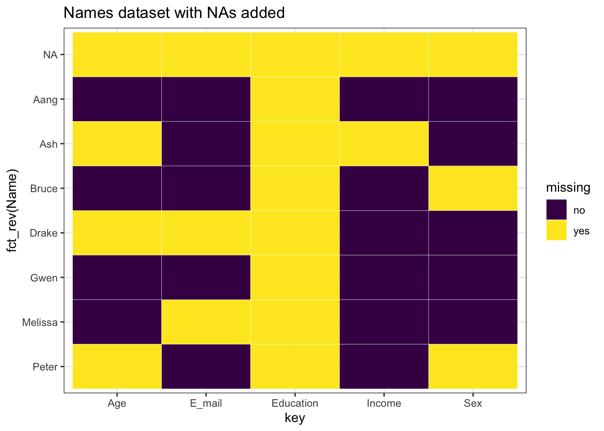
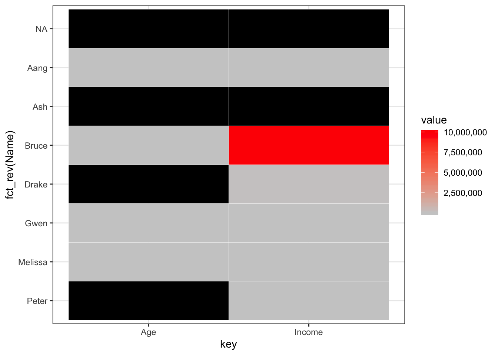
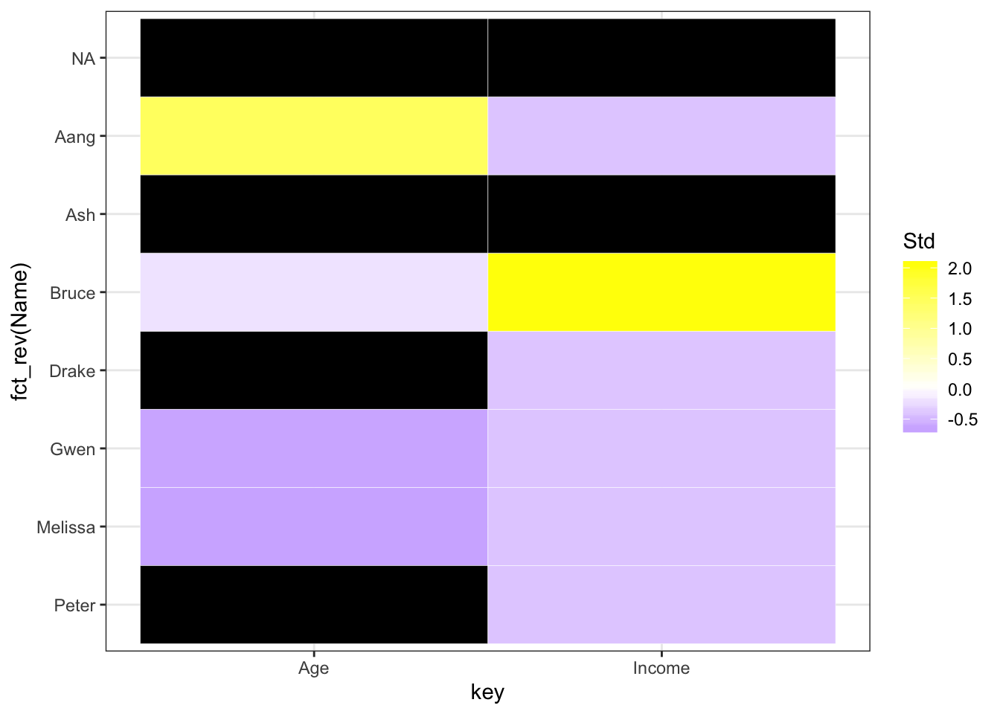
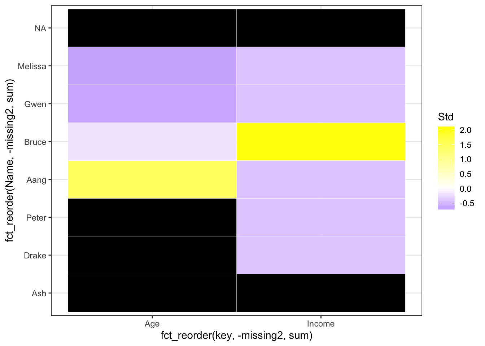
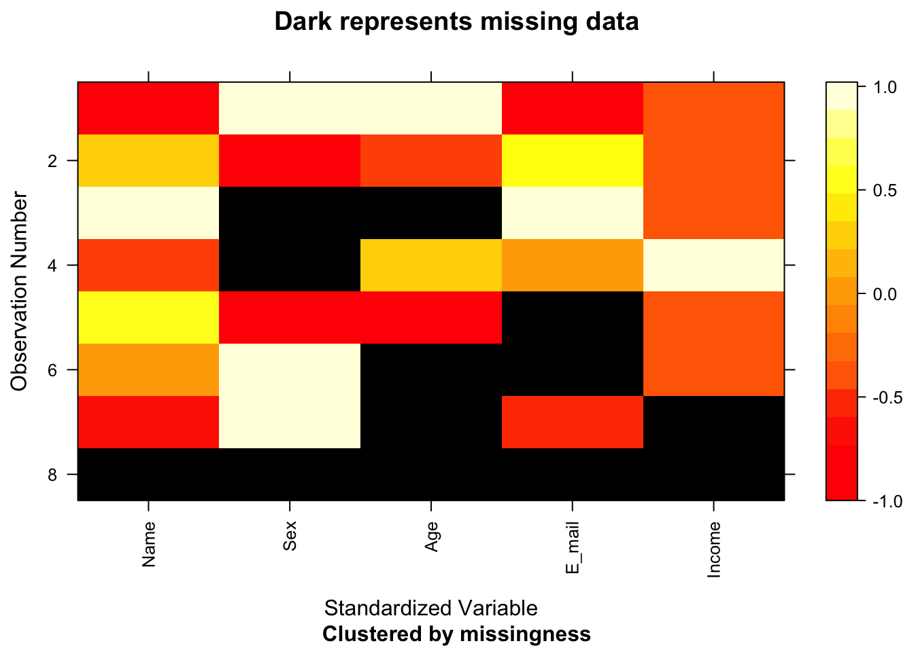
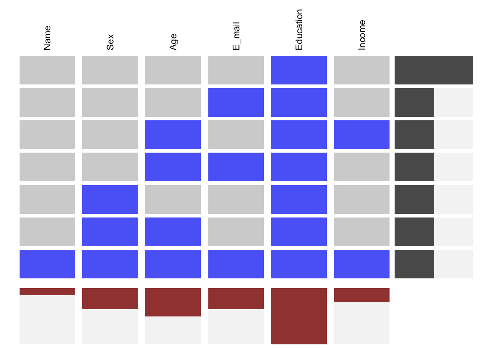
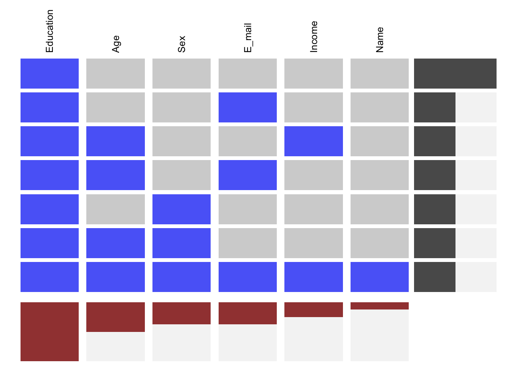

# Données manquantes {#missing}


*Ce chapitre a été réalisé dans le cadre d'une collaboration communautaire créée par [ujjwal95](https://github.com/ujjwal95){target="_blank"}*

*Cette page est en cours de réalisation. Nous apprécions tout commentaire ou feedback. Si vous voulez participez et nous aider à améliorer cette page, vous pouvez [contribuer à notre repo](contribute.html).*

## Vue d'ensemble
Dans cette section, nous verrons plusieurs types de données manquantes et la façon de les traiter. 

## tl;dr
Il peut être difficile de traiter des données manquantes! S'il manque des données dans nos datasets, ce qui est très souvent le cas, on peut soit s'en débarrasser, soit en déduire la valeur. 

## Que sont les NAs?

Lorsqu'une donnée dans un rang ou colonne est manquante, elle apparaitra sous de la forme NA. Regardons ça d'un peu plus près:


Name      Sex       Age  E_mail                    Education     Income
--------  -------  ----  ------------------------  ----------  --------
Melissa   Female     27  NA                        NA           1.0e+04
Peter     NA         NA  peter.parker@esu.edu      NA           7.5e+03
Aang      Male      110  aang@avatars.com          NA           1.0e+03
Drake     Male       NA  NA                        NA           5.0e+04
Bruce     NA         45  bruce.wayne@wayne.org     NA           1.0e+07
Gwen      Female     28  gwen.stacy@esu.edu        NA           2.3e+04
Ash       Male       NA  ash.ketchum@pokemon.com   NA                NA
NA        NA         NA  NA                        NA                NA

On peut aussi voir le nombre de NAs dans chaque rang et colonne.

```r
colSums(is.na(data))
```

```
##      Name       Sex       Age    E_mail Education    Income 
##         1         3         4         3         8         2
```


```r
rowSums(is.na(data))
```

```
## [1] 2 3 1 3 2 1 3 6
```

On peut aussi calculer le ratio du nombre de NAs dans chaque rang et colonne:

```r
colMeans(is.na(data))
```

```
##      Name       Sex       Age    E_mail Education    Income 
##     0.125     0.375     0.500     0.375     1.000     0.250
```


```r
rowMeans(is.na(data))
```

```
## [1] 0.3333333 0.5000000 0.1666667 0.5000000 0.3333333 0.1666667 0.5000000
## [8] 1.0000000
```

## Types de Données Manquantes

- **Missing Completely at Random (MCAR)**: Ce sont des valeurs manquantes qui ne sont pas liées à d'autres valeurs, manquantes ou non, du dataset. 

- **Missing at Random (MAR)**: Ce sont des valeurs manquantes qui sont liées à un ou plusieurs autres groupes de données dans le dataset. La bonne nouvelle avec les valeurs manquantes de ce type-là, c'est qu'elles peuvent être déduites (et prédites) par d'autres données présentes dans le dataset. Par exemple, on peut observer que des personnes de plus de 70 ans ont tendance à ne pas donner d'informations sur leur salaire. La plupart des données manquantes à traiter dans la vraie vue sont de ce type-là.  

- **Missing Not at Random (MNAR)**: En général, une donnée manquante qui n'est pas MAR est MNAR. Le problème est cependant qu'il n'y a pas de grande distinction entre les deux. On supposera donc que la donnée manquante est de type MAR à moins que le contraire soit précisé et confirmé par une source extérieure.

## Patterns manquants 

### Patterns manquants par colonne

On peut voir certains patterns manquants dans les données par colonne,


```r
ggplot(tidy_names, aes(x = key, y = fct_rev(Name), fill = missing)) +
  geom_tile(color = "white") + 
  ggtitle("Names dataset with NAs added") +
  scale_fill_viridis_d() +
  theme_bw()
```



Et on peut aussi ajouter une échelle de valeur pour vérifier les valeurs numériques disponibles dans le dataset et tenter de trouver des tendances:

```r
library(scales) # for legend
# Select columns having numeric values
numeric_col_names <- colnames(select_if(data, is.numeric))
filtered_for_numeric <- tidy_names[tidy_names$key %in% numeric_col_names,]
filtered_for_numeric$value <- as.integer(filtered_for_numeric$value)
# Use label=comma to remove scientific notation
ggplot(data = filtered_for_numeric, aes(x = key, y = fct_rev(Name), fill = value)) +
  geom_tile(color = "white") + 
  scale_fill_gradient(low = "grey80", high = "red", na.value = "black", label=comma) + 
  theme_bw()
```



Est-ce que vous pouvez voir le problème avec le graphe ci-dessus? Avez-vous vu que l'échelle est pour *toutes* les valeurs, et que donc on ne peut pas voir les différences de niveau entre variables?
Pour résoudre ce problème, on peut standardiser les variables:

```r
filtered_for_numeric <- filtered_for_numeric %>% 
  group_by(key) %>% 
  mutate(Std = (value-mean(value, na.rm = TRUE))/sd(value, na.rm = TRUE)) %>% 
  ungroup()

ggplot(filtered_for_numeric, aes(x = key, y = fct_rev(Name), fill = Std)) +
  geom_tile(color = "white") + 
  scale_fill_gradient2(low = "blue", mid = "white", high ="yellow", na.value = "black") + theme_bw()
```



Maintenant, on peut mieux voir les patterns manquants! Trions-les selon le nombre manquant pour chaque rang et colonne:

```r
# convert missing to numeric so it can be summed up
filtered_for_numeric <- filtered_for_numeric %>% 
  mutate(missing2 = ifelse(missing == "yes", 1, 0))

ggplot(filtered_for_numeric, aes(x = fct_reorder(key, -missing2, sum), y = fct_reorder(Name, -missing2, sum), fill = Std)) +
  geom_tile(color = "white") + 
  scale_fill_gradient2(low = "blue", mid = "white", high ="yellow", na.value = "black") + theme_bw()
```



### Patterns manquants par rang

On peut aussi voir les patterns manquants dans le dataset par rang en utilisant le package `mi`:

```r
library(mi)
x <- missing_data.frame(data)
```

```
## Warning in .guess_type(y, favor_ordered, favor_positive, threshold,
## variable_name): Education : cannot infer variable type when all values are
## NA, guessing 'irrelevant'
```

```
## NOTE: In the following pairs of variables, the missingness pattern of the second is a subset of the first.
##  Please verify whether they are in fact logically distinct variables.
##      [,1]        [,2]    
## [1,] "Age"       "Income"
## [2,] "Education" "Income"
```

```
## Warning in .local(.Object, ...): Some observations are missing on all included variables.
## Often, this indicates a more complicated model is needed for this missingness mechanism
```

```r
image(x)
```



Avez-vous remarqué que la variable `Education` n'a pas été prise en compte? C'est parce que toute la colonne est manquante. 
Essayons maintenant de trouver des patterns dans les données manquantes:

```r
x@patterns
```

```
## [1] E_mail                         Sex, Age                      
## [3] nothing                        Age, E_mail                   
## [5] Sex                            nothing                       
## [7] Age, Income                    Name, Sex, Age, E_mail, Income
## 7 Levels: nothing E_mail Sex Sex, Age Age, E_mail ... Name, Sex, Age, E_mail, Income
```


```r
levels(x@patterns)
```

```
## [1] "nothing"                        "E_mail"                        
## [3] "Sex"                            "Sex, Age"                      
## [5] "Age, E_mail"                    "Age, Income"                   
## [7] "Name, Sex, Age, E_mail, Income"
```


```r
summary(x@patterns)
```

```
##                        nothing                         E_mail 
##                              2                              1 
##                            Sex                       Sex, Age 
##                              1                              1 
##                    Age, E_mail                    Age, Income 
##                              1                              1 
## Name, Sex, Age, E_mail, Income 
##                              1
```

On peut visualiser les patterns manquants en utilisant la fonction `visna` (VISualize NA) dans le package `extracat`:

```r
extracat::visna(data)
```


 
Ici, les rangs représentent un pattern manquant et les colonnes représentent le niveau de la colonne dans laquelle les valeurs sont manquantes. L'avantage de ce graph est qu'il montre seulement les patterns manquants qui sont disponibles dans les données et pas toutes les combinaisons possibles de données (ce qui reviendrait à 2^6 = 64), et on peut donc se concentrer sur le pattern dans les données elles-mêmes. 

We can sort the graph by most to least common missing pattern (i.e., by row):
On peut réarranger le graphe du pattern manquant le plus commun au moins commun. 

```r
extracat::visna(data, sort = "r")
```



Ou du plus au moins de valeurs manquantes (ex: par colonne):

```r
extracat::visna(data, sort = "c")
```


Ou on peut également trier par rang et colonne: 

```r
extracat::visna(data, sort = "b")
```



## Traiter les valeurs manquantes

il y a plusieurs méthodes pour traiter les valeurs manquantes

### Supression des rangs comprenant des NAs 

Souvent, on supprimera les rangs qui contiennent des NAs lorsqu'on fait face à des données MCR. 
On peut procéder de la façon suivante:

```r
na.omit(data)
```

```
## [1] Name      Sex       Age       E_mail    Education Income   
## <0 rows> (or 0-length row.names)
```

Cette méthode est appelée *list-wise deletion*. Elle supprime tous les rangs avec des NAs. Mais comme on peut voir que la colonne 'Education' ne contient que des NAs, on peut supprimer toute la colonne:

```r
edu_data <- data[, !(colnames(data) %in% c("Education"))]
na.omit(edu_data)
```

```
##   Name    Sex Age             E_mail Income
## 3 Aang   Male 110   aang@avatars.com   1000
## 6 Gwen Female  28 gwen.stacy@esu.edu  23000
```

On peut également parler d'une autre méthode appelée *pair-wise deletion*, avec laquelle seulement les rangs qui possèdent des valeurs manquantes dans la variable d'intérêt seront supprimés. 

### Technique de prédiction

Imputation means to replace missing data with substituted values. These techniques are generally used with MAR data.
Une autre possibilité est de remplacer les valeurs manquantes par des valeurs de substitution. Ces techniques sont généralement utilisées avec des données MAR. 

#### Substition par la Moyenne/Médiane/Mode 

On peut remplacer les valeurs manquantes pour des variables continues par leur moyenne ou médiane et les valeurs manquantes pour des variables discrètes ou catégorielles par leur mode. 

Soit on remplace toutes les valeurs de la variable manquante directement (par exemple, si 'Income' a une médiane de 15000, on remplace toutes les variables manquantes de "Income" par 15000) grâce à une technique qu'on appelle *Generalized Imputation*.

Soit on remplace toutes les valeurs sur base de cas similaires. Par exemple, si on remarque les personnes avec `Age > 60` ont un salaire beaucoup plus bas que ceux avec `Age < 60` en moyenne, on va calculer le salaire médian pour chaque groupe d'`Age` séparément.

Le problème avec ces méthodes cependant est qu'elles perturbent la distribution sous-jacente de nos données. 

### Prédiction par modèle

Il existe plusieurs modèles pour tenter de prédire les données manquantes ainsi que plusieurs packages comme [mice](https://cran.r-project.org/web/packages/mice/index.html){target="_blank"}, [Hmisc](https://cran.r-project.org/web/packages/Hmisc/index.html){target="_blank"}, et [Amelia II](https://cran.r-project.org/web/packages/Amelia/index.html){target="_blank"}.

Pour plus d'info, veuillez lire [ce blog sur DataScience+ sur la prédiction de données manquantes avec le package mice en R](https://datascienceplus.com/imputing-missing-data-with-r-mice-package/){target="_blank"}.

## External Resources
- [Missing Data Imputation](http://www.stat.columbia.edu/~gelman/arm/missing.pdf){target="_blank"} - A PDF by the Stats Department at Columbia University regarding Missing-data Imputation
- [How to deal with missing data in R](https://datascienceplus.com/missing-values-in-r/){target="_blank"} - A 2 min read blogpost in missing data handling in R
- [Imputing Missing Data in R; MICE package](https://datascienceplus.com/imputing-missing-data-with-r-mice-package/){target="_blank"} - A 9 min read on how to use the `mice` package to impute missing values in R
- [How to Handle Missing Data](https://towardsdatascience.com/how-to-handle-missing-data-8646b18db0d4){target="_blank"} - A great blogpost on how to handle missing data.

