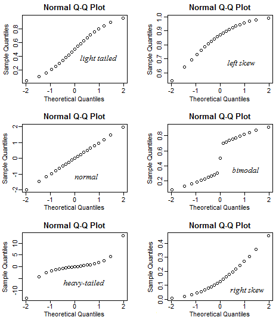

# Diagramme : QQ-Plot {#qqplot}


*Ce chapitre est à l'origine une contribution de [hao871563506](https://github.com/hao871563506){target="_blank"}*

*En cours de progression. Toute amélioration est la bienvenue. Si vous souhaitez participer rendez vous sur [contribuer au repo](contribute.html).*


## Introduction
En statistiques, un Q-Q (quantile-quantile) plot est une méthode graphique pour comparer deux distributions de probabilité en affachant leur quantiles contre quantiles. Un point (x,y) du graphique représente un quantile de la seconde distribution (axe y) contre le même quantile de la première distribution (axe x). Ainsi la droite est une courbe paramétrique dont le paramètre est le nombre d'intervalle des quantiles.


## Interpretation des qqplots

## Normal ou pas (example avec qqnorm)

### qqplot normal

```r
x <- rnorm(1000, 50, 10)
qqnorm(x)
qqline(x, col = "red")
```


Les points semblent s'aligner le long de la droite. Remarquez que sur l'axe des x il s'agit des quantiles théoriques. Ces quantiles sont ceux de la distribution normale centrée réduite.

### qqplot non-normal

```r
x <- rexp(1000, 5)
qqnorm(x)
qqline(x, col = "red")
```


Remarquez que les forment une courbe et non pas une droite. Un Q-Q plot normal qui ressemble à ça indique que votre échantillon est biaisé (skewed en anglais)

## Différents genre de qqplots
Le graphique suivant est une compilation des différents types de qqplots.

*via [Stack Exchange](https://stats.stackexchange.com/questions/101274/how-to-interpret-a-qq-plot/){target="_blank"}*

- **Normal qqplot**: La distribution normale est symétrique, donc aucun biais (skew) (la moyenne est égale à la médiane).

- **Right skewed qqplot**: Right-skew aussi appelé positive skew.

- **Left skewed qqplot**: Left-skew aussi appelé negative skew.

- **Light tailed qqplot**: Cela veut dire que comparé à la distribution normale il y a un peu plus de données dans les extrémités que dans le centre de la distribution.

- **Heavy tailed qqplot**: Cela veut dire que comparé à la distribution normale il y a un beaucoup plus de données dans les extrémités que dans le centre de la distribution.

- **Biomodel qqplot**: illustre une distribution bimodale.


## qqplot avec ggplot
Pour faire un qqplot avec `ggplot2` on doit utiliser un dataframe, ainsi nous commençons par convertir notre structure de données. On peut voir qu'avec ggplot le qqplot donne un résultat similaire à celui obtenu en utilisant qqnorm.

```r
library(ggplot2)
x <- rnorm(1000, 50, 10)
x <- data.frame(x)
ggplot(x, aes(sample = x)) +
  stat_qq() +
  stat_qq_line()
```


Néanmoins, si on a besoin d'afficher différents groupes, ggplot est très utile et permet une coloration par facteurs.

```r
library(ggplot2)
ggplot(mtcars, aes(sample = mpg, colour = factor(cyl))) +
  stat_qq() +
  stat_qq_line()
```


## References
- [Understanding Q-Q Plots](https://data.library.virginia.edu/understanding-q-q-plots/){target="_blank"}: Une discussion de  University of Virginia Library sur les qqplots.
- [How to interpret a QQ plot](https://stats.stackexchange.com/questions/101274/how-to-interpret-a-qq-plot){target="_blank"}: Une autre ressource sur l'interprétation des qqplots.
- [A QQ Plot Dissection Kit](http://seankross.com/2016/02/29/A-Q-Q-Plot-Dissection-Kit.html){target="_blank"}: Une excellente revue exhaustive des qqplots par Sean Kross.
- [Probability plotting methods for the analysis of data](https://www.jstor.org/stable/2334448?seq=1#metadata_info_tab_contents){target="_blank"}: Article sur les techniques d'affichage notamment pour les qqplots. (Wilk, M.B.; Gnanadesikan, R. (1968))
- [QQ-Plot Wiki](https://en.wikipedia.org/wiki/Q%E2%80%93Q_plot#cite_note-1){target="_blank"}: Wikipedia sur les qqplots

