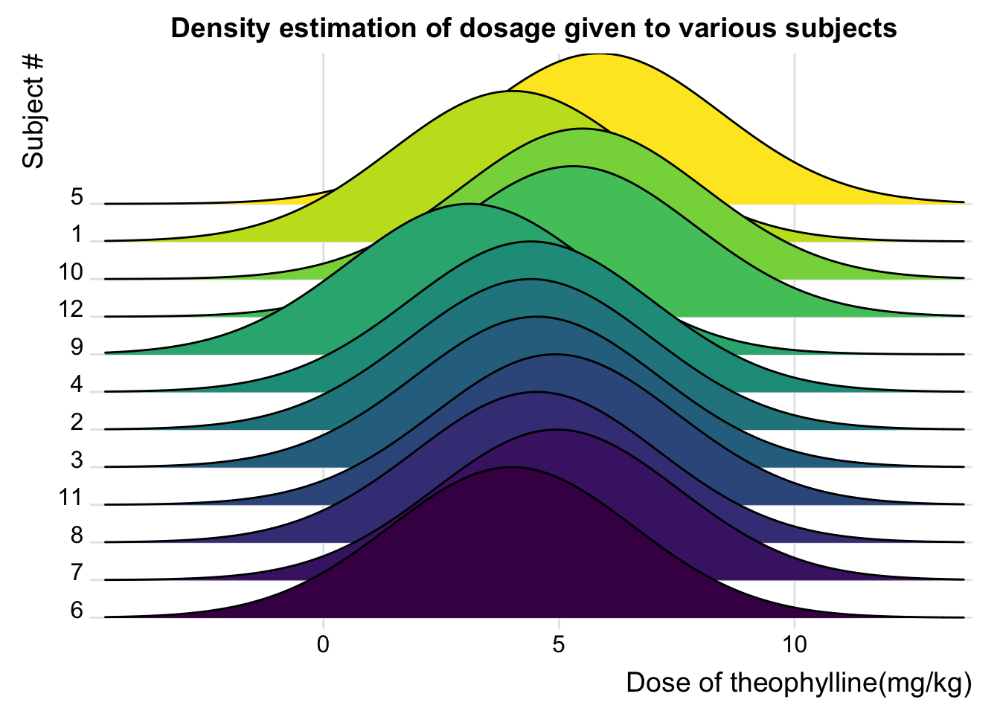
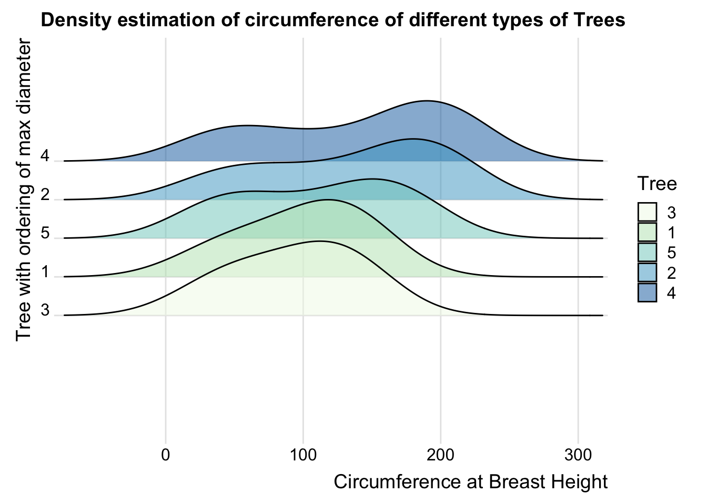
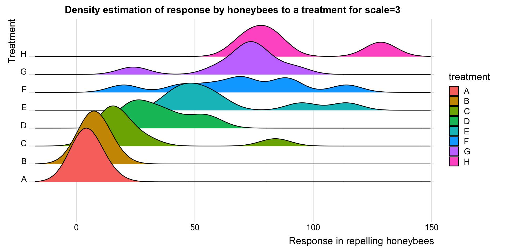
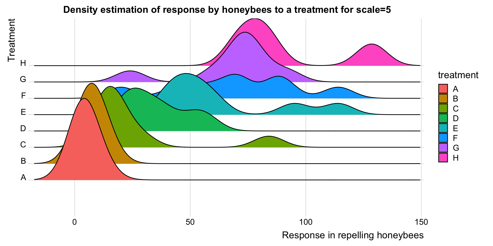
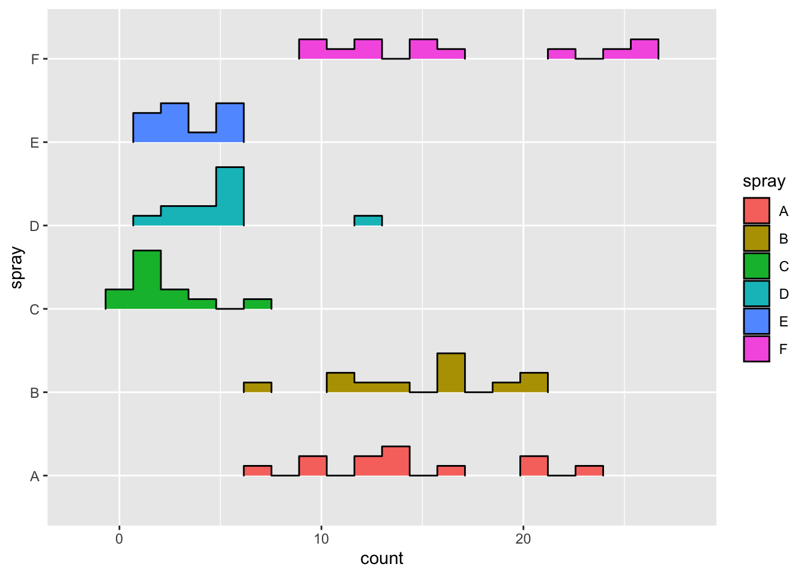
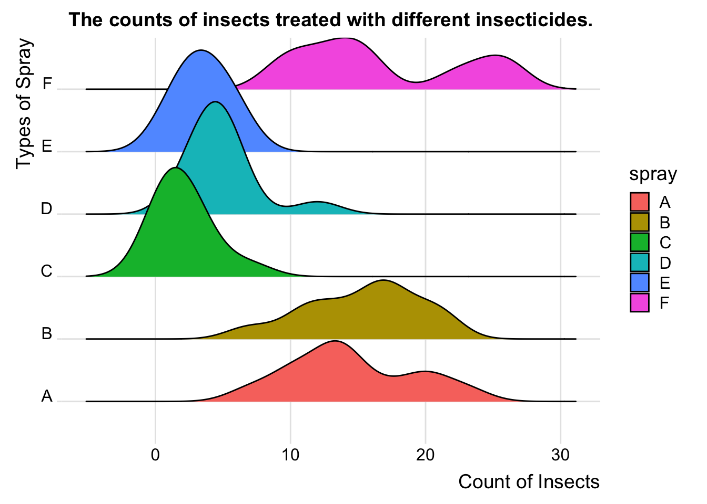

# Diagramme : Ridgeline Plots {#ridgeline}


*Ce chapitre est à l'origine une contribution de [nehasaraf1994](https://github.com/nehasaraf1994){target="_blank"}*

*En cours de progression. Toute amélioration est la bienvenue. Si vous souhaitez participer rendez vous sur [contribuer au repo](contribute.html).*


 
## Avant-propos

Cette section vous apprendra comment construire un ridgeline plot. 
 
## tl;dr

Je veux un exemple sympa et je le veux tout de suite, maintenant !!

Ici, on observe la concentration theophylline d'un jeu de donnée portant sur les doses de theophylline administrées oralement à des sujets.


 
Voici le code :


```r
library("ggridges")
library("tidyverse")
Theoph_data <- Theoph
ggplot(Theoph_data, aes(x=Dose,y=Subject,fill=Subject))+
  geom_density_ridges_gradient(scale = 4, show.legend = FALSE) + theme_ridges() +
  scale_y_discrete(expand = c(0.01, 0)) +
  scale_x_continuous(expand = c(0.01, 0)) +
  labs(x = "Dose of theophylline(mg/kg)",y = "Subject #") +
  ggtitle("Density estimation of dosage given to various subjects") +
  theme(plot.title = element_text(hjust = 0.5))
```
 

For more info on this dataset, type `?datasets::Theoph` into the console.
 
## Exemple simple
 
Okay...plus simple svp.
 
Utilisons le jeu de données `Orange` du package `datasets` :


```r
library("datasets")
head(Orange, n=5)
```

```
## Grouped Data: circumference ~ age | Tree
##   Tree  age circumference
## 1    1  118            30
## 2    1  484            58
## 3    1  664            87
## 4    1 1004           115
## 5    1 1231           120
```

## Ridgeline Plots avec ggridge


```r
library("ggridges")
library("tidyverse")
ggplot(Orange, aes(x=circumference,y=Tree,fill = Tree))+
  geom_density_ridges(scale = 2, alpha=0.5) + theme_ridges()+
  scale_fill_brewer(palette = 4)+
  scale_y_discrete(expand = c(0.8, 0)) +
  scale_x_continuous(expand = c(0.01, 0))+
  labs(x="Circumference at Breast Height", y="Tree with ordering of max diameter")+
  ggtitle("Density estimation of circumference of different types of Trees")+
  theme(plot.title = element_text(hjust = 0.5))
```



`ggridge` utilise des utilises deux geoms particulières pour faire des ridgeline density plots : "geom_density_ridges" et "geom_ridgeline". Ils sont utilisés pour afficher des densités de variables catégorielles et regarder leur distribution sur un axe lui continue.

## Quand utiliser ?
 
Les ridgeline plots peuvent être utilisés lorsque vous devez afficher différentes partie des données sur un même axe. Ce graphique présente ces différentes grandeurs avec un petit chevauchement. Les ridgeline plots sont très utiles pour visualiser la distribution d'une variable catégorielle au cours du temps ou l'espace.

Un bon exemple d'utilisation des ridgeline plots est la distribution des salaires au sein de différentes entreprises.

## Considerations
 
Le niveau de chevauchement peut être contrôlé en ajustant la valeur de l'echelle (scale en anglais). L'echelle vous permet de choisir à quel point le plus haut pique de la courbe du bas peut toucher la courbe du haut.


```r
library("ggridges")
library("tidyverse")
OrchardSprays_data <- OrchardSprays
ggplot(OrchardSprays_data, aes(x=decrease,y=treatment,fill=treatment))+
  geom_density_ridges_gradient(scale=3) + theme_ridges()+
  scale_y_discrete(expand = c(0.3, 0)) +
  scale_x_continuous(expand = c(0.01, 0))+
  labs(x="Response in repelling honeybees",y="Treatment")+
  ggtitle("Density estimation of response by honeybees to a treatment for scale=3")+
  theme(plot.title = element_text(hjust = 0.5))
```



```r
ggplot(OrchardSprays_data, aes(x=decrease,y=treatment,fill=treatment))+
  geom_density_ridges_gradient(scale=5) + theme_ridges()+
  scale_y_discrete(expand = c(0.3, 0)) +
  scale_x_continuous(expand = c(0.01, 0))+
  labs(x="Response in repelling honeybees",y="Treatment")+
  ggtitle("Density estimation of response by honeybees to a treatment for scale=5")+
  theme(plot.title = element_text(hjust = 0.5))
```



Les ridgeline plots peuvent être aussi utilisé pour afficher des histogrammes plutôt que des density plots. Mais cette pratique ne vous donnera très probablement pas des résultats intéressants.


```r
library("ggridges")
library("tidyverse")
ggplot(InsectSprays, aes(x = count, y = spray, height = ..density.., fill = spray)) + 
  geom_density_ridges(stat = "binline", bins = 20, scale = 0.7, draw_baseline = FALSE)
```



Si on fait la même chose avec des ridgeline plots, c'est quand même mieux.


```r
library("ggridges")
library("tidyverse")
ggplot(InsectSprays, aes(x=count,y=spray,fill=spray))+
  geom_density_ridges_gradient() + theme_ridges()+
  labs(x="Count of Insects",y="Types of Spray")+
  ggtitle("The counts of insects treated with different insecticides.")+
  theme(plot.title = element_text(hjust = 0.5))
```



## Ressources externes

- [Introduction to ggridges](https://cran.r-project.org/web/packages/ggridges/vignettes/introduction.html){target="_blank"}:  Une excellente collection d'exemple de code sur comment réaliser des ridgeline plots avec `ggplot2`. Cela couvre tous les paramètres de ggridges et comment les modifier pour avoir une meilleure visualisation. Si vous voulez personaliser votre ridgeline plot cet article vous aidera certainement.

- [Article on ridgeline plots with ggplot2](https://rdrr.io/cran/ggridges/man/geom_density_ridges.html){target="_blank"}: Quelques exemples. Un bon point de départ pour les ridgeline plots.

- [History of Ridgeline plots](https://blog.revolutionanalytics.com/2017/07/joyplots.html){target="_blank"}: Théorie des ridgeline plots.

