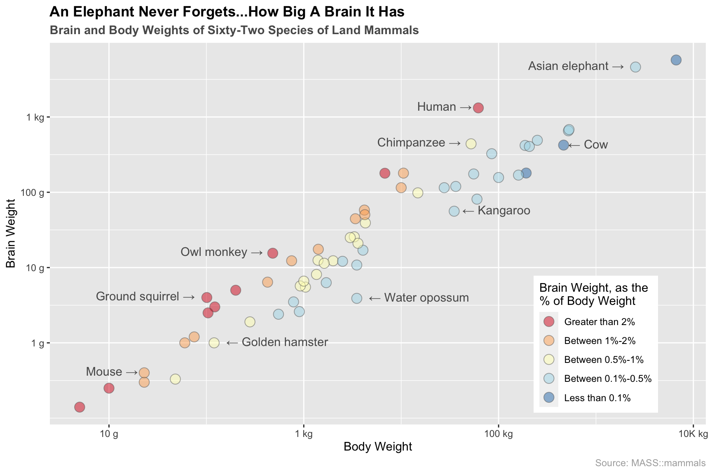
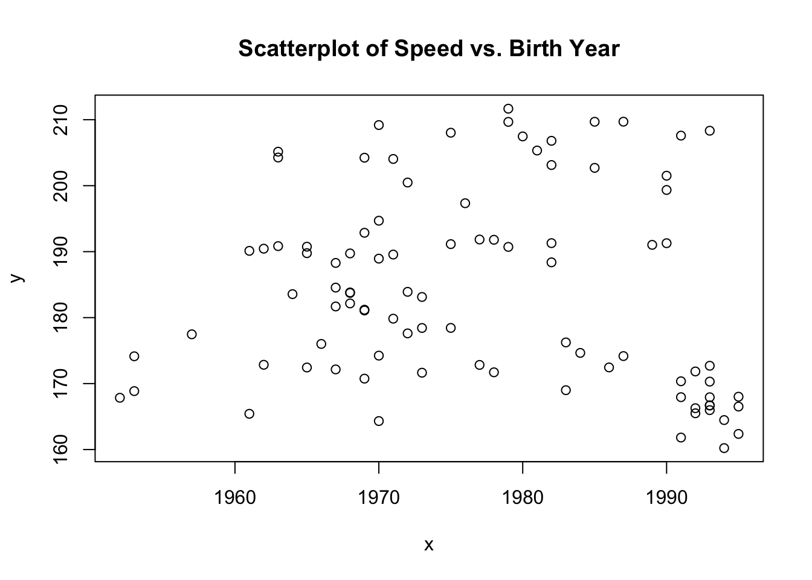
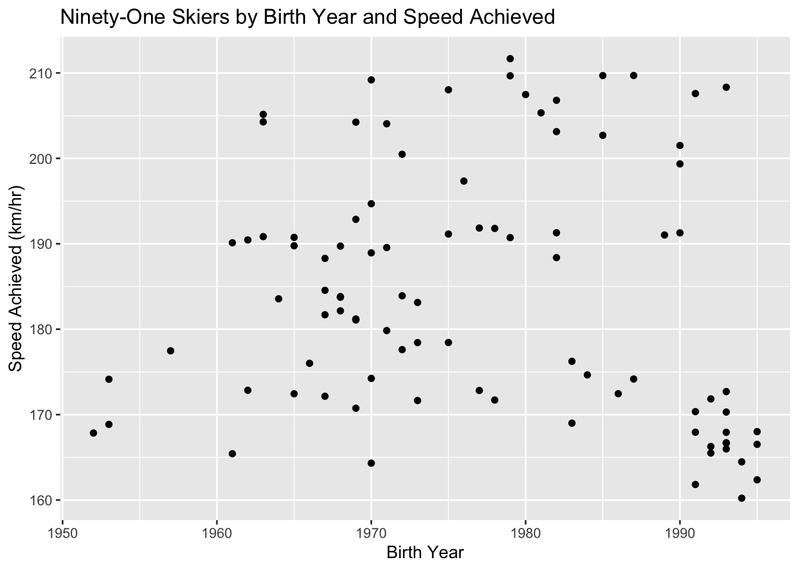
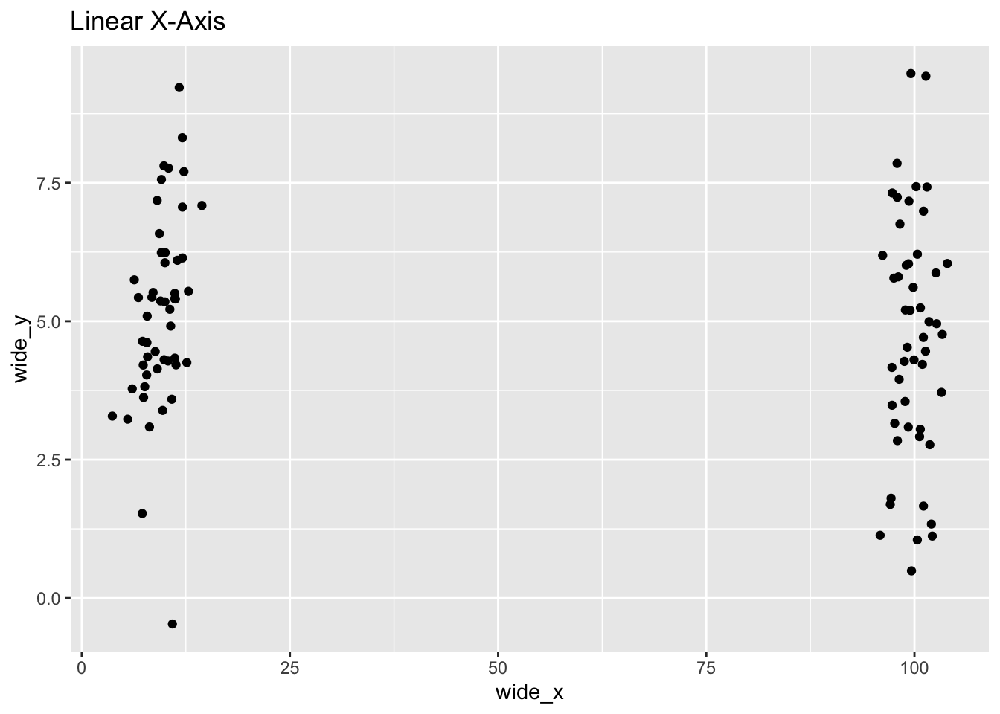
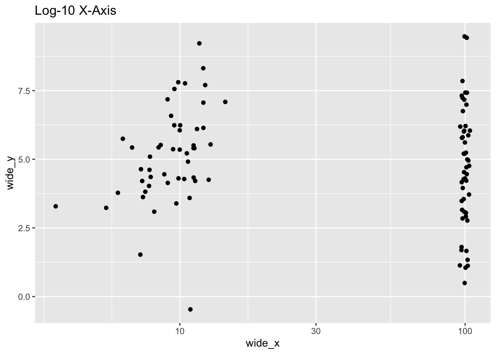
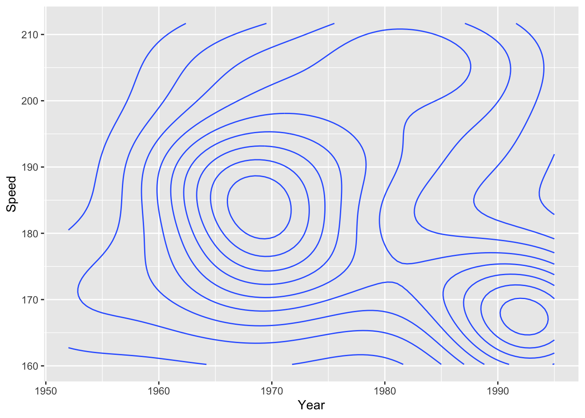
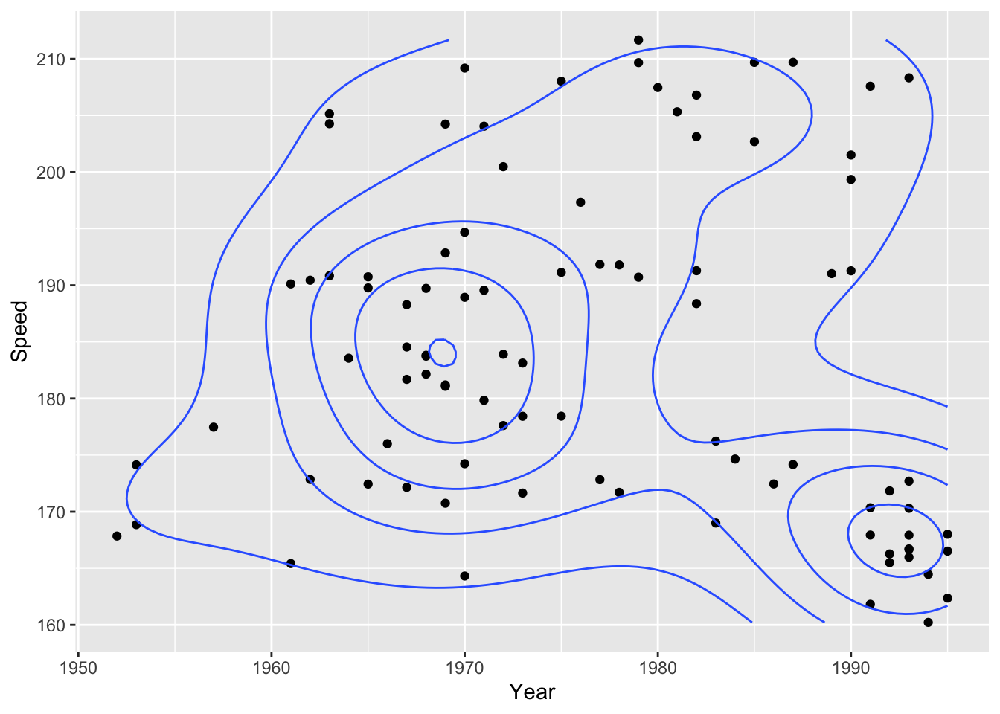
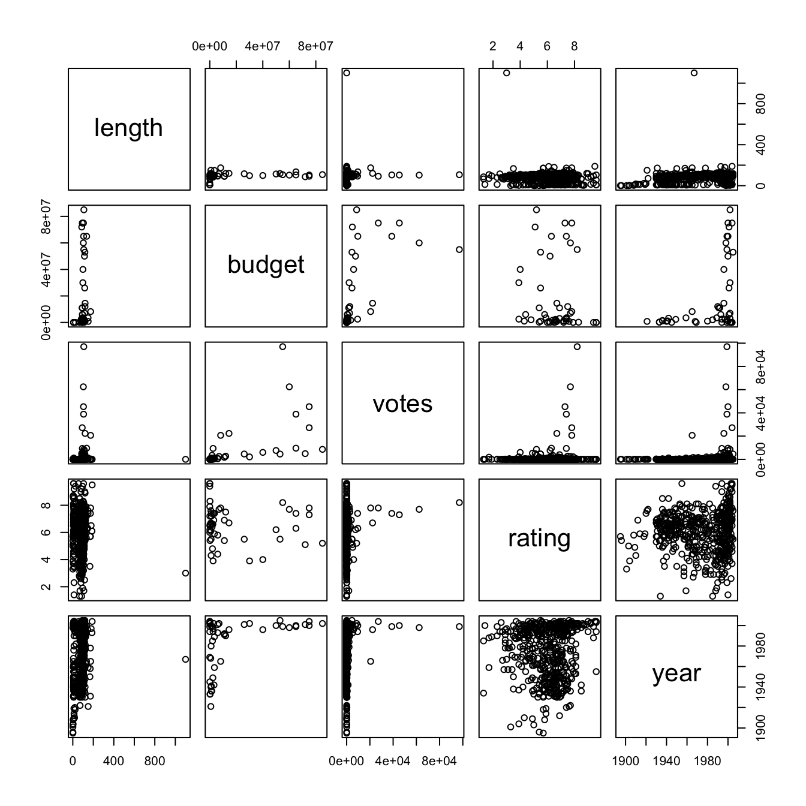
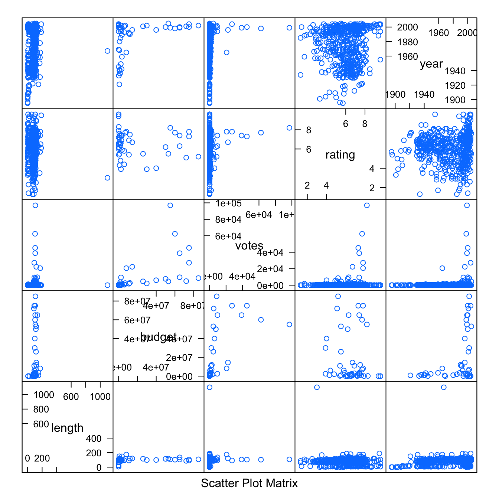

# (PART) Multivariate Continuous {-}

# Diagramme : Scatterplot {#scatter}


## Avant-propos

Cette section présente comment construire un scatterplot (nuage de points en français).

## tl;dr
Un exemple cool MAINTENANT! Je veux, je veux, JE VEUX !

<!-- Explanation: -->
On s'interesse ici à la relation entre le poids du cerveau et le poids du corps de 62 espèces de mamifères terrestres :



Voici le code :

```r
library(MASS) # data
library(ggplot2) # plotting

# ratio for color choices
ratio <- mammals$brain / (mammals$body*1000)

ggplot(mammals, aes(x = body, y = brain)) + 
  # plot points, group by color
  geom_point(aes(fill = ifelse(ratio >= 0.02, "#0000ff",
                   ifelse(ratio >= 0.01 & ratio < 0.02, "#00ff00", 
                   ifelse(ratio >= 0.005 & ratio < 0.01, "#00ffff",
                   ifelse(ratio >= 0.001 & ratio < 0.005, "#ffff00", "#ffffff"))))), 
             col = "#656565", alpha = 0.5, size = 4, shape = 21) +
  # add chosen text annotations
  geom_text(aes(label = ifelse(row.names(mammals) %in% c("Mouse", "Human", "Asian elephant", "Chimpanzee", "Owl monkey", "Ground squirrel"),
                               paste(as.character(row.names(mammals)), "→", sep = " "),'')),
            hjust = 1.12, vjust = 0.3, col = "grey35") +
  geom_text(aes(label = ifelse(row.names(mammals) %in% c("Golden hamster", "Kangaroo", "Water opossum", "Cow"), 
                               paste("←", as.character(row.names(mammals)), sep = " "),'')),
            hjust = -0.12, vjust = 0.35, col = "grey35") +
  # customize legend/color palette
  scale_fill_manual(name = "Brain Weight, as the\n% of Body Weight",
                    values = c('#d7191c','#fdae61','#ffffbf','#abd9e9','#2c7bb6'),
                    breaks = c("#0000ff", "#00ff00", "#00ffff", "#ffff00", "#ffffff"),
                    labels = c("Greater than 2%", "Between 1%-2%", "Between 0.5%-1%", "Between 0.1%-0.5%", "Less than 0.1%")) +
  # formatting
  scale_x_log10(name = "Body Weight", breaks = c(0.01, 1, 100, 10000),
                labels = c("10 g", "1 kg", "100 kg", "10K kg")) +
  scale_y_log10(name = "Brain Weight", breaks = c(1, 10, 100, 1000),
                labels = c("1 g", "10 g", "100 g", "1 kg")) +
  ggtitle("An Elephant Never Forgets...How Big A Brain It Has", 
          subtitle = "Brain and Body Weights of Sixty-Two Species of Land Mammals") +
  labs(caption = "Source: MASS::mammals") +
  theme(plot.title = element_text(face = "bold")) +
  theme(plot.subtitle = element_text(face = "bold", color = "grey35")) +
  theme(plot.caption = element_text(color = "grey68")) +
  theme(legend.position = c(0.832, 0.21))
```

Pour plus d'info sur le jeu de données, tapez `?MASS::mammals` dans le terminal. 

Et si ça vous rend fou de ne pas savoir quelle espèce est dans le coin en haut à droite, c'est une autre éléphant. Plus précisement c'est un éléphant africain. Il n'oublie jamais à quel point son cerveau est grand. <i class="far fa-smile-beam"></i>

## Exemples simples
<!-- Simplify Note -->
C'était *trop* sophistiqué ! Plus simple svp !
 
<!-- Simple Explanation of Data: -->
Utilisons le jeu de données `SpeedSki` du package `GDAdata` pour regarder comment la vitesse atteinte par les participants est reliée à leur année de naissance :

```r
library(GDAdata)

head(SpeedSki, n = 7)
```

```
##   Rank Bib FIS.Code                 Name Year Nation  Speed  Sex     Event
## 1    1  61     7039       ORIGONE Simone 1979    ITA 211.67 Male Speed One
## 2    2  59     7078         ORIGONE Ivan 1987    ITA 209.70 Male Speed One
## 3    3  66   190130       MONTES Bastien 1985    FRA 209.69 Male Speed One
## 4    4  57     7178 SCHROTTSHAMMER Klaus 1979    AUT 209.67 Male Speed One
## 5    5  69   510089         MAY Philippe 1970    SUI 209.19 Male Speed One
## 6    6  75     7204          BILLY Louis 1993    FRA 208.33 Male Speed One
## 7    7  67     7053       PERSSON Daniel 1975    SWE 208.03 Male Speed One
##   no.of.runs
## 1          4
## 2          4
## 3          4
## 4          4
## 5          4
## 6          4
## 7          4
```

### Scatterplot de base en R

```r
x <- SpeedSki$Year
y <- SpeedSki$Speed
# plot data
plot(x, y, main = "Scatterplot of Speed vs. Birth Year")
```



<!-- Base R Plot Explanation -->
Les scatterpolts de base en R sont faciles à faire. Tout ce dont vous avez besoin c'est deux variables que vous vouler représenter. Bien que les scatterplots sont faisables avec des données catégorielles, les variables avec lesquelles vous travaillerez dans ce cadre seront générallement continues.

### Scatterplot avec ggplot2

```r
library(GDAdata) # data
library(ggplot2) # plotting

# main plot
scatter <- ggplot(SpeedSki, aes(Year, Speed)) + geom_point()

# show with trimmings
scatter +
  labs(x = "Birth Year", y = "Speed Achieved (km/hr)") +
  ggtitle("Ninety-One Skiers by Birth Year and Speed Achieved")
```



<!-- ggplot2 explanation -->
`ggplot2` permets de créer facilement des scatterplots. En utilisant `geom_point()`,  vous pouvez aisément afficher deux types différents d'aesthetic en un graphique. C'est aussi très simple de les personnaliser pour les rendre plus jolis (tout ce qui est vraiment nécessaire c'est les données, l'aesthetic et la geom).

## Théorie

Les scatterplots sont vraiment utiles pour comprendre les correlations (ou pas) entre des variables. Par exemple dans la [section 13.2](scatter.html#tldr-7) vous pourrez remarquer la correlation positive entre le poids du cerveau et le poids du corps des differentes espèces de mammifères terrestres. Le scatterplot donne généralement une bonne idée pour savoir si un corrélation est positive ou négative (si tant est qu'elle existe). Néanmoins il ne faut pas confondre corrélation et causalité dans un scatterplot !

Ci-dessous, différentes variations sur les scatterplots qui peuvent être utilisé pour améliorer l'interpretabilité.

<!-- *Link to textbook -->
*   Pour plus d'info sur comment ajouter des lignes, contours, comparer des grouper et afficher des variables continues regarder [Chapter 5](http://www.gradaanwr.net/content/ch05/){target="_blank"} du livre.

## Quand utiliser ?
<!-- Quick Note on When to use this plot -->
Les scatterplots sont bien pour étudier les liens entre les différentes variables. Fondamentalement, si vous vous interessez au lien qui unissent différentes variables, les scatterplots sont un bon point de départ.

## Considérations

<!-- *   List of things to pay attention to with examples -->
### Chevauchement des données.
Les données avec des valeurs similaires vont se chevaucher dans un scatterplot et cela peut conduire à des problèmes. Vous pourrez pour cela au choix essayer le [alpha blending](iris.html#aside-example-where-alpha-blending-works) ou le [jittering](iris.html#second-jittering) (liens vers le [chevauchement](iris.html#overlapping-data) de la section sur [Iris Walkthrough](iris.html)).

### Changement d'échelle
N'oubliez pas que le changement d'échelle peut modifier la perception des données :

```r
library(ggplot2)
num_points <- 100
wide_x <- c(rnorm(n = 50, mean = 100, sd = 2), 
            rnorm(n = 50, mean = 10, sd = 2))
wide_y <- rnorm(n = num_points, mean = 5, sd = 2)
df <- data.frame(wide_x, wide_y)
  
ggplot(df, aes(wide_x, wide_y)) +
  geom_point() +
  ggtitle("Linear X-Axis")
```



```r
ggplot(df, aes(wide_x, wide_y)) +
  geom_point() +
  ggtitle("Log-10 X-Axis") +
  scale_x_log10()
```



## Modifications

### Lignes de contours
<!-- blurb -->
Les lignes de contour donnent en un regard une compréhension de la densité..

Pour ces contour maps, on va utiliser le jeu de données `SpeedSki`.

Les lignes de contour peuvent être afficher en utilisant `geom_density_2d()`:

```r
ggplot(SpeedSki, aes(Year, Speed)) + 
  geom_density_2d() 
```



Les lignes de contour marchent d'autant mieux lorsqu'elles sont combinées aux autres couches :

```r
ggplot(SpeedSki, aes(Year, Speed)) + 
  geom_point() + 
  geom_density_2d(bins = 5)
```



### Matrices de scatterplot
Si vous souhaitez comparer de multiples paramètres les uns par rapport aux autres vous pourrez untiliser une matrice de scatterplots. Cela vous permettra de mettre en exergue de multiples comparaisons de façon compact et efficaces.

Pour ces matrices de scatterplot, on va utiliser le jeu de données `movies` du package `ggplot2movies`.

Par défaut la fonction R de base `plot()` crée une matrice de scatterplots lorsque de multiples variables sont données en entrée :

```r
library(ggplot2movies) # data
library(dplyr) # manipulation

index <- sample(nrow(movies), 500) #sample data
moviedf <- movies[index,] # data frame

splomvar <- moviedf %>% 
  dplyr::select(length, budget, votes, rating, year)

plot(splomvar)
```



Bien que cela peut être très utile lors d'une exploration personnelle des données, ce n'est **pas** recommender pour une présentation. L'[Hermann grid illusion](https://en.wikipedia.org/wiki/Grid_illusion){target="_blank"} rend ces graphiques très durs à examiner.

Pour palier ce problème, utilisez la fonction `splom()` du package `lattice` :

```r
library(lattice) #sploms

splom(splomvar)
```



## Ressources externes
<!-- - []](){target="_blank"}: Links to resources with quick blurb -->
- [Quick-R article](https://www.statmethods.net/graphs/scatterplot.html){target="_blank"} sur les scatterplots de base en R. Du simple au plus sophistiqué avec notamment des matruces, de la haut densité et des versions 3D
- [STHDA Base R](http://www.sthda.com/english/wiki/scatter-plots-r-base-graphs){target="_blank"}: article sur les scatterplots de base en R. Plus d'exmple pour améliorer un graphe.
- [STHDA ggplot2](http://www.sthda.com/english/wiki/ggplot2-scatterplot-easy-scatter-plot-using-ggplot2-and-r-statistical-software){target="_blank"}: articles sur les scatterplots via `ggplot2`. Très bon pour le formattage et les options dispoinibles pour le facetting.
- [Stack Overflow](https://stackoverflow.com/questions/15624656/label-points-in-geom-point){target="_blank"} sur comment labeliser des points avec `geom_point()`
- [ggplot2 cheatsheet](https://www.rstudio.com/wp-content/uploads/2015/03/ggplot2-cheatsheet.pdf){target="_blank"}: Toujours bon d'y jeter un oeil.


