# Thèmes et Palettes {#themes}


*Ce chapitre a été réalisé dans le cadre d'une collaboration communautaire crée par [ar3879](https://github.com/Akanksha1Raj){target="_blank"}*
  
  *Cette page est un travail en cours. Nous apprécions tout commentaire ou feedback. Si vous souhaitez améliorer cette page, vous pouvez [participer à notre repo](contribute.html).


## Vue d'ensemble
 
  Nos graphiques doivent non seulement être informatifs mais aussi esthétiques pour obtenir l'attention de notre public. Les thèmes et les couleurs utilisées ont un rôle important à jouer quant à l'esthétique des graphiques.
 
  Cette section explique comment utiliser différentes palettes et thèmes selon le contexte et comment rendre nos graphiques cools.
  
## Thèmes ggplot2
  
   `ggplot2` offre un ensemble de thème que nous pouvons choisir pour nos graphiques. Vous trouverez ci-dessous une brève description de chacun: 
  
  * `theme_gray()`: thème signature de `ggplot2`
  * `theme_bw()`: thème noir et blanc de `ggplot2`
  * `theme_linedraw()`: lignes noires sur fond blanc uniquement
  * `theme_light()`: similaire à `linedraw()` mais avec des lignes grises également
  * `theme_dark()`: lignes sur un fond foncé plutôt que clair 
  * `theme_minimal()`: pas d'annotations sur le fond du graphique
  * `theme_classic()`: thème sans grillage 
  * `theme_void()`: thème vide sans aucun élément
  
### exemples de thèmes ggplot 
  

```r
q <- ggplot(subset, aes(x = clarity, y = carat, color = cut)) +
  geom_point(size = 2.5,alpha = 0.75) 

q + theme_minimal()
```

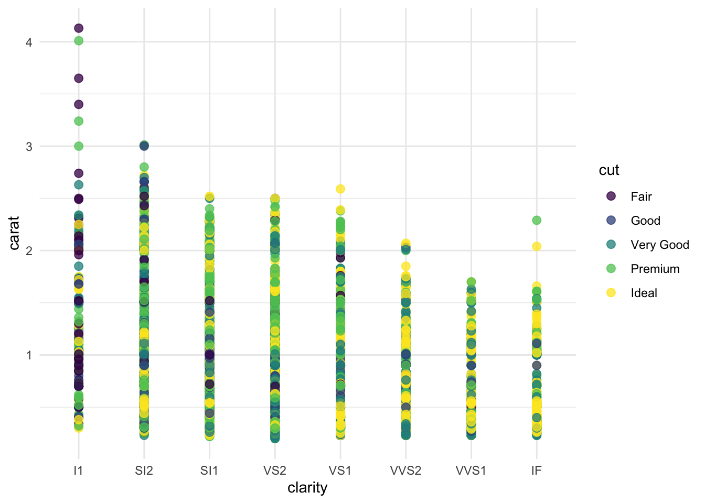
  
  Il y a plusieurs autres packages disponibles qui permettent de modifier les thèmes et couleurs de plusieurs façons différentes. Nous discuterons 4 d'entre-eux. 
  
  1. RColorBrewer
  2. ggthemes
  3. ggthemr
  4. ggsci
  
  
## RColorBrewer 
  
Souvent, on cherche des couleurs qui rendront notre graphique clair et cool.

RColorBrewer offre une multitude de palettes que nous pouvons utiliser en fonction du contexte de notre graphique. Il y a **trois** catégories de palettes: *Sequential*, *Diverging* et *Qualitative*.


```r
q <- ggplot(subset, aes(x = clarity, y = carat, color = cut)) +
  geom_point(size = 2.5, alpha = 0.75) 
```

- **Sequential Palette**: Cette palette représente la nuance de la couleur, de clair à foncé. On l'utilise en général pour représenter un interval de données pour lequel les valeurs basses seront représentées par une couleur claire et les valeurs élevées par une couleur foncée. On citera comme exemples: Blues, BuPu, YlGn, Reds, OrRd.


```r
q + scale_colour_brewer(palette = "Blues")
```

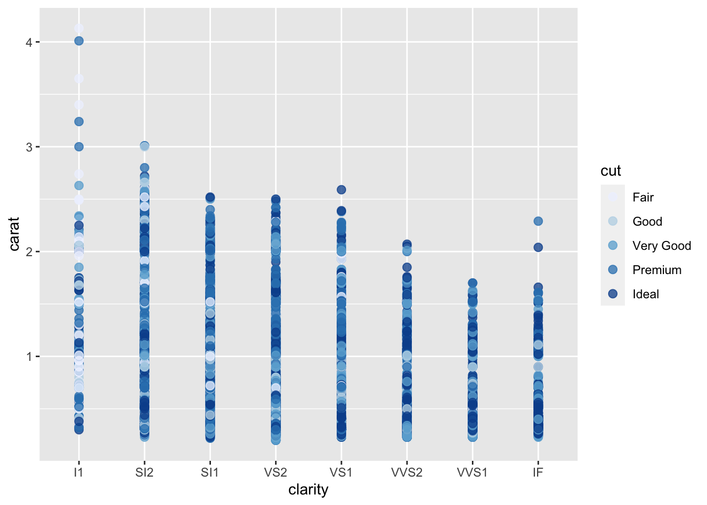

- **Diverging Palette**: Cette palette présente trois couleurs ou plus qui divergent totalement (par exemple du bleu, du blanc et du rouge) pour permettre d'établir des contrastes entre données plus facilement. On citera par exemple:Spectral, RdGy, PuOr


```r
q + scale_colour_brewer(palette = "PuOr")
```

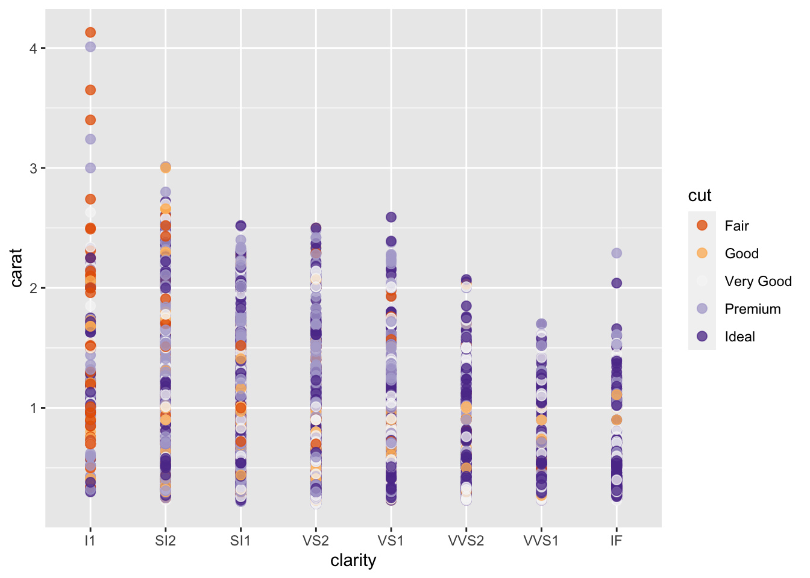

- **Qualitative Palette**: Cette palette est généralement utilisée lorsque l'on veut souligner les différences entre classes de variables (variables catégorielles). On citera par exemple: set1, set2, set3, pastel1, pastel2 , dark2.
  

```r
q + scale_colour_brewer(palette = "Pastel1")
```

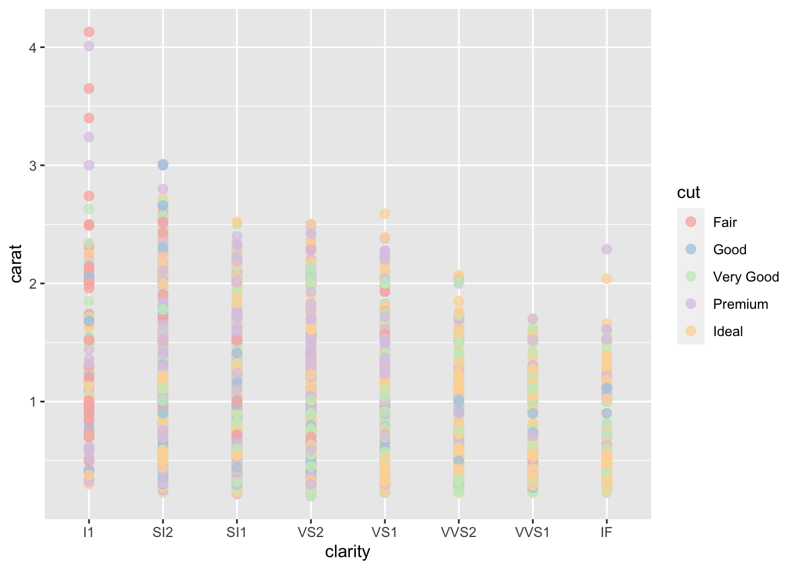

## ggthemes

**ggthemes** élargit le choix de geoms, scales et thèmes de `ggplot2`. Certains sont vraiment très sympas! On peut changer le thème et la couleur du graphique en fonction du contexte. 


```r
g1 <- ggplot(subset, aes(x = clarity, y = carat, color = cut)) +
  geom_point(size = 2.5,alpha = 0.75) 
```

### exemples de ggthemes


```r
g1 + theme_economist() + scale_colour_economist()
```

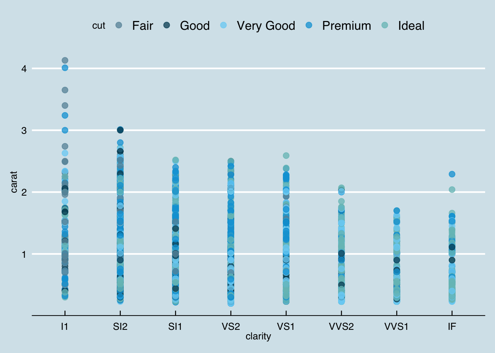


```r
g1 + theme_igray() + scale_colour_tableau()
```

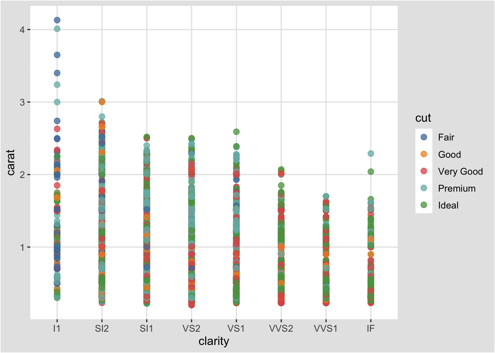


```r
g1 + theme_wsj() + scale_color_wsj()
```

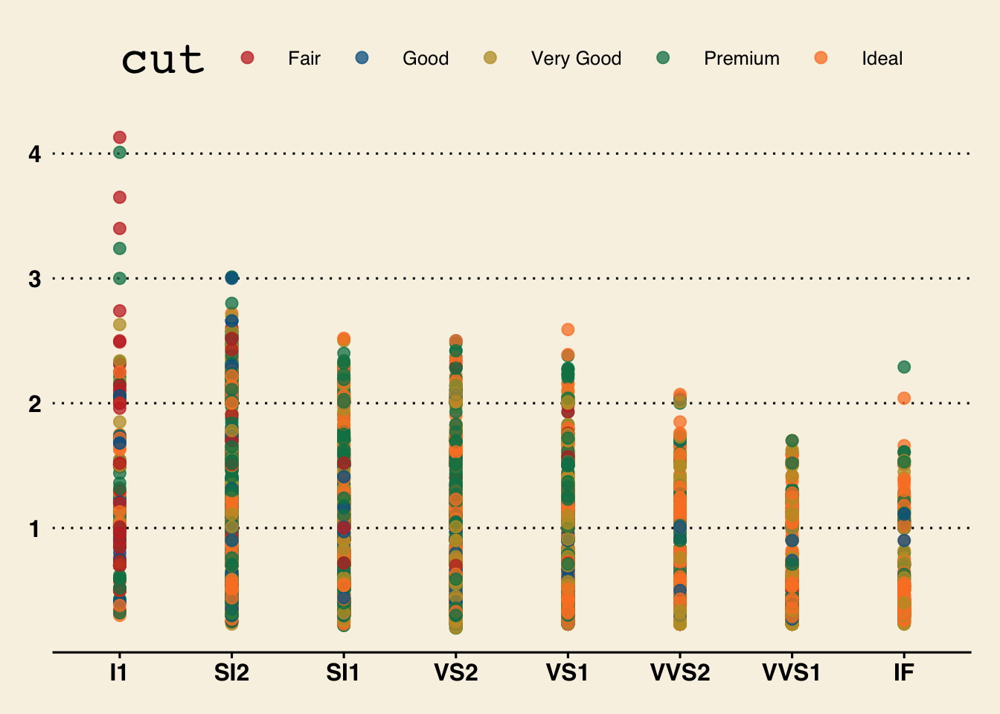


```r
g1 + theme_igray() + scale_colour_colorblind()
```

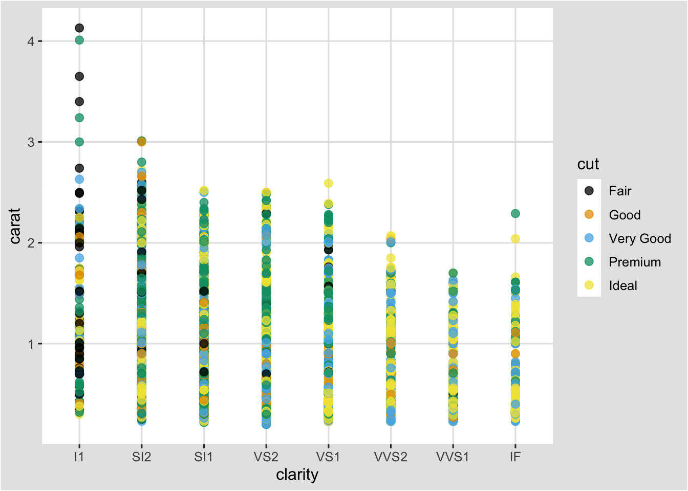

Si on veut utiliser ces couleurs dans nos graphiques mais qu'il n'est pas possible d'utiliser `ggthemes`, on peut utiliser le package `scales` pour trouver quelles couleurs ont été utilisées dans une palette donnée. Par exemple: 


```r
show_col(colorblind_pal()(6))
```

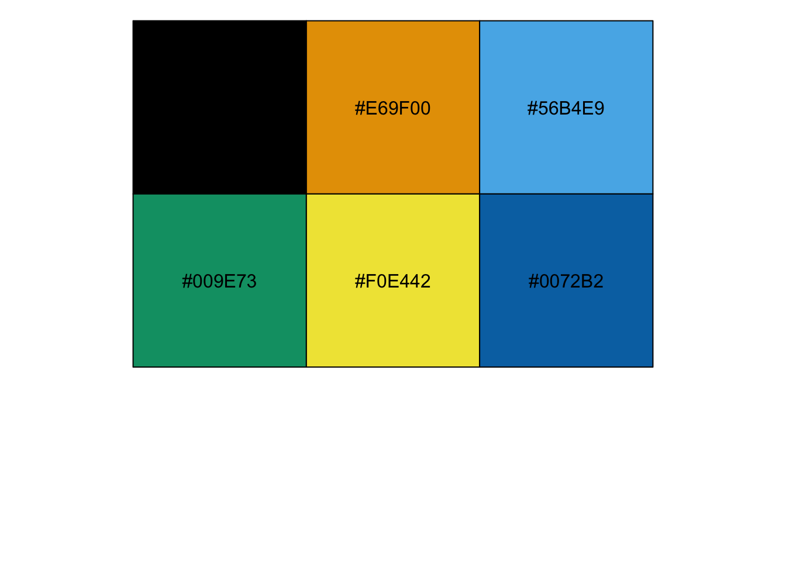

## ggthemr

**ggthemr** est utilisé pour déterminer le thème des graphiques ggplot. Il y a 17 thèmes différents pour changer la façon de présenter un graphique ggplot. L'utilisation de ggthemr est cependant différente des autres packages: on décide du thème *avant* de l'utiliser. 

### exemples ggthemr 


```r
ggthemr("sky")
```

```
## Warning: New theme missing the following elements: axis.ticks.length.x,
## axis.ticks.length.x.top, axis.ticks.length.x.bottom, axis.ticks.length.y,
## axis.ticks.length.y.left, axis.ticks.length.y.right, plot.title.position,
## plot.caption.position
```

```r
ggplot(subset, aes(x = clarity, y = carat, color = cut)) +
  geom_point(size = 2.5, alpha = 0.75)
```

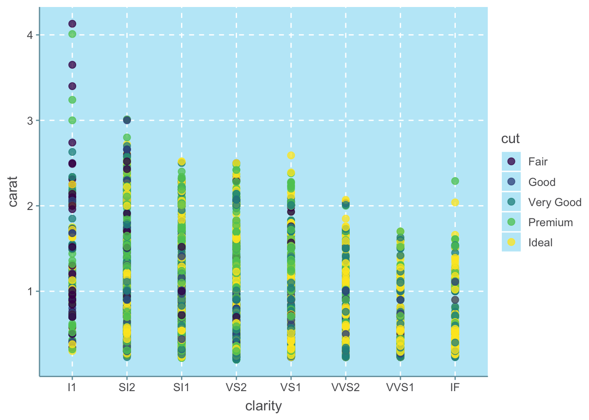


```r
ggthemr("flat")
```

```
## Warning: New theme missing the following elements: axis.ticks.length.x,
## axis.ticks.length.x.top, axis.ticks.length.x.bottom, axis.ticks.length.y,
## axis.ticks.length.y.left, axis.ticks.length.y.right, plot.title.position,
## plot.caption.position
```

```r
ggplot(subset, aes(x = clarity, y = carat, color = cut)) +
  geom_point(size = 2.5, alpha = 0.75)
```

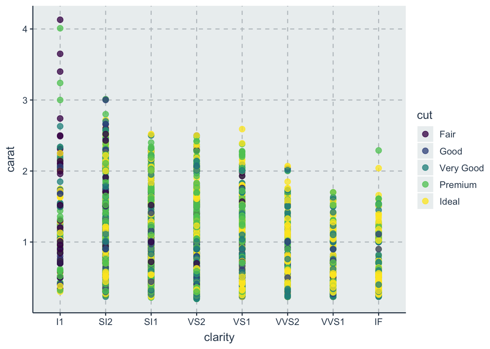

On peut également définir plus de paramètres pour changer les thèmes:


```r
ggthemr("lilac", type = "outer", layout = "scientific", spacing = 2)
```

```
## Warning: New theme missing the following elements: axis.ticks.length.x,
## axis.ticks.length.x.top, axis.ticks.length.x.bottom, axis.ticks.length.y,
## axis.ticks.length.y.left, axis.ticks.length.y.right, plot.title.position,
## plot.caption.position
```

```r
ggplot(subset, aes(x = clarity, y = carat, color = cut)) +
  geom_point(size = 2.5, alpha = 0.75)
```

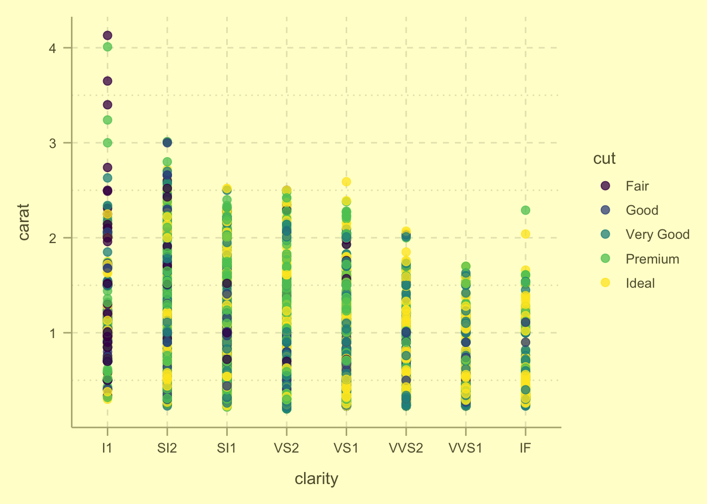

## ggsci

**ggsci** offers a number of palettes inspired by colors used in scientific journals, science fiction movies, and TV shows. For continous data, `scale_fill_material(colname)` is used, and for discrete data, `scale_color_palname()` or `scale_fill_palname()` are used. 

**ggsci** offrent un nombre de palettes inspirées de couleurs utilisées dans les journaux scientifiques, films de science fiction et séries télévisées. Pour des données continues, on utilise `scale_fill_material()` et pour des données discères, `scale_color_palname()` ou `scale_fill_palname()` sont utilisées. 

### ggsci pour données discrètes


```r
# we need to remove the theme set previously if we don't want to use it anymore
ggthemr_reset()

g1 <- ggplot(subset, aes(x = clarity, y = carat, color = cut)) +
  geom_point(size = 2.5, alpha = 0.75)

g1 + scale_color_startrek()
```

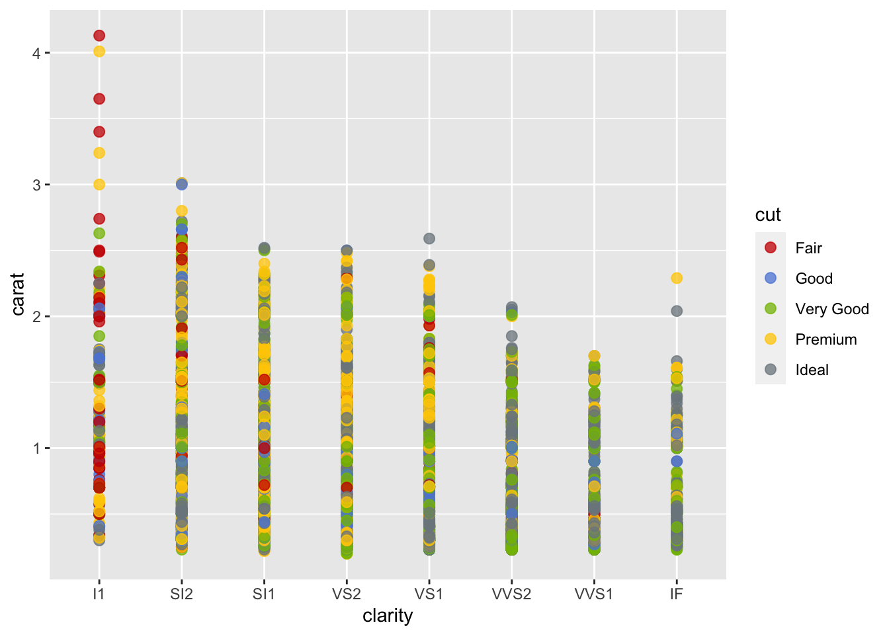


```r
g1 + scale_color_jama()
```

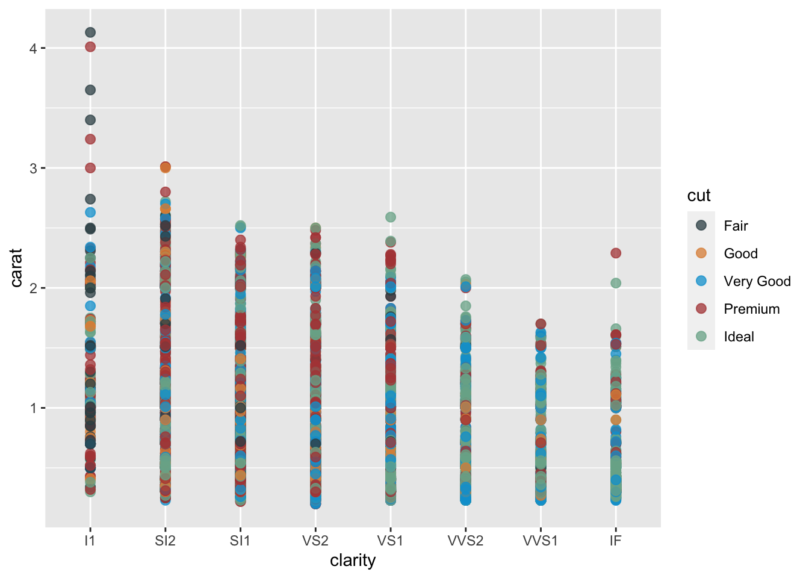


```r
g1 + scale_color_locuszoom()
```

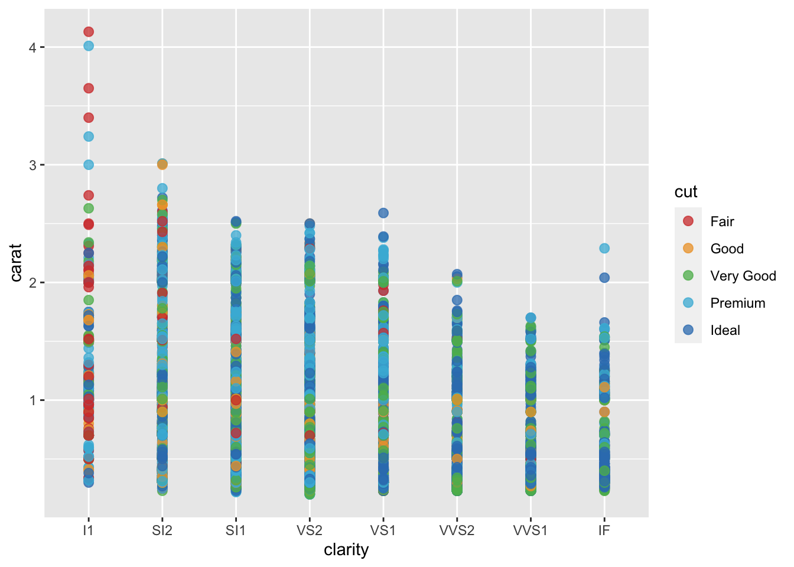

### ggsci pour données continues


```r
ggplot(diamonds, aes(carat, price)) +
  geom_hex(bins = 20, color = "red") +
  scale_fill_material("orange")
```

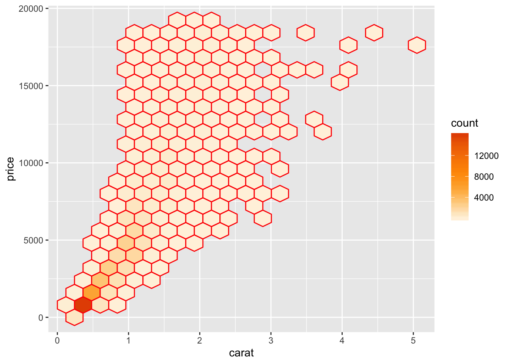

On peut aussi retrouver la couleur utilisée afin de la réutiliser dans d'autres graphiques créés avec base R: 


```r
palette = pal_lancet("lanonc", alpha = 0.7)(9)
show_col(palette)
```

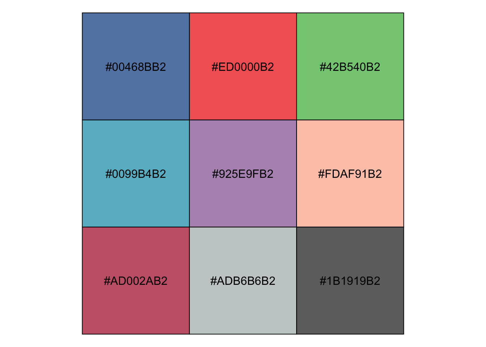

## Ressources externes 

- [RColorBrewer](https://data.library.virginia.edu/setting-up-color-palettes-in-r/){target="_blank"}: Setting up Color Palettes in R
- [ggthemes](https://yutannihilation.github.io/allYourFigureAreBelongToUs/ggthemes/){target="_blank"}: Github page containing more examples 
- [ggthemr](https://github.com/cttobin/ggthemr){target="_blank"}: Github Repository of the package
- [ggsci](https://cran.r-project.org/web/packages/ggsci/vignettes/ggsci.html){target="_blank"}: Scientific Journal and Sci-Fi Themed Color Palettes for ggplot2
