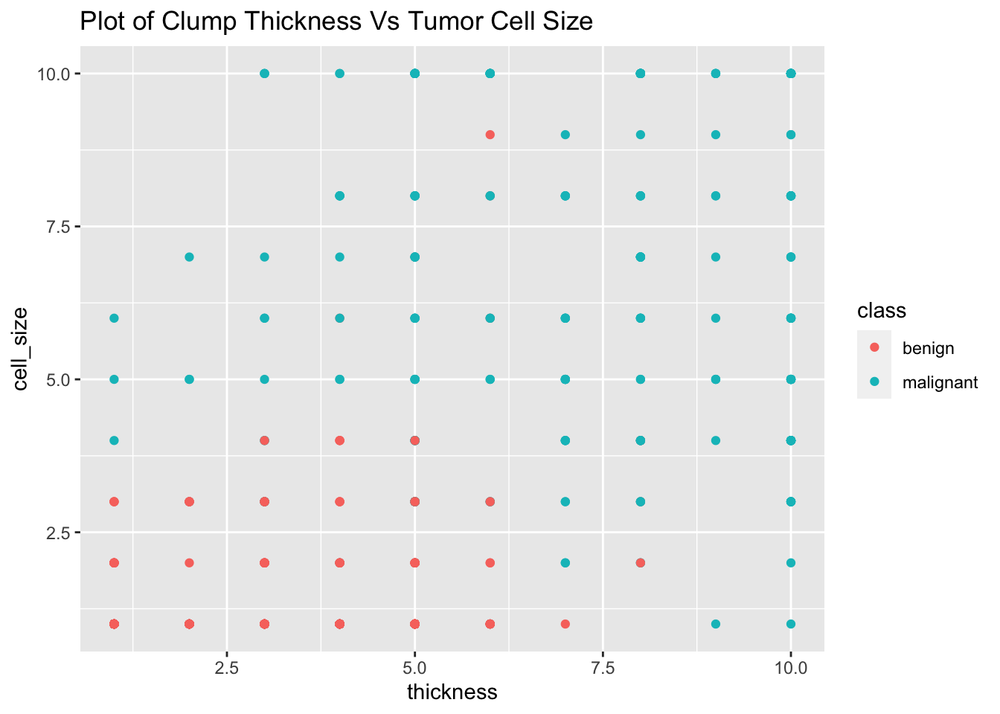

# Revue détaillée : Tidy Data & dplyr {#tidy}


*Ce chapitre est à l'origine une contribution communautaire de [akshatapatel](https://github.com/akshatapatel){target="_blank"}*

*En cours de progression. Toute amélioration est la bienvenue. Si vous souhaitez participer rendez vous sur [contribuer au repo](contribute.html).*


## Vue d'ensemble

Cet exemple présente certains travaux avec le jeu de données `biopsy` en utilisant les fonctions de `dplyr` pour obtenir un tidy dataset.

### Les packages 

* [`dplyr`](https://www.rdocumentation.org/packages/dplyr){target="_blank"}
* [`MASS`](https://www.rdocumentation.org/packages/MASS/versions/7.3-51.1){target="_blank"}
* [`tidyr`](https://www.rdocumentation.org/packages/tidyr/versions/0.8.2){target="_blank"}


## Installer les packages
Écrivez le statements suivant dans le console:

* `install.packages('dplyr')`
* `install.packages('ggplot2')`
* `install.packages('tidyr')`
* `install.packages('MASS')` 

**Remarque**: Les trois premiers packages font partie de **tidyverse**, une collection de packages utiles dans R, qui peuvent tous être installés à l'aide de `install.packages('tidyverse')`.

`dplyr` est utilisé pour le formattage et la transformation des données dans un dataframe. Le "d" dans "dplyr" signifie "dataframes" qui est la structure de données la plus utilisée pour stocker des jeux de données dans R.

## Voir les données
Commençons par charger le package afin que nous puissions obtenir les données dans des dataframes :

```r
#loading the dplyr library
library(dplyr)

#loading data from MASS:biopsy
library(MASS)
class(biopsy)
```

```
## [1] "data.frame"
```


```r
#glimpse is a part of the dplyr package
glimpse(biopsy)
```

```
## Observations: 699
## Variables: 11
## $ ID    <chr> "1000025", "1002945", "1015425", "1016277", "1017023", "10…
## $ V1    <int> 5, 5, 3, 6, 4, 8, 1, 2, 2, 4, 1, 2, 5, 1, 8, 7, 4, 4, 10, …
## $ V2    <int> 1, 4, 1, 8, 1, 10, 1, 1, 1, 2, 1, 1, 3, 1, 7, 4, 1, 1, 7, …
## $ V3    <int> 1, 4, 1, 8, 1, 10, 1, 2, 1, 1, 1, 1, 3, 1, 5, 6, 1, 1, 7, …
## $ V4    <int> 1, 5, 1, 1, 3, 8, 1, 1, 1, 1, 1, 1, 3, 1, 10, 4, 1, 1, 6, …
## $ V5    <int> 2, 7, 2, 3, 2, 7, 2, 2, 2, 2, 1, 2, 2, 2, 7, 6, 2, 2, 4, 2…
## $ V6    <int> 1, 10, 2, 4, 1, 10, 10, 1, 1, 1, 1, 1, 3, 3, 9, 1, 1, 1, 1…
## $ V7    <int> 3, 3, 3, 3, 3, 9, 3, 3, 1, 2, 3, 2, 4, 3, 5, 4, 2, 3, 4, 3…
## $ V8    <int> 1, 2, 1, 7, 1, 7, 1, 1, 1, 1, 1, 1, 4, 1, 5, 3, 1, 1, 1, 1…
## $ V9    <int> 1, 1, 1, 1, 1, 1, 1, 1, 5, 1, 1, 1, 1, 1, 4, 1, 1, 1, 2, 1…
## $ class <fct> benign, benign, benign, benign, benign, malignant, benign,…
```

```r
head(biopsy)
```

```
##        ID V1 V2 V3 V4 V5 V6 V7 V8 V9     class
## 1 1000025  5  1  1  1  2  1  3  1  1    benign
## 2 1002945  5  4  4  5  7 10  3  2  1    benign
## 3 1015425  3  1  1  1  2  2  3  1  1    benign
## 4 1016277  6  8  8  1  3  4  3  7  1    benign
## 5 1017023  4  1  1  3  2  1  3  1  1    benign
## 6 1017122  8 10 10  8  7 10  9  7  1 malignant
```

## Qu'est ce qu'une Tidy data?
**Qu'est-ce que cela signifie pour vos données d'être *tidy* ?**

**Tidy data** est un format normalisé et constitue une manière cohérente d'organiser vos données dans R.

Voici la définition d'une Tidy Data donnée par Hadley Wickham :

>Un ensemble de données est ordonné our desordonné selon la manière dont les lignes, les colonnes et les tableaux correspondent aux observations, aux variables et aux types. Une tidy data :
>
>* Chaque variable forme une colonne.
>
>* Chaque observation forme une ligne.
>
>* Chaque unité d'observation est une valeur dans la table.
>
*Voir [r4ds on tidy data](https://r4ds.had.co.nz/tidy-data.html){target="_blank"} pour plus d'info.*

**Quels sont les avantages des tidy data?**

* Uniformité : il est plus facile d'apprendre les outils pour travailler avec ces données car elles sont stockées de façon cohérentes.

* La plupart des fonctions de base en R utilisent des vecteurs de valeurs. Ainsi, avoir des variables en tant que colonnes/vecteurs permet à la nature vectorielle de R de briller.

**Pouvez-vous observer et dire pourquoi ces données sont en désordre ?**

* Les noms de colonnes tels que V1, V2 ne sont pas intuitifs dans leur contexte; c'est bon signe que la donnée est untidy.

* Ce ne sont pas des variables différentes, mais des valeurs d'une variable commune.

Nous allons maintenant voir comment transformer nos données en utilisant les fonctions de `dplyr` et ensuite voir comment comment rendre plus propre ces données.

## Tibbles

Un **tibble** est une structure moderne du dataframe.

Ceci est particulièrement utile pour les grands ensembles de données car *il n'imprime que les premières lignes*. Cela vous aide à faire face plus tôt aux problèmes, ce qui vous permet de nettoyer le code.

```r
# Converting a df to a tibble
biopsy <- tbl_df(biopsy)
biopsy
```

```
## # A tibble: 699 x 11
##    ID         V1    V2    V3    V4    V5    V6    V7    V8    V9 class    
##    <chr>   <int> <int> <int> <int> <int> <int> <int> <int> <int> <fct>    
##  1 1000025     5     1     1     1     2     1     3     1     1 benign   
##  2 1002945     5     4     4     5     7    10     3     2     1 benign   
##  3 1015425     3     1     1     1     2     2     3     1     1 benign   
##  4 1016277     6     8     8     1     3     4     3     7     1 benign   
##  5 1017023     4     1     1     3     2     1     3     1     1 benign   
##  6 1017122     8    10    10     8     7    10     9     7     1 malignant
##  7 1018099     1     1     1     1     2    10     3     1     1 benign   
##  8 1018561     2     1     2     1     2     1     3     1     1 benign   
##  9 1033078     2     1     1     1     2     1     1     1     5 benign   
## 10 1033078     4     2     1     1     2     1     2     1     1 benign   
## # … with 689 more rows
```


## Test pour les valeurs manquantes


```r
# Number of missing values in each column in the data frame
colSums(is.na(biopsy))
```

```
##    ID    V1    V2    V3    V4    V5    V6    V7    V8    V9 class 
##     0     0     0     0     0     0    16     0     0     0     0
```

Le jeu de données contient des valeurs manquantes qui doivent être traitées.

## Remplacer les valeurs manquantes
Une façon de traiter les valeurs manquantes consiste à les recoder avec la moyenne de toutes les autres valeurs de cette colonne :

```r
#change all the NAs to mean of the column
biopsy$V6[is.na(biopsy$V6)] <- mean(biopsy$V6, na.rm = TRUE)
colSums(is.na(biopsy))
```

```
##    ID    V1    V2    V3    V4    V5    V6    V7    V8    V9 class 
##     0     0     0     0     0     0     0     0     0     0     0
```

Consultez notre chapitre sur [time series avec données manquantes](missingTS.html) pour plus d'informations sur la gestion des données manquantes.

## Vocabulaire de la manipulation de données
Voici le vocabulaire et les functions les plus couramment utilisés qui aident à manipuler les données et les résumer :

* Rename
* Select
* Mutate
* Filter
* Arrange
* Summarize
* Group_by

Les fonctions **Select** et **mutate** manipulent les *variables* (les colonnes du dataframe). **Filter** et **arrange** manipulent les *observations* (les lignes), enfin **summarize** manipule les *groupes* d'observations.

Toutes les fonctions de `dplyr` travaillent sur une copie des données et renvoient une copie modifiée. Ils ne changent **pas** le dataframe original. Si nous voulons accéder aux résultats par la suite, nous devons enregistrer la copie modifiée.

## Renommage

Les noms des colonnes dans nos données biopsy sont très vagues et ne nous donnent pas signification. Nous devons modifier les noms de la colonne afin qu'une personne extérieur puisse avoir une idée des valeurs auxquelles il fait référence.


```r
rename(biopsy,
       thickness = V1,cell_size = V2,
       cell_shape = V3, marg_adhesion = V4,
       epithelial_cell_size = V5, bare_nuclei = V6,
       chromatin = V7, norm_nucleoli = V8, mitoses = V9)
```

```
## # A tibble: 699 x 11
##    ID    thickness cell_size cell_shape marg_adhesion epithelial_cell…
##    <chr>     <int>     <int>      <int>         <int>            <int>
##  1 1000…         5         1          1             1                2
##  2 1002…         5         4          4             5                7
##  3 1015…         3         1          1             1                2
##  4 1016…         6         8          8             1                3
##  5 1017…         4         1          1             3                2
##  6 1017…         8        10         10             8                7
##  7 1018…         1         1          1             1                2
##  8 1018…         2         1          2             1                2
##  9 1033…         2         1          1             1                2
## 10 1033…         4         2          1             1                2
## # … with 689 more rows, and 5 more variables: bare_nuclei <dbl>,
## #   chromatin <int>, norm_nucleoli <int>, mitoses <int>, class <fct>
```

Le tibble présenté ci-dessus n'est pas enregistré et ne peut plus être utilisé. Pour l'utiliser ensuite, nous l'enregistrons comme un nouveau tibble :

```r
#saving the rename function output
biopsy_new<-rename(biopsy,
       thickness = V1,cell_size = V2,
       cell_shape = V3, marg_adhesion = V4,
       epithelial_cell_size = V5, bare_nuclei = V6,
       chromatin = V7, norm_nucleoli = V8, mitoses = V9)

head(biopsy_new,5)
```

```
## # A tibble: 5 x 11
##   ID    thickness cell_size cell_shape marg_adhesion epithelial_cell…
##   <chr>     <int>     <int>      <int>         <int>            <int>
## 1 1000…         5         1          1             1                2
## 2 1002…         5         4          4             5                7
## 3 1015…         3         1          1             1                2
## 4 1016…         6         8          8             1                3
## 5 1017…         4         1          1             3                2
## # … with 5 more variables: bare_nuclei <dbl>, chromatin <int>,
## #   norm_nucleoli <int>, mitoses <int>, class <fct>
```

Le dataframe `biopsy_new` peut maintenant être utilisé pour d'autres manipulations.

## Select
**Select** renvoie un sous-ensemble des données. Plus précisément, seules les colonnes spécifiées sont incluses.

Dans les données biopsy, nous n’avons pas besoin des variables "chromatin" et "mitoses". Alors, éliminons-les en utilisant un signe moins:

```r
#selecting all except the columns chromatin and mitoses
biopsy_new<-select(biopsy_new,-chromatin,-mitoses)

head(biopsy_new,5)
```

```
## # A tibble: 5 x 9
##   ID    thickness cell_size cell_shape marg_adhesion epithelial_cell…
##   <chr>     <int>     <int>      <int>         <int>            <int>
## 1 1000…         5         1          1             1                2
## 2 1002…         5         4          4             5                7
## 3 1015…         3         1          1             1                2
## 4 1016…         6         8          8             1                3
## 5 1017…         4         1          1             3                2
## # … with 3 more variables: bare_nuclei <dbl>, norm_nucleoli <int>,
## #   class <fct>
```

## Mutate
La fonction **mutate** crée de nouvelles variables à partir des variables déjà existantes et les ajoute à l'ensemble de données. Il indique que les données déjà contenues mais n’ont jamais été affichées.

La variable "V6" contient les valeurs du bare nucleus de 1,00 à 10,00. Si nous voulons normaliser la variable, nous pouvons utiliser la fonction mutate :

```r
#normalize the bare nuclei values 
maximum_bare_nuclei<-max(biopsy_new$bare_nuclei,na.rm=TRUE)
biopsy_new<-mutate(biopsy_new,bare_nuclei=bare_nuclei/maximum_bare_nuclei)

head(biopsy_new,5)
```

```
## # A tibble: 5 x 9
##   ID    thickness cell_size cell_shape marg_adhesion epithelial_cell…
##   <chr>     <int>     <int>      <int>         <int>            <int>
## 1 1000…         5         1          1             1                2
## 2 1002…         5         4          4             5                7
## 3 1015…         3         1          1             1                2
## 4 1016…         6         8          8             1                3
## 5 1017…         4         1          1             3                2
## # … with 3 more variables: bare_nuclei <dbl>, norm_nucleoli <int>,
## #   class <fct>
```

## Filter
**Filter** est la fonction soeur de **select** pour les lignes; elle renvoie une copie modifiée qui ne contient que certaines lignes.
Cette fonction *filtre* les ligne en fonction du contenu et des conditions fournies en argument.
La fonction filter prend le dataframe comme premier argument. L'argument suivant contient une ou plusieures conditions logiques. Les lignes/observations qui vérifient ces conditions logiques sont retourné(e)s dans le résultat.

Dans notre example, on veut garder uniquement les données dont les cellules tuméreuses ont une certaine épaisseur. En pratique on garde celles dont l'épaisseur est supérieure à six, puisque la plupart des tumeurs malignes ont cette épaisseur dans le graphique d'épaisseur de cellule en fonction de la taille de cellule tuméreuse, groupé par classe :


```r
library(ggplot2)

ggplot(biopsy_new)+
  geom_point(aes(x=thickness,y=cell_size,color=class))+
  ggtitle("Plot of Clump Thickness Vs Tumor Cell Size")
```




```r
#normalize the bare nuclei values 
biopsy_new<-filter(biopsy_new,thickness>5.5)

head(biopsy_new,5)
```

```
## # A tibble: 5 x 9
##   ID    thickness cell_size cell_shape marg_adhesion epithelial_cell…
##   <chr>     <int>     <int>      <int>         <int>            <int>
## 1 1016…         6         8          8             1                3
## 2 1017…         8        10         10             8                7
## 3 1044…         8         7          5            10                7
## 4 1047…         7         4          6             4                6
## 5 1050…        10         7          7             6                4
## # … with 3 more variables: bare_nuclei <dbl>, norm_nucleoli <int>,
## #   class <fct>
```


## Arrange
**Arrange** réordonne les lignes en fonction de leur contenu dans l'ordre croissant par défaut.

Les médecins voudraient voir les données dans l'ordre de la taille de la tumeur.

```r
#arrange in the order of V2:cell size
arrange(biopsy_new,cell_size)
```

```
## # A tibble: 186 x 9
##    ID    thickness cell_size cell_shape marg_adhesion epithelial_cell…
##    <chr>     <int>     <int>      <int>         <int>            <int>
##  1 1050…         6         1          1             1                2
##  2 1204…         6         1          1             1                2
##  3 1223…         6         1          3             1                2
##  4 5435…         6         1          3             1                4
##  5 63375         9         1          2             6                4
##  6 7529…        10         1          1             1                2
##  7 1276…         6         1          1             3                2
##  8 1238…         6         1          1             3                2
##  9 1257…         6         1          1             1                1
## 10 1224…         6         1          1             1                2
## # … with 176 more rows, and 3 more variables: bare_nuclei <dbl>,
## #   norm_nucleoli <int>, class <fct>
```

Cela montre les données en ordre croissant de la taille de la cellule.

Pour organiser les lignes dans l'ordre décroissant de V2, nous ajoutons la fonction `desc ()` à la variable avant de la passer dans arrange.


```r
#arrange in the order of V2:cell size in decreasing order
arrange(biopsy_new,desc(cell_size))
```

```
## # A tibble: 186 x 9
##    ID    thickness cell_size cell_shape marg_adhesion epithelial_cell…
##    <chr>     <int>     <int>      <int>         <int>            <int>
##  1 1017…         8        10         10             8                7
##  2 1080…        10        10         10             8                6
##  3 1100…         6        10         10             2                8
##  4 1103…        10        10         10             4                8
##  5 1112…         8        10         10             1                3
##  6 1116…         9        10         10             1               10
##  7 1123…         6        10          2             8               10
##  8 1168…        10        10         10            10               10
##  9 1170…        10        10         10             8                2
## 10 1173…        10        10         10             3               10
## # … with 176 more rows, and 3 more variables: bare_nuclei <dbl>,
## #   norm_nucleoli <int>, class <fct>
```

Comme vous pouvez le constater, plusieurs lignes ont la même valeur de `V2:cell_size`. Pour palier ce problème, vous pouvez ajouter une autre variable à utiliser pour l'ordonnencement lorsque la première variable a la même valeur.

Ici nous utilisons V3 pour ordonner : par taille de cellule et pas ID :

```r
#arrange in the order of V2:cell size
biopsy_new<-arrange(biopsy_new,desc(cell_size),desc(cell_shape),ID)

head(biopsy_new,5)
```

```
## # A tibble: 5 x 9
##   ID    thickness cell_size cell_shape marg_adhesion epithelial_cell…
##   <chr>     <int>     <int>      <int>         <int>            <int>
## 1 1017…         8        10         10             8                7
## 2 1073…        10        10         10            10                6
## 3 1080…        10        10         10             8                6
## 4 1100…         6        10         10             2                8
## 5 1100…         6        10         10             2                8
## # … with 3 more variables: bare_nuclei <dbl>, norm_nucleoli <int>,
## #   class <fct>
```

## Summarize & Group By
**Summarize** utilise les données pour créer un nouveau dataframe avec les statistiques récapitulatives telles que le minimum, le maximum, la moyenne, etc. Ces statistiques doivent être des fonctions agrégées qui prennent un vecteur de valeurs en entrée et une valeur unique en sortie.

La fonction **group_by** regroupe les données en fonction des valeurs des variables. Ceci, en plus de summarize, fait des observations des groupes de lignes de l’ensemble de données.

Les médecins voudraient connaître la taille maximale de la cellule et son épaisseur pour chacune des classes : bénigne et maligne. Cela peut être fait en regroupant les données par classe et en recherchant le maximum des variables cherchées :

```r
biopsy_grouped <- group_by(biopsy_new,class)
summarize(biopsy_grouped, max(thickness), mean(cell_size), var(norm_nucleoli))
```

```
## # A tibble: 2 x 4
##   class     `max(thickness)` `mean(cell_size)` `var(norm_nucleoli)`
##   <fct>                <int>             <dbl>                <dbl>
## 1 benign                   8              2.67                 5.93
## 2 malignant               10              6.73                11.3
```

## Pipe Operator
Que faire si nous voulons utiliser les différentes fonctions **ensemble**?

Cela pourrait être fait en sauvegardant le résultat de chaque fonction dans une nouvelle variable et en l'utilisant pour la fonction suivante, comme nous l'avons fait ci-dessus. Cependant, ceci n'est pas recommandé :

1. Cela nécessite une saisie supplémentaire et un code plus long.

2. L'espace inutile est utilisé pour sauvegarder les différentes variables. Si les données sont volumineuses, cette méthode ralentit l’analyse.

L'opérateur **pipe** peut être utilisé à la place pour le même but. L'opérateur est placé entre l'objet et la fonction. Le pipe prend l'objet à sa gauche et le passe comme premier argument de la fonction à sa droite.

Le pipe fait partie du package `magrittr`. Cependant, ce package n'a pas besoin d'être chargé car `dplyr` nous simplifie la vie et l'importe pour nous :

```r
biopsy_grouped <- biopsy_new %>% 
  group_by(class) %>% 
  summarize(max(thickness),mean(cell_size),var(norm_nucleoli))

head(biopsy_grouped)
```

```
## # A tibble: 2 x 4
##   class     `max(thickness)` `mean(cell_size)` `var(norm_nucleoli)`
##   <fct>                <int>             <dbl>                <dbl>
## 1 benign                   8              2.67                 5.93
## 2 malignant               10              6.73                11.3
```


## Nettoyer les données transformées

Regardez encore une fois les données désordonnées :


```r
# Messy Data
head(biopsy_new,5)
```

```
## # A tibble: 5 x 9
##   ID    thickness cell_size cell_shape marg_adhesion epithelial_cell…
##   <chr>     <int>     <int>      <int>         <int>            <int>
## 1 1017…         8        10         10             8                7
## 2 1073…        10        10         10            10                6
## 3 1080…        10        10         10             8                6
## 4 1100…         6        10         10             2                8
## 5 1100…         6        10         10             2                8
## # … with 3 more variables: bare_nuclei <dbl>, norm_nucleoli <int>,
## #   class <fct>
```

La planification est nécessaire pour décider quelles colonnes nous devons garder inchangées, lesquelles modifier et quels noms doivent être donnés aux nouvelles colonnes. Les colonnes à conserver sont celles qui sont déjà tidy. Les colonnes à modifier sont celles qui ne sont pas de vraies variables mais en réalité des niveaux d'une autre variable.

Ainsi, les colonnes `ID` et la `class` sont déjà tidy. Celles-ci sont conservées telles quelles.

Les colonnes `V1:thickness`, `V2:cell_size`, `V3:cell_shape`, `V4:marg_adhesion`, `V5:epithelial_cell_size`, `V6:bare_nuclei`, et `V8:norm_nucleoli` ne sont pas de vraies variables mais des valeurs de la variable `Tumor_attributes`.

Nous pouvons résoudre ce problème avec `tidyr::gather()`, qui est utilisé pour convertir les données messy en tidy. La fonction `gather` prend le dataframe que nous voulons nettoyer entrée. Les deux paramètres suivants sont les noms des colonnes key et value columns du jeu de données tidy.

Dans notre exemple, key = 'Tumor_Atrributes' et value = 'Score'. Vous pouvez également préciser les colonnes que vous ne voulez pas ranger, à savoir ID et class:

```r
#Tidy Data
library(tidyr)
tidy_df <- biopsy_new %>% gather(key = "Tumor_Attributes", value = "Score", -ID, -class)

tidy_df
```

```
## # A tibble: 1,302 x 4
##    ID      class     Tumor_Attributes Score
##    <chr>   <fct>     <chr>            <dbl>
##  1 1017122 malignant thickness            8
##  2 1073960 malignant thickness           10
##  3 1080185 malignant thickness           10
##  4 1100524 malignant thickness            6
##  5 1100524 malignant thickness            6
##  6 1103608 malignant thickness           10
##  7 1112209 malignant thickness            8
##  8 1116116 malignant thickness            9
##  9 1116116 malignant thickness            9
## 10 1168736 malignant thickness           10
## # … with 1,292 more rows
```

## Liens utiles
- [r4ds on tidy data](https://r4ds.had.co.nz/tidy-data.html){target="_blank"}: C'est toujours mieux d'apprendre de la source, ainsi voici le livre écrit par Hadley Wickham.
- [DataCamp dplyr course](https://www.datacamp.com/courses/dplyr-data-manipulation-r-tutorial){target="_blank"}: Ce cours couvre les différentes fonctions de dplyr et comment manipuler les données.

