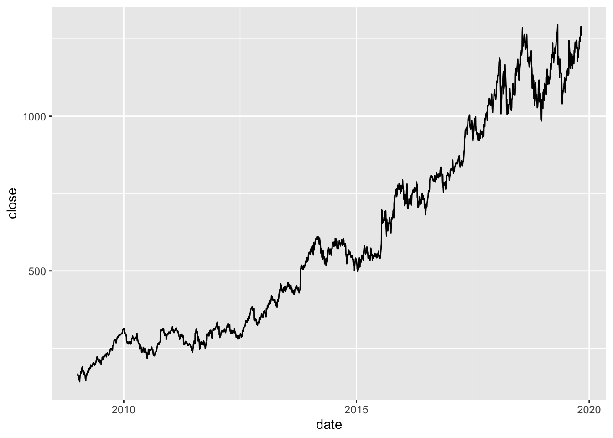
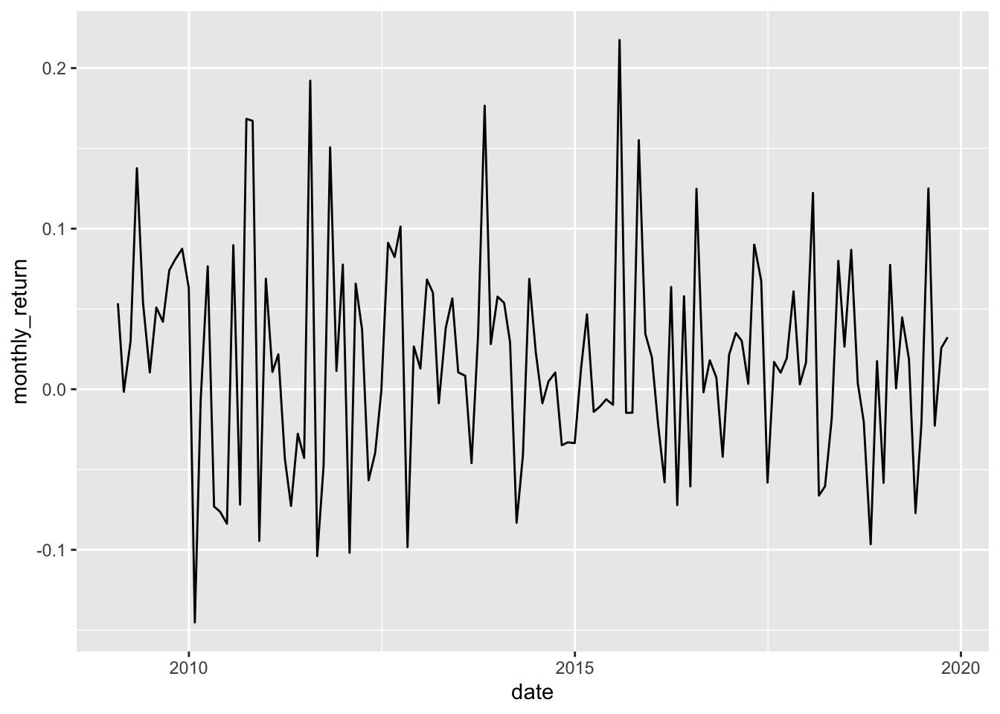
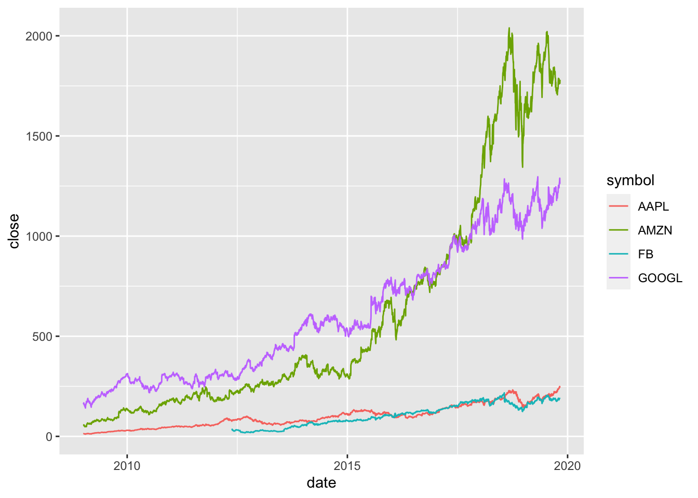
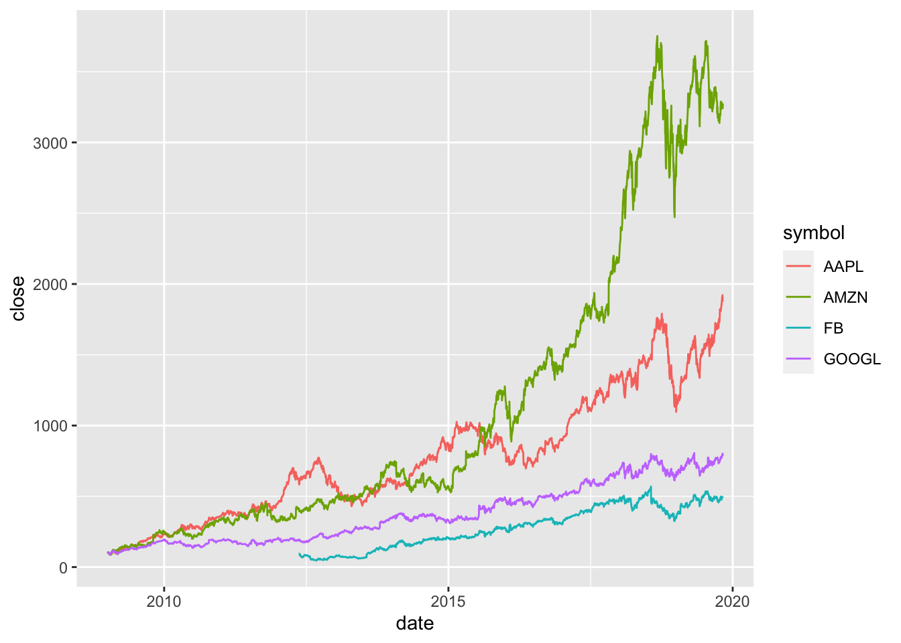
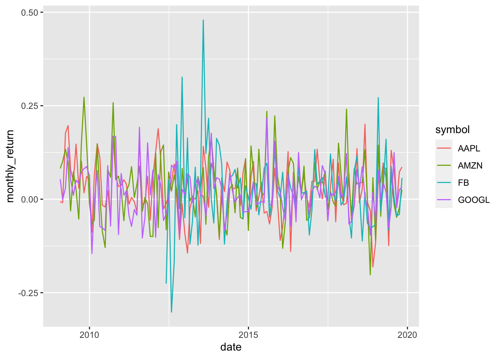

# Stock data with tidyquant {#tidyquant}


*Ce chapitre est à l'origine une contribution communautaire de [naotominakawa](https://github.com/naotominakawa){target="_blank"}*

*En cours de progression. Toute amélioration est la bienvenue. Si vous souhaitez participer rendez vous sur [contribuer au repo](contribute.html).*


## Vue d'ensemble
Cette section explique comment utiliser le package `tidyquant` pour effectuer une analyse de timeseries.

## Qu'est ce que tidyquant ?

`tidyquant` est une solution complète dédiée à l'analyse financière. Il intervient dans l'analyse des données temporelles (timeseries), telles que des données financières ou économiques. `tidyquant` se connecte à diverses sources de données telles que Yahoo! Finance, Morning Star, données de marché Bloomberg, etc. Il se comporte également bien avec les autres packages tels que `Tidyverse`.

## Installer tidyquant
Vous pouvez installer **tidyquant** à partir de CRAN:

```
install.packages("tidyquant")
```

Si vous voulez voir quelles functions sont disponibles, vous pouvez exécuter les commandes suivantes :

```r
# to see which functions are available (not run)
library(tidyquant)
tq_transmute_fun_options()
```

## Simple timeseries
Obtenir des données historiques pour un stock unique (par exemple, Google) :

```r
# get historical data for single stock. e.g. google
library(tidyquant)
tq_get("GOOGL", get="stock.prices")
```

```
## # A tibble: 2,726 x 7
##    date        open  high   low close   volume adjusted
##    <date>     <dbl> <dbl> <dbl> <dbl>    <dbl>    <dbl>
##  1 2009-01-02  154.  161.  153.  161.  7213700     161.
##  2 2009-01-05  161.  166.  158.  164.  9768200     164.
##  3 2009-01-06  167.  171.  163.  167. 12837500     167.
##  4 2009-01-07  164.  166.  160.  161.  8980000     161.
##  5 2009-01-08  159.  163.  159.  163.  7194100     163.
##  6 2009-01-09  164.  164.  157.  158.  8672300     158.
##  7 2009-01-12  158.  160.  155.  157.  6601900     157.
##  8 2009-01-13  156.  160.  155.  157.  8856100     157.
##  9 2009-01-14  155.  157.  149.  151. 10924800     151.
## 10 2009-01-15  149.  152.  144.  150. 11857100     150.
## # … with 2,716 more rows
```

Calculer le retour mensuel de stock unique :

```r
library(dplyr)
# calculate monthly return of single stock
tq_get(c("GOOGL"), get="stock.prices") %>%
  tq_transmute(select=adjusted,
               mutate_fun=periodReturn,
               period="monthly",
               col_rename = "monthly_return")
```

```
## # A tibble: 130 x 2
##    date       monthly_return
##    <date>              <dbl>
##  1 2009-01-30        0.0536 
##  2 2009-02-27       -0.00160
##  3 2009-03-31        0.0298 
##  4 2009-04-30        0.138  
##  5 2009-05-29        0.0537 
##  6 2009-06-30        0.0104 
##  7 2009-07-31        0.0509 
##  8 2009-08-31        0.0420 
##  9 2009-09-30        0.0740 
## 10 2009-10-30        0.0812 
## # … with 120 more rows
```

Créer un line chart du *prix de clôture* pour un stock donné :

```r
# showing closing price for single stock
library(ggplot2)
tq_get(c("GOOGL"), get="stock.prices") %>%
  ggplot(aes(date, close)) +
  geom_line()
```



Créer un line chart du *retour mensuel* pour un stock donné :

```r
# showing monthly return for single stock
tq_get(c("GOOGL"), get="stock.prices") %>%
  tq_transmute(select=adjusted,
               mutate_fun=periodReturn,
               period="monthly",
               col_rename = "monthly_return") %>%
  ggplot(aes(date, monthly_return)) +
  geom_line()
```



## Timeseries multiples
Obtenir des données historiques pour plusieurs actions (par exemple, GAFA) :

```r
# get historical data for multiple stocks. e.g. GAFA
tq_get(c("GOOGL","AMZN","FB","AAPL"), get="stock.prices")
```

```
## # A tibble: 10,053 x 8
##    symbol date        open  high   low close   volume adjusted
##    <chr>  <date>     <dbl> <dbl> <dbl> <dbl>    <dbl>    <dbl>
##  1 GOOGL  2009-01-02  154.  161.  153.  161.  7213700     161.
##  2 GOOGL  2009-01-05  161.  166.  158.  164.  9768200     164.
##  3 GOOGL  2009-01-06  167.  171.  163.  167. 12837500     167.
##  4 GOOGL  2009-01-07  164.  166.  160.  161.  8980000     161.
##  5 GOOGL  2009-01-08  159.  163.  159.  163.  7194100     163.
##  6 GOOGL  2009-01-09  164.  164.  157.  158.  8672300     158.
##  7 GOOGL  2009-01-12  158.  160.  155.  157.  6601900     157.
##  8 GOOGL  2009-01-13  156.  160.  155.  157.  8856100     157.
##  9 GOOGL  2009-01-14  155.  157.  149.  151. 10924800     151.
## 10 GOOGL  2009-01-15  149.  152.  144.  150. 11857100     150.
## # … with 10,043 more rows
```

Créez un multiple line chart des cours de clôture de plusieurs actions (GAFA à nouveau). Nous pouvons afficher chaque action dans une couleur différente sur le même graphique :

```r
# Create a multiple line chart of the closing prices of the four stocks,
# showing each stock in a different color on the same graph.
tq_get(c("GOOGL","AMZN","FB","AAPL"), get="stock.prices") %>%
  ggplot(aes(date, close, color=symbol)) +
  geom_line()
```



Transformer les données pour que chaque stock commence à 100 et réafficher (il s'agit de standardiser les données pour pouvoir comparer les timeseries) :

```r
# Create a multiple line chart of the closing prices of the four stocks,
# showing each stock in a different color on the same graph.
# Transform the data so each stock begins at 100 and replot.
tq_get(c("GOOGL","AMZN","FB","AAPL"), get="stock.prices") %>%
  group_by(symbol) %>%
  mutate(close = 100*close/first(close)) %>%
  ggplot(aes(date, close, color=symbol)) +
  geom_line()
```



Calculez le *retour mensuel* de plusieurs actions (encore une fois, GAFA):

```r
# calculate monthly return of multiple stocks
tq_get(c("GOOGL","AMZN","FB","AAPL"), get="stock.prices") %>%
  group_by(symbol) %>%
  tq_transmute(select=adjusted,
               mutate_fun=periodReturn,
               period="monthly",
               col_rename = "monthly_return")
```

```
## # A tibble: 480 x 3
## # Groups:   symbol [4]
##    symbol date       monthly_return
##    <chr>  <date>              <dbl>
##  1 GOOGL  2009-01-30        0.0536 
##  2 GOOGL  2009-02-27       -0.00160
##  3 GOOGL  2009-03-31        0.0298 
##  4 GOOGL  2009-04-30        0.138  
##  5 GOOGL  2009-05-29        0.0537 
##  6 GOOGL  2009-06-30        0.0104 
##  7 GOOGL  2009-07-31        0.0509 
##  8 GOOGL  2009-08-31        0.0420 
##  9 GOOGL  2009-09-30        0.0740 
## 10 GOOGL  2009-10-30        0.0812 
## # … with 470 more rows
```

Créez un multiple line chart donnant le rendement mensuel des quatre actions. De nouveau, nous pouvons afficher chaque action dans une couleur différente sur le même graphique:

```r
# Create a multiple line chart of monthly return of the four stocks,
# showing each stock in a different color on the same graph
tq_get(c("GOOGL","AMZN","FB","AAPL"), get="stock.prices") %>%
  group_by(symbol) %>%
  tq_transmute(select=adjusted,
               mutate_fun=periodReturn,
               period="monthly",
               col_rename = "monthly_return") %>%
  ggplot(aes(date, monthly_return, color=symbol)) +
  geom_line()
```



## Ressources externes
- [tidyquant CRAN doc](https://cran.r-project.org/web/packages/tidyquant/vignettes/TQ00-introduction-to-tidyquant.html){target="_blank"}: documentation formelle du package
- [tidyquant Github repo](https://github.com/business-science/tidyquant){target="_blank"}: Le repo Github de `tidyquant` avec un bon README
