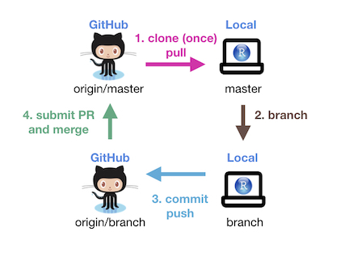
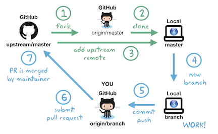
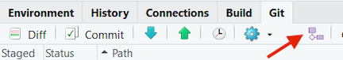
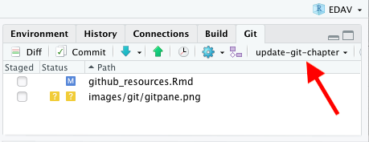
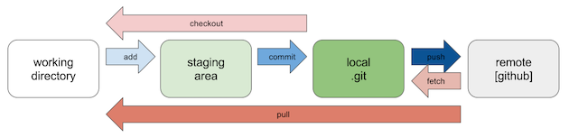

# GitHub/git Resources {#github}

## Vue d'ensemble

Cette section décrit les différents workflows pour travailler avec Github/git et donne des conseils sur comment collaborer en équipe sur de grands projects de programmation. Si vous voulez apprendre comment proposer des changements au livre [edav.info](edav.info) (ou n'importe quel autre repo) sans quitter github.com, veuillez vous référer au chapitre [Contribuer à cette ressource](contribute.html).

Ok, pas satisfait de supprimer des futes de frappes sur GitHub? Vous êtes prêts à travailler localement et modifier du code entre vos repos (ou ceux de quelqu'un d'autre) et votre machine? Pour cela, vous aurez besoin de Git, un système de contrôle de version très répandu. C'est très puissant et utile, mais aussi très agaçant et [difficile à comprendre](https://xkcd.com/1597/){target="_blank"}. Plutôt que d'essayer de maîtriser tout le système, on suggère de commencer avec des workflows plutôt basiques, comme ceux expliqués ci-dessous. On peut en tirer beaucoup de profit sans être un expert pour autant.
 
## Tout d'abord

1. *Installer Git* Pour se faire, suivre les instructions dans le chapitre [Install Git](https://happygitwithr.com/install-git.html){target="_blank"} de *Happy Git with R*.

2. *Entrez votre nom et votre adresse mail.* [Introduce yourself to Git](https://happygitwithr.com/hello-git.html){target="_blank"} in *Happy Git* explique comment faire.

3. (Optionel) *Assurez-vous que vous pouvez lancer des pulls et pushs entre Github et votre ordinateur* [Connect to GitHub](https://happygitwithr.com/push-pull-github.html){target="_blank"} 

## Le workflow sans branche

Pour vous familiariser avec Git, commencez par ce workflow basique dans lequel vous allez pull de et push vers *votre* repo sur Github. Cela reste entre vous, sans collaboration avec personne: 

Le chapitre [Connect RStudio to Git and GitHub](https://happygitwithr.com/rstudio-git-github.html){target="_blank"} de *Happy Git* vous aidera à commencer: vous allez créer un repo su GitHub, cloner le repo dans un projet RStudio, et faire des changements.

Une fois que tout est prêt, votre workflow local sera **pull, work, commit/push**

**PULL** A chaque fois que vous ouvrez RStudio et choisissez le projet, vous 'pullerez' tous les changements faits sur le repo en clickant sur la **Flèche vers le bas** dans le panel Git dans RStudio. Vous pouvez penser qu'aucun changement n'a été fait et qu'il n'y a rien à 'pull', mais vous pouvez oublier les fautes de frappe que vous avez corrigé en ligne et c'est une bonne chose de toujours commencer par 'pull' au cas où. 

**TRAVAILLEZ** Faites ce que vous avez à faire, faites des changements dans vos fichiers, ajoutez-en des nouveaux, etc. Gardez un oeil sur le panel Git dans RStudio: il vous montrera quels fichiers ont été modifiés.

**COMMIT/PUSH** Quand vous avez fini de travailler, il faut décider de ce qu'on fait avec les fichiers qui ont été modifiés. Si vous aimez comme nous garder un panel Git propre, vous avez trois options pour chaque fichier: 1) Clicker sur "Staged" pour préparer le fichier à être envoyer sur GitHub; 2) Supprimer le fichier si on n'en a pas besoin, 3) Ajouter le fichier à `.gitignore` s'il s'agit d'un fichier que vous souhaitez garder localement sans l'envoyer sur GitHub. (Gardez à l'esprit que les fichiers dans `.gitignore` ne sont pas sauvegardés à moins que vous auez un autre système de backup.).

L'étape suivante est de clicker sur le bouton **Commit** et ajouter un message qui décrit ce qui a été changé. Enfin, clickez sur la **Flèche du Haut** pour envoyer le commit sur GitHub.

Ce n'est pas une bonne idée de commit trop souvent mais si vous êtes débutants, cela peut être utile pour apprendre comme ça fonctionne. 

## Votre repo avec branche

Une fois que vous êtes à l'aise avec le workflow décrit ci-dessus, vous êtes prêt à commencer le branching. Le procédé est similaire que l'on travaille sur son propre repo ou sur celui de quelqu'un d'autres. 

S'il s'agit de *votre* repo, vous pouvez suivre les étapes énoncées dans [ces slides](https://github.com/jtr13/EDAV/blob/master/pdfs/BranchingYourRepo.pdf){target="_blank"}, qui expliquent pas-à-pas comment créer une branche, travailler dessus et envoyer une demande de pull pour fusionner les changements sur l'origin/master. Ou vous pouvez suivre les étapes suivantes, en passant les étapes 1 et 3.

## 1ère PR sur un autre repo avec branching

### Etape 1: 'Fork' le repo 'upstream' (une seule fois) {-}

*Passez cette étape si vous êtes en sync avec votre propre repo, c'est-à-dire que vous avez créé le repo et vous ne clonez pas une fork du repo quelqu'un d'autre.*

Supposons que vous souhaitiez contribuer à EDAV! 'Forkez' [notre repo GitHub](https://github.com/jtr13/EDAV){target="_blank"}, puis, sur votre propre page GitHub, vous verrez un repo ** EDAV **  dans la section 'repositories'. Notez qu'à partir de maintenant, le terme ** repo upsteam ** fait référence au repo d'origine du projet que vous avez forké et le terme ** repo d'origine ** fait référence au repo que vous avez créé ou forké sur GitHub. De votre point de vue, ** upstream ** et ** origine ** sont tous deux des repos dit "remote".

*A fork of jtr13/EDAV*

### Etape 2: Clonez le repo d'origine et créez un repo local (une fois){-}

Un ** repo local ** est le repo résidant sur votre ordinateur. Pour pouvoir travailler localement, nous devons créer une copie locale du repo 'remote'.

Comme nous avons déjà connecté git à RStudio, nous pouvons créer un repo local de la manière suivante. Dans RStudio, cliquez sur **Fichier** -> **Nouveau projet** -> **Contrôle de version** -> ** Git**. Vous pouvez maintenant renseigner l'URL du repo ** d'origine ** et cliquer sur **Create Project** pour créer un repo local.

### Etape 3: Configurez le repo 'remote' qui est relié au repo 'upstream' (une fois){-}

*Ignorez cette étape si vous synchronisez avec votre propre repo.*

Le but de cette étape est de spécifier l'emplacement du repo 'upstream', c'est-à-dire le projet d'origine, pas votre copie.

Pour compléter cette étape, tapez la ligne de commande suivante: 

`> git remote add upstream <upstream repo url>`

Source: [Configuring a remote for a fork](https://help.github.com/en/articles/configuring-a-remote-for-a-fork){target="_blank"}

### Etape 4: Branch {-}

Avec ce workflow, tout nouveau travail est effectué sur une branche. Il est donc important de ne pas oublier de créer une nouvelle branche avant de commencer à travailler. Une fois le travail terminé, une 'pull request' est soumise et si tout se passe bien, le nouveau code sera fusionné dans la branche principale du projet sur GitHub.

Lorsque vous êtes prêt à commencer à travailler sur quelque chose de nouveau, créez une nouvelle branche. **Ne réutilisez pas une branche fusionnée.** Chaque "fix" devrait avoir sa propre branche et être supprimé après avoir été fusionné.

Pour créer une branche, cliquez sur le bouton présenté ci-dessous:

 

   

Donnez à votre nouvelle branche un nom significatif. Par exemple, si vous avez l'intention d'ajouter un exemple de facet au chapitre sur les histogrammes, vous pouvez appeler votre branche `add_hist_facet`. Laissez la case "Sync branche with remote" cochée. Ainsi, vous créerez non seulement une branche locale, mais également une branche 'remote' sur l'origine et la branche locale sera configurée pour suivre la branche remote. En bref, ils seront liés et git prendra note de tout changement de l'un ou l’autre.

### Etape 5: Travaillez, commit et push {-}

Lorsque vous créez une branche en suivant la méthode décrite à l'étape 4, vous serez automatiquement envoyés sur la nouvelle branche. Vous pouvez changer de branche en cliquant sur la liste déroulante située à droite du bouton de la nouvelle branche. Cependant, faites bien attention lorsque vous le faites. Les travaux non commit, même s'ils sont sauvegardés, n'appartiennent pas à une branche et sont donc déplacés avec vous lorsque vous changez de branche. On peut donc facilement être sur la mauvaise branche. Vérifiez toujours que vous êtes au bon endroit et pendant que vous travaillez, gardez un œil sur les fichiers modifiés dans le panel Git.

  
 

Rappelez-vous les trois étapes pour déplacer un travail sauvegardé de votre directory vers GitHub, représentées par les commandes git: `add`,` commit` et `push`.

 

 

Dans RStudio, pour **add**, il vous suffit de cliquer sur la case à cocher de chaque fichier que vous avez modifié dans la colonne "staged" située à gauche du volet Git. Pour **commit**, il suffit de cliquer sur le bouton **commit** sous l'onglet Git. La saisie d'un message commit est obligatoire. choisissez une description en lien avec les modifications du code. Enfin, pour appliquer les modifications à GitHub, cliquez sur le bouton **push**, qui est représenté par une flèche pointant vers le haut. Vous pouvez combiner plusieurs commits en un "push".

Il n’est pas considéré comme bon de commit trop souvent, car tous les commits sont entrés dans l’historique des commits et il est difficile de trouver ce dont vous avez besoin si vous 'commit' votre travail toutes les cinq minutes. (Au début, cependant, ne vous en faites pas. Il est plus important d'utiliser les commandes fréquemment pour acquérir de l'expérience.)

Le chapitre [Repeated Amend de Happy Git with R](https://happygitwithr.com/repeated-amend.html){target="_blank"} décrit une approche pour traiter de la fréquence des commits.

### Etape 6: Envoyer une pull request {-}

Vous pouvez maintenant voir la branche que vous avez créée sur la page GitHub. L'étape suivante consiste à soumettre une pull request. Le processus est très similaire au processus décrit dans [GitHub only walkthrough](contribue.html#étape-5-comparaison-modifications), en commençant par l'étape 6.

### Etape 7: Fusionner la pull request {-}

Si vous avez soumis un PR à un autre projet, vous n'êtes pas celui qui va fusionner la PR. Vous n'avez donc rien à faire ici. 

S'il s'agit de votre projet et qu'il vous incombe de le faire, sachez qu'il existe de nombreuses méthodes pour fusionner une demande. La plus simple et directe consiste à [fusionner le PR sur GitHub](https://help.github.com/fr/articles/merging-a-pull-request#merging-a-pull-request-on-github). Cette méthode fonctionne bien pour la fusion de fautes de frappe fixes. Si vous souhaitez pouvoir tester le code, vous pouvez vérifier le PR localement, le tester et même éventuellement le modifier avant de le fusionner.

Les meilleures pratiques dans ce domaine évoluent. Notre recommandation actuelle est d'utiliser le paquetage `usethis`, qui simplifie énormément les tâches complexes. ["Comment modifier une demande d'extraction localement"](https://github.com/jtr13/usethis_demos/blob/master/how_to1.md) explique comment procéder.

Une autre ressource intéressante est ["Explore and extend a pull request"](https://happygitwithr.com/pr-extend.html) dans *Happy Git with R*. Ce chapitre décrit deux versions officielles de GitHub qui permettent de fusionner un pull request, ainsi qu'un workflow en développement en utilisant `git2r`.

## 2ème-*n*ème PR sur un autre repo avec branching 

Après la première pull request, le processus change un peu. Nous n'avons plus besoin de bifurquer et de cloner le repo. Ce que nous devons faire, cependant, est de nous assurer que notre copie locale du repo est à jour avec la version de GitHub. Nous devons effectuer d'autres opérations de nettoyage. Par conséquent, après la première pull request, nous remplacerons les étapes 1 à 3 ci-dessus par les opérations suivantes:

### Step 1: Synchroniser {-}

La façon dont vous synchronisez dépend de si vous synchronisez avec votre propre repo ("origine") ou celui de quelqu'un d'autre ("upstream"). Cela devrait être fait au début de chaque session de travail.

**Votre repo**

Allez sur la branche principale (important!), puis cliquez sur le bouton Pull (flèche vers le bas) de le panel Git de RStudio. Ou vous pouvez taper ce qui suit dans le terminal:

`> git checkout master`  

`> git pull`

Il n'y aura pas de rappel vous prévenant que vous êtes en retard, alors c'est à vous de décider. Faites-en une habitude.

**Le repo de quelqu'un d'autre**

Si vous travaillez sur le repo de quelqu'un d'autre, assurez-vous que vous avez [configuré un repo upstream](https://edav.info/github.html#step-3-configure-remote-that-points-to-the- upstream-repository-once).

Faites ensuite ce qui suit pour updater votre fork: 

`> git fetch upstream`

`> git checkout master`

`> git merge upstream/master`

Source: [Syncing a fork](https://help.github.com/en/articles/syncing-a-fork){target="_blank"}

Notez que ces commandes apportent des modifications directement à partir du repo upstream.

### Etape 2: Supprimer l'ancienne branche {-}

Si votre pull request précédente a été fusionnée, il est recommandé de supprimer la branche associée, car l'upstream contient déjà toutes les modifications que vous avez apportées. Pour supprimer complètement une branche, vous devez 1) supprimer la branche locale, 2) supprimer la branche distante, 3) cesser de suivre la branche:

1. Une façon de supprimer la branche remote est de le faire sur GitHub. Accédez à la pull request fermée sur le repo upstream. Si votre branche a été fusionnée, la boîte de dialogue de pull request affiche le message suivant: "Vous avez terminé - la branche` <nom de la branche> `peut être supprimée en toute sécurité." Cliquez simplement sur le bouton Supprimer la branche à côté du message.

Si vous préférez travailler dans le terminal, vous pouvez supprimer la branche distante avec:

`> git push origin --delete <branchname>`

2. Pour supprimer la branche locale, passez à la branche principale dans RStudio puis tapez ce qui suit dans le terminal:

`> git branch -d branchname`

3. Notez que git n'arrête pas de suivre la branche remote même si elle est supprimées des deux endroits! Pour arrêter de suivre les branches supprimées, utilisez les éléments suivants:

`> git fetch -p`

Sinon, vous verrez toujours les branches supprimées répertoriées dans le panel Git de RStudio, et elles apparaîtront quand même lorsque vous regarderez toutes vos branches avec la fonction suivante: 

`> git branch -a`  (* = checked out branch)

En parlant de cela, sachez que le panel Git n’a pas tendance à se mettre à jour en temps réel. Vous verrez donc probablement toujours les branches supprimées. Veillez à ne pas être envoyés dessus, ou vous les recréerez par inadvertance. (Les branches supprimées ont l'habitude de revenir.) Un clic sur master (même si vous êtes déjà dessus) apparaît pour déclencher une mise à jour de la liste déroulante. Si cela ne fonctionne pas, le fait de quitter le projet et d'y revenir le fera si vous voulez être sûr que les branches que vous avez supprimées le sont vraiment.

#### Troubleshooting {-}

- Assurez-vous de ne pas être sur la branche que vous essayez de supprimer.

- Notez que si vous essayez de supprimer une branche qui n'a pas été complètement fusionnée, vous recevrez un avertissement, ou peut-être une erreur en fonction de ce qui s'est passé. Il est possible qu'il pense juste que la branche n'a pas été fusionnée alors que vous l'avez fait, car vous n'êtes pas à jour. On peut y remédier avec `git pull`. Dans les autres cas, vous devrez suivre les instructions pour utiliser `-D` au lieu de` -d`, par exemple, si vous décidez d'abandonner et de supprimer une branche sans soumettre de pull request.

- Si vous avez du mal à vous débarrasser des branches, rassurez-vous, vous n'êtes pas seul. [Comment puis-je supprimer une branche Git localement et à distance?] _blank"} est la **[troisième question la plus posée](https://stackoverflow.com/questions?sort=votes){target ="_blank"}** sur StackOverflow!

### Etape 3: Mettre à jour votre fork sur GitHub {-}

Ignorez cette étape s'il n'y a pas de repo upstream.

Oui, c'est étrange, mais une fois que vous avez créé et cloné le repo du projet, la copie sur GitHub devient relativement inutile. Cependant, ce n'est pas une mauvaise idée de la garder à jour, ne serait-ce que parce qu'il est dérangeant de voir des messages comme celui-ci dans votre panel Git:

 

 

Heureusement, votre fork de GitHub peut être facilement mis à jour en cliquant sur la flèche verte vers le haut ou en entrant «git push» dans le terminal.

### Etapes 4-7: Voir ci-dessus {-}

Nous sommes maintenant prêts à répéter le worklow: branche, travail, commit, push, pull request. Pour ce faire, suivez [Étapes 4 à 7 ci-dessus](# étape-4-branche).

## Infos Git qui peuvent être utiles

### Supprimer le dernier commit

`git reset --soft HEAD~1`

### Supprimer tous les changements depuis le dernier commit

`git reset HEAD --hard`

### Oublier de créer une nouvelle branche (sans commit)

Créez simplement la nouvelle branche et les modifications y seront déplacées ... [les modifications du répertoire de travail n'appartiennent pas à une branche tant qu'elles ne sont pas validées](https://stackoverflow.com/a/1394804/5314416){target="_blank"} (Il semblerait que les modifications sont également dans le master, mais une fois que vous avez commit les modifications, elles disparaîtront de ce dernier.)

### Annuler la supression d'une branche

Recherchez le SHA (hash) renvoyé lorsque vous avez supprimé la branche. Alors ensuite, tapez:

`git checkout -b <branch-name> <SHA>`   

Voir aussi: [Git undo local branch delete](https://stackoverflow.com/a/39038276/5314416){target="_blank"}

## Autres ressources

### Obtenir de l'aide {-}

Si vous êtes perdus, ce qui suit pourrait aider: 

- [GitHub Guides](https://guides.github.com/){target="_blank"}: Il s'agit d'une collection phénoménale de courts articles de GitHub destinés à vous aider à en apprendre davantage sur les fondamentaux de GitHub. Ils sont vraiment géniaux. Ci-dessous d'autres articles intéressants:
    - [Understanding the GitHub Flow](https://guides.github.com/introduction/flow/){target="_blank"}: Explique comment fonctionne GitHub en général.

    - [Git Handbook](https://guides.github.com/introduction/git-handbook/){target="_blank"}: Explique le contrôle de version.
    
- [GitHub Help](https://help.github.com/){target="_blank"}: Les pages jaunes de GitHub. Vous pouvez poser une question et il essaiera de vous rediriger dans la bonne direction. [Get it?](https://getyarn.io/yarn-clip/6e7f4795-b65b-4fad-b1fb-c5c9161a95fa){target="_blank"}

### Ramification {-}

GitHub est super sociable. Apprenez comment vous impliquer! [<i class="far fa-smile"></i>](https://getyarn.io/yarn-clip/c5de0e9e-6122-48f9-87ed-337aeb2e9ae4){target="_blank"}

- [Open Source Guide](https://opensource.guide/how-to-contribute/){target="_blank"}: Info sur comment contribuer à réaliser des projets open-source.
- [Forking Projects](https://guides.github.com/activities/forking/){target="_blank"}: Lecture rapide de GitHub sur comment forker un repo pour pouvoir y contribuer.
- [Mastering Issues](https://guides.github.com/features/issues/){target="_blank"}: Sur les problèmes qu'on peut avoir en utilisant GitHub et comment ils peuvent aider à accomplir notre travail. 
- [Notre page pour contribuer](contribute.html): Vous pouvez contribuer à *edav.info/* grâce à vos nouvelles compétences GitHub! Allez voir notre page sur comment contribuer à travers des pulls requests et autres problèmes.

### Ressources additionnelles {-}

Pour bien commencer, consultez [GitHub Learning Lab](https://lab.github.com/){target="_blank"}. Cette application vous apprendra comment utiliser GitHub avec des cours pratiques utilisant des repos réels. C'est le moyen idéal pour comprendre comment utiliser GitHub.

Pour les [nerds dans la pièce](https://getyarn.io/yarn-clip/64bbb001-ed8a-450a-8826-b939f653b969){target="_blank"} ...

- [Git For 4 ans et plus](https://www.youtube.com/watch?v=3m7BgIvC-uQ){target="_blank"}: Il se passe beaucoup de choses sous le capot. Cette présentation aidera à expliquer comment tout cela fonctionne ... avec des jouets pour enfants!

- [Créer de jolis logs git](https://stackoverflow.com/questions/1057564/pretty-git-branch-graphs){target="_blank"}: Rappelez-vous toujours [(Un chien)](https: // i .stack.imgur.com / ElVkf.jpg){target="_ blank"}. De plus, cette commande d'alias est bonne à connaître:
    - `git config --global alias.adog "log --all --decorate --oneline --graph"`

- [`add` et` commit` avec une commande](https://stackoverflow.com/questions/4298960/git-add-and-commit-in-one-command){target="_blank"}: un autre commande d'alias utile:
    - `git config --global alias.add-commit '!git add -A && git commit'`

- [Git Aware Prompt](https://github.com/jimeh/git-aware-prompt){target="_blank"}: Un excellent complément au terminal qui vous indique quelle branche vous avez consultée. Quelqu'un a également créé [une version encore plus performante](https://github.com/udondan/git-aware-prompt){target="_blank"} où il vous informera de votre statut git en utilisant des émojis utiles.

- [Contribuer avec git2r](https://popgen.nescent.org/CONTRIBUTING_WITH_GIT2R.html){target="_blank"}, sur la [Génétique des populations en R](https://popgen.nescent.org/index. html){target="_ blank"} fournit des informations utiles sur l’utilisation des commandes git dans R par le biais du paquet git2r. En particulier, il explique comment créer un GITHUB_PAT puis définir le paramètre `credential` dans certaines fonctions pour trouver le PAT. (Notez cependant que le site a été créé en 2015 et qu'il n'a pas été mis à jour depuis février 2019.)

- **Vous voulez lire un peu aussi?**: [Resources to learn Git](https://try.github.io/){target="_blank"} est un site simple divisé en deux parties: *Apprendre en lisant* et *apprendre en faisant*. Faites votre choix. <i class ="far fa-smile"></i>

- [Guide du débutant pour effectuer une pull request (pour un package R)](https://tonyelhabr.rbind.io/post/making-first-pull-request/){target="_blank"}, l'expérience de Tony Elhabr pour faire une pull request à un package R lors de la journée des développeurs tidyverse (élément de [rstudio:: conf 2019](https://www.rstudio.com/conference/){target="_blank"}.

