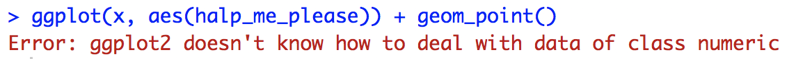

# (PART) Continuous Variables {-}

# Diagramme: Histogrammes {#histo}


## Avant-propos

Cette section présente comment construire un histogramme (histogram en anglais).

## tl;dr
Donnes-moi un véritable exemple !

Voici une application d'histogrammes qui montre comment les becs des pinsons des Galápagos ont changé enfonction de facteurs externes :

```{r tldr-finch-example, echo=FALSE}
library(Sleuth3) # data
library(ggplot2) # plotting

# load data
finches <- Sleuth3::case0201
# finch histograms by year with overlayed density curves
ggplot(finches, aes(x = Depth, y = ..density..)) + 
  # plotting
  geom_histogram(bins = 20, colour = "#80593D", fill = "#9FC29F", boundary = 0) +
  geom_density(color = "#3D6480") + 
  facet_wrap(~Year) +
  # formatting
  ggtitle("Severe Drought Led to Finches with Bigger Chompers",
          subtitle = "Beak Depth Density of Galapagos Finches by Year") +
  labs(x = "Beak Depth (mm)", caption = "Source: Sleuth3::case0201") +
  theme(plot.title = element_text(face = "bold")) +
  theme(plot.subtitle = element_text(face = "bold", color = "grey35")) +
  theme(plot.caption = element_text(color = "grey68"))
```

Et voici le code :
```{r tldr-finch-code, eval=FALSE}
library(Sleuth3) # data
library(ggplot2) # plotting

# load data
finches <- Sleuth3::case0201
# finch histograms by year with overlayed density curves
ggplot(finches, aes(x = Depth, y = ..density..)) + 
  # plotting
  geom_histogram(bins = 20, colour = "#80593D", fill = "#9FC29F", boundary = 0) +
  geom_density(color = "#3D6480") + 
  facet_wrap(~Year) +
  # formatting
  ggtitle("Severe Drought Led to Finches with Bigger Chompers",
          subtitle = "Beak Depth Density of Galapagos Finches by Year") +
  labs(x = "Beak Depth (mm)", caption = "Source: Sleuth3::case0201") +
  theme(plot.title = element_text(face = "bold")) +
  theme(plot.subtitle = element_text(face = "bold", color = "grey35")) +
  theme(plot.caption = element_text(color = "grey68"))
```

Pour plus d'information sur le jeu de donnée, tapez `?Sleuth3::case0201` dans la console.

## Simple examples
Whoa whoa whoa! Plus simple s'il vous plait!

Utilisons un jeu de données très simple :
```{r simple-example-hist-data}
# store data
x <- c(50, 51, 53, 55, 56, 60, 65, 65, 68)
```

### Histogramme de base en R
```{r base-r-hist}
# plot data
hist(x, col = "lightblue", main = "Base R Histogram of x")
```

L'avantage des histogrammes de base en R est qu'ils sont faciles à réaliser. En vérité, tout ce dont vous avez besoin pour afficher la donnée `x` est d'utiliser `hist(x)`. Mais nous y ajoutons un petit peu de couleur pour le rendre plus présentable..

La documentation complete de `hist()` peut être trouver [ici](https://www.rdocumentation.org/packages/graphics/versions/3.5.0/topics/hist){target="_blank"}


### Histogramme avec ggplot2
```{r ggplot-hist}
# import ggplot
library(ggplot2)
# must store data as dataframe
df <- data.frame(x)

# plot data
ggplot(df, aes(x)) +
  geom_histogram(color = "grey", fill = "lightBlue", 
                 binwidth = 5, center = 52.5) +
  ggtitle("ggplot2 histogram of x")
```

La version ggplot des histogramme est un peu plus compliquée en apparence, mais elle vous donnera plus de contrôle sur le résultat. **Note** : Comme montré ci-dessus, ggplot requière un dataframe en entrée. Donc si vous rencontrez une erreur du type "R doesn't know what to do" comme ça :



vérifiez que vous utilisez des dataframes.

## Théorie

De façon générale, un histogramme est une des nombreuses façon de représenter des données continues.

Un histogramme est claire et facile à faire. Les histogrammes sont relativement manifestes : ils présentent la distribution empirique de vos données dans un jeu d'intervalles donné. Les histogrammes peuvent être employés sur des données brutes pour avoir une idée de leur distribution sans réaliser de manipulations compliquées. Nous recommendons les histogrammes pour avoir un sens basique et pratique de la distribution de vos données avec le minimum de traitement. 

*   Pour plus d'info sur les histogrammes et les variables continues, regardez [Chapter 3](http://www.gradaanwr.net/content/03-examining-continuous-variables/){target="_blank"} du livre. 

## Types d'histogrammes

Utilisez un histogramme pour représenter la distribution d'*une variable continue*. L'axe des y peut représenter une grande variété de résultats :

### Frequence ou compte

y = nombre de valeur dans chaque bâton.

### Frequence relative

y = nombre de valeur dans chaque bâton / nombre total de valeur

### Frequence cumulée

y = nombre total de valeur plus petite que la bordure droite du bâton.

### Densité

y = frequence relative / largeur des bâtons


## Paramètres

### Limite droite et gauches des bâtons
Soyez vigilent avec les limites car un point peut tomber dans le bâton de droite ou de gauche en fonction de la configuration des limites que vous avez choisis.
```{r bin-boundaries}
# format layout
op <- par(mfrow = c(1, 2), las = 1)

# right closed
hist(x, col = "lightblue", ylim = c(0, 4),
     xlab = "right closed ex. (55, 60]", font.lab = 2)
# right open
hist(x, col = "lightblue", right = FALSE, ylim = c(0, 4),
     xlab = "right open ex. [55, 60)", font.lab = 2)
```

### Nombre de bâtons
Le nombre de bâtons par défaut dans ggplot2 est 30 mais ce n'est pas toujours le choix idéal. Par conséquent pensez à le modifier si le résultat vous parait étrange. Vous pouvez le faire en utilisant `binwidth` et préciser la largeur de bande que vous souhaitez, ou bien vous pouvez donner directement le nombre de bâton souhaiter en utilisant `bins`.
```{r}
# default...note the pop-up about default bin number
ggplot(finches, aes(x = Depth)) +
  geom_histogram() +
  ggtitle("Default with pop-up about bin number")
```

Voici quelques exemples en utilisant les deux méthodes décrites plus haut :
```{r fixed-histograms-binwidth}
# using binwidth
p1 <- ggplot(finches, aes(x = Depth)) +
  geom_histogram(binwidth = 0.5, boundary = 6) +
  ggtitle("Changed binwidth value")
# using bins
p2 <- ggplot(finches, aes(x = Depth)) +
  geom_histogram(bins = 48, boundary = 6) +
  ggtitle("Changed bins value")

# format plot layout
library(gridExtra)
grid.arrange(p1, p2, ncol = 2)
```


### Alignement des bâtones
Vérifiez que vos axes reflètent les vraies limites de votre histogramme. Vous pouvez utiliser `boundary` pour préciser le point final de n'importe quel bâton. Vous pouvez également utiliser `center` pour préciser le centre d'un bâton. `ggplot2` est en mesure de calculer où placer tous les autres bâtons (aussi, remarquez que lorsque la limite a été changée, le nombre de bâton a diminué de 1. Cela est dû au fait que par défaut les bâtons sont centrés vont au-dessus/dessous de l'intervalle des données.)
```{r}
df <- data.frame(x)

# default alignment
ggplot(df, aes(x)) +
  geom_histogram(binwidth = 5,
                 fill = "lightBlue", col = "black") +
  ggtitle("Default Bin Alignment")
```

```{r alignment-fix}
# specify alignment with boundary
p3 <- ggplot(df, aes(x)) +
  geom_histogram(binwidth = 5, boundary = 60,
                 fill = "lightBlue", col = "black") +
  ggtitle("Bin Alignment Using boundary")

# specify alignment with center
p4 <- ggplot(df, aes(x)) +
  geom_histogram(binwidth = 5, center = 67.5,
                 fill = "lightBlue", col = "black") +
  ggtitle("Bin Alignment Using center")

# format layout
library(gridExtra)
grid.arrange(p3, p4, ncol = 2)
```

**Note** : Ne pas utiliser à la fois `boundary` *et* `center` pour l'alignement. Choisissez-en un seul.

## Histogramme interactif avec `ggvis`

Le package `ggvis` est toujours en cours de développement, mais certaines choises marchent déjà très bien tels que l'ajustement interactive de certains paramètre en codant.

Comme les images ne peuvent pas être partager en utilisant knit (comme pour les autres package comme `plotly`), nous présentons ici que le code et pas le résultat. Pour essayer copier-collez le code suivant dans une session R..

###  Changer la largeur de bande de façon interactive
```{r, eval = FALSE}
library(tidyverse)
library(ggvis)
faithful %>% ggvis(~eruptions) %>% 
    layer_histograms(fill := "lightblue", 
        width = input_slider(0.1, 2, value = .1, 
                             step = .1, label = "width"))
```

### GDP
```{r, eval = FALSE}
df <-read.csv("countries2012.csv")
df %>% ggvis(~GDP) %>% 
    layer_histograms(fill := "green", 
        width = input_slider(500, 10000, value = 5000, 
        step = 500, label = "width"))
```

### Changer le centre de façon interactive
```{r, eval = FALSE}
df <- data.frame(x = c(50, 51, 53, 55, 56, 60, 65, 65, 68))
df %>% ggvis(~x) %>% 
    layer_histograms(fill := "red", 
        width = input_slider(1, 10, value = 5, step = 1, label = "width"),
        center = input_slider(50, 55, value = 52.5, step = .5, label = "center"))
```

### Changer le centre (avec affichage des valeurs)
```{r, eval = FALSE}
df <- data.frame(x = c(50, 51, 53, 55, 56, 60, 65, 65, 68), 
                 y = c(.5, .5, .5, .5, .5, .5, .5, 1.5, .5))
df %>% ggvis(~x, ~y) %>% 
    layer_histograms(fill := "lightcyan", width = 5,
                     center = input_slider(45, 55, value = 45, 
                                           step = 1, label = "center")) %>% 
  layer_points(fill := "blue", size := 200) %>% 
  add_axis("x", properties = axis_props(labels = list(fontSize = 20))) %>% 
  scale_numeric("x", domain = c(46, 72)) %>% 
  add_axis("y", values = 0:3, 
           properties = axis_props(labels = list(fontSize = 20)))
```

### Changer les limites droites et gauches de façon interactive
```{r, eval = FALSE}
df %>% ggvis(~x) %>% 
    layer_histograms(fill := "red", 
        width = input_slider(1, 10, value = 5, 
                             step = 1, label = "width"),
        boundary = input_slider(47.5, 50, value = 50,
                                step = .5, label = "boundary"))
```


## Ressources externes
- [hist documentation](https://www.rdocumentation.org/packages/graphics/versions/3.5.0/topics/hist){target="_blank"}: Documentation sur les histogramme en base R.
- [ggplot2 cheatsheet](https://www.rstudio.com/wp-content/uploads/2015/03/ggplot2-cheatsheet.pdf){target="_blank"}: Toujours bon d'y jeter un oeil.


