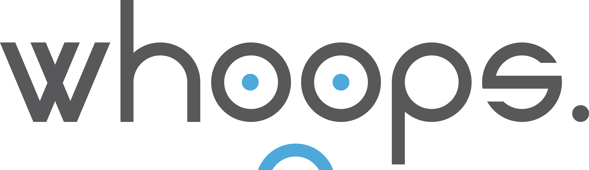
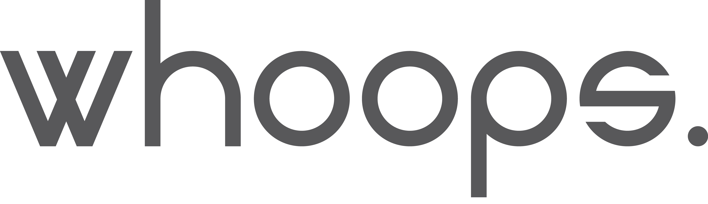
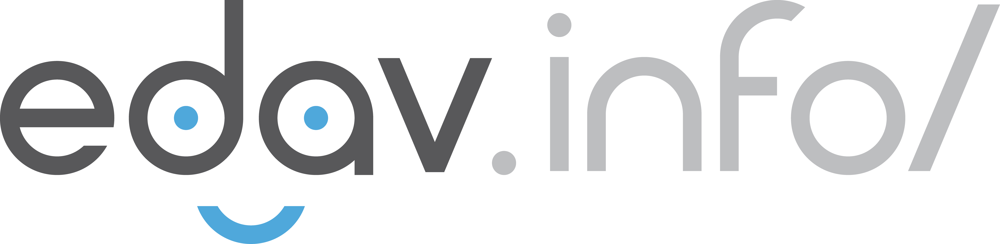

--- 
title: "edav.info/"
author:
- "Zach Bogart, Joyce Robbins"
- "Translated by Amaury Sudrie, Maxime Tchibozo, Romane Goldmuntz and Vy Tran"
date: "`r Sys.Date()`"
site: bookdown::bookdown_site
documentclass: book
link-citations: yes
github-repo: "amalrich/EDAV"
url: 'https://edav.info/'
description: "This resource is a collaborative collection of resources designed to help students succeed in GR5702 Exploratory Data Analysis and Visualization, a course offered at Columbia University. While the course lectures and textbook focus on theoretical issues, this resource, in contrast, provides coding tips and examples to assist students as they create their own analyses and visualizations. It is our hope that students will contribute to edav.info and it will grow with the course."
cover-image: "images/edav_link_logo.png"
---

```{r setup, include=FALSE}
knitr::opts_chunk$set(cache=TRUE)
```

# Bienvenue {-}


## Tout ce dont vous aurez besoin pour Exploratory Data Analysis & Visualization

Cette ressource a tout ce dont vous aurez besoin pour réussir avec R, dans le cours d'EDAV et plus encore. Vous êtes prêt ? C'est parti !

L'objectif de cette ressource est de vous fournir un collection exhaustive d'outils et réferences qui faciliteront votre apprentissage du maniement de données avec R.

En outre, nous avons une section sur les **graphiques et outils basiques** qui vous permettront d'apprendre en pratiquant.

Il y a également quelques **revues détaillées** où nous travaillerons sur données, resolverons des problèmes et vous donnerons quelques trucs et astuces.

On espères que cette ressource vous satisfera !!

Cette ressource est spécialement conçue pour le cours GR5702 Exploratory Data Analysis and Visualization offert à [Columbia University](https://www.columbia.edu/){target="_blank"}. Nonobstant, n'importe qui d'interressé par R peut profiter de ces quelques pages et tutoriels. Bon codage !

## Contact

Zach Bogart: 
[Site Web](https://zachbogart.com/){target="_blank"}
/
[Twitter](https://twitter.com/zachbogart){target="_blank"}
/
[GitHub](https://github.com/zachbogart){target="_blank"}

Joyce Robbins: 
[Profil Columbia](http://stat.columbia.edu/department-directory/name/joyce-robbins/){target="_blank"}
/
[GitHub](https://github.com/jtr13){target="_blank"}

<!-- License -->
## License

<a rel="license" href="http://creativecommons.org/licenses/by-sa/4.0/" target="_blank"></a><br />This work is licensed under a <a rel="license" href="http://creativecommons.org/licenses/by-sa/4.0/" target="_blank">Creative Commons Attribution-ShareAlike 4.0 International License</a>.

<!-- Colophon -->
## Colophon

Le logo de EDAV, les bannières url/404 et les icônes des chapitres associés ont été disgnés par Zach Bogart et publié sous sa permission. L'url et les bannières 404 ont été adapté pour la police [Koji](https://zachbogart.com/koji){target="_blank"}. Les icônes de chapitre peuvent être trouvées et achetées sur [The Noun Project](https://thenounproject.com/zachbogart/){target="_blank"}. Merci de rendre crédit au créateur si vous les utilisez sur des ressources extérieures (voir [leur directive d'attribution des icônes](https://thenounproject.zendesk.com/hc/en-us/articles/200509928-How-do-I-give-creators-credit-in-my-work-){target="_blank"} pour plus d'information). 

<!-- Adding these nonvisible image files here to trick bookdown into copying them into the images folder -->





