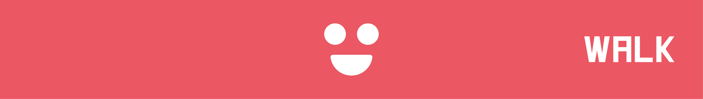
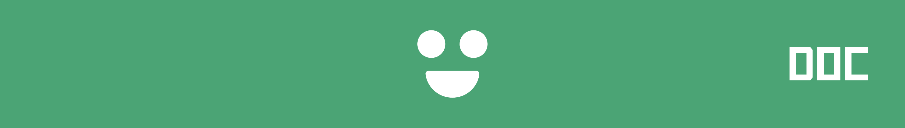
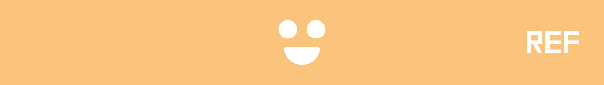

# (PART) Getting Started {-}

# Introduction {#intro}


## Avant-propos
Dans ce chapitre, vous trouverez comment le site est organisé, comment vous pouvez y ajouter des contenus et enfin quelques remerciements.

## Types d'assistance

Chaque chapitre respecte un code couleur indiquant quel type d'assistance un chapitre vous apportera. Ci-dessous vous trouverez une explication détaillée de chaque type.

### Information (Bleu)


Les pages bleus contiennent des **informations** basiques. A titre d'exemple cette page et la page [basics page](basics.html) sont des pages bleues. Cette dernière vous aidera à installer R/Studio ainsi que comment obtenir de l'aide si vous en avez besoin. Les pages bleues sont un peu le centre d'assistance de ce site : jetez y un oeil si vous vous sentez perdus. 

### Revue détaillée (Rouge)



Les pages rouges contiennent des **revues plus détaillées**. Vous trouverez un exemple de page sur [iris walkthrough](iris.html). Elle présente un jeu de données très connus à travers un joli nuage de points et vous guidera du début à la fin pour le réaliser vous même. Ce type de page est très complet et a pour objectif de fournir une documentation exhaustive, des explications sur les choix esthétiques ainsi que des conseils sur les bonnes pratiques. C'est comment aller en "office hours" et obtenir des calrifications de la part d'un TA... en mode d'article. Si vous souhaitez voir voir des tutoriels complets avec un maximum de conseils tout du long, jetez un oeil aux pages rouges.

### Documentation (Vert)



Les pages vertes contiennent des **documentations** plus compactes. A titre d'exemple la page [histogram page](histo.html) est verte et inclue des exemples simple d'histogrammes, quand les utilisez et les choses auxquelles il faut faire attention. Les pages vertes vous prendront beaucoup moins par la main que les pages rouges : elles vous expliqueron comment utiliser un graphique ou outil à l'aide d'exemples et de termes simples. Si vous avez une idée en tête et que vous vous demandez simplement comment l'exécuter, les pages vertes vous aideront à le faire.

### References (Yellow)



Les pages jaunes contiennent des collections de **references**. A titre d'exemple vous pouvez consultez [external resources page](general.html) qui liste différents materiels et contenus intéressant que vous pourrez étudier. Les pages jaunes ne vous aideront pas en tant que tel, il s'agit seulement de collections de ressources et de tutoriels minimalistes qui vous permettront d'explorer et d'apprendre de nouvelles choses.

## Aider à améliorer *edav.info/*

Ce site est une ressource évolutive par les étudiants pour les étudiants, vous êtes inviter à aider à l'améliorer. Vous ne trouvez pas ce que vous chercher ? Vous pensez qu'une section pourrait être plus claire ? N'hésitez pas à aider *edav.info/* en soumettant une pull request sur le [github](https://github.com/jtr13/EDAV){target="_blank"}. Je ne comprends pas cette dernière phrase ? Jetes un oeil à [Comment contribuer à *edav.info/*](contribute.html).

## Fun stuff

### T-shirts

Zach Bogart a fait quelques t-shirt disponible sur [Teespring](https://teespring.com/stores/edav){target="_blank"} ainsi vous pourrez montrer votre amour pour EDAV et R. Nous éspérons que vous aimerez !! <i class="far fa-smile"></i>

<center>
[](https://teespring.com/stores/edav){target="_blank" class="active-banner"}
</center>

## Acknowledgments

### Our Contributors

Un grand merci à tous ceux qui ont contribué de prêt ou de loin.. Vous avez rendu *edav.info/* possible. 

<i class="fas fa-heart"></i>

```{r, results = "asis", echo = FALSE, message = FALSE}
# this chunk is adapted from r4ds (https://r4ds.had.co.nz/)
library(dplyr)
new_tab <- '{target="_blank"}'
contributors <- readr::read_csv("contributors.csv", col_types = list())
contributors <- contributors %>% 
  mutate(
    link = glue::glue("[\\@{login}](https://github.com/{login}){new_tab}"),
    desc = ifelse(is.na(name), link, glue::glue("{name} ({link})"))
  ) %>%
  filter(!login %in% c('zachbogart', 'jtr13'))

cat(paste0(contributors$desc, collapse = ", "))
```
