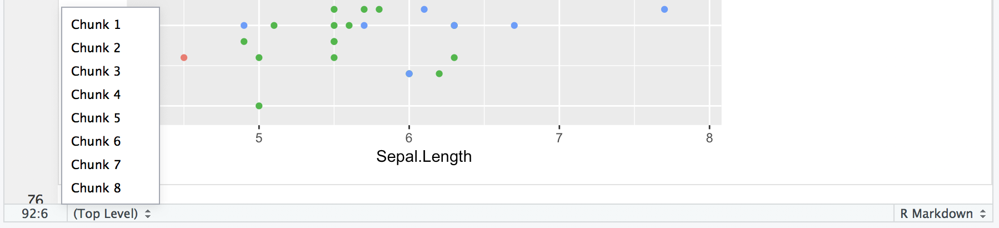
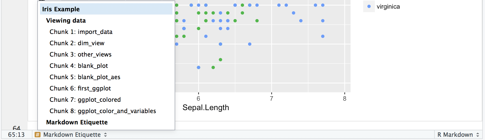

# Walkthrough: Iris Scatterplot {#iris}


## Avant-propos

Cet exemple s'intéresse au jeu de données `iris` et s'achève par la construction d'un scatterplot présentable.

### tl;dr

Voilà ce à quoi on doit aboutir :

```{r goal}
library(ggplot2)
base_plot <- ggplot(data = iris, mapping = aes(x = Sepal.Length, y = Sepal.Width)) + 
  geom_point(aes(color = Species), size = 3, alpha = 0.5, position = "jitter") +
  xlab("Sepal Length (cm)") +
  ylab("Sepal Width (cm)") +
  ggtitle("Sepal Dimensions in Different Species of Iris Flowers")

base_plot + theme_minimal()
```

Tu te demandes comment on est arrivé là ? Tu peux jeter un oeil à

### Packages 

* [`ggplot2`](https://www.rdocumentation.org/packages/ggplot2){target="_blank"}
* [`dplyr`](https://www.rdocumentation.org/packages/dplyr){target="_blank"}
* [`stats`](https://www.rdocumentation.org/packages/stats){target="_blank"}
* [`Base`](https://www.rdocumentation.org/packages/base){target="_blank"}
* [`datasets`](https://www.rdocumentation.org/packages/datasets){target="_blank"}
* [(`gridExtra`)](https://www.rdocumentation.org/packages/gridExtra){target="_blank"}

### Techniques

On te les laisse en anglais par cohérence avec le cours et les recherches que tu pourras faire sur Google

* Keyboard Shortcuts
* Viewing Data Structure/Dimensions/etc.
* Accessing Documentation
* Plotting with `ggplot2`
* Layered Nature of `ggplot2`/Grammar of Graphics
* Mapping aesthetics in `ggplot2`
* Overlapping Data: alpha and jitter
* Presenting Graphics
* Themes

***

## Petite note sur comment le faire sans effort

Les raccourcis sont tes meilleurs amis pour aller plus vite. Et en plus ils sont faciles à trouver.

Dans la barre principale :
`Tools > Keyboard Shortcuts Help` OR `⌥⇧K`

Quelques bons raccourcis :

* Insérer un opérateur d'assignation (`<-`): Alt/Option+-
* Insérer un (`%>%`): Ctrl/Cmd+Shift+M
* Mettre un commentaire :  Ctrl/Cmd+Shift+C
* Lancer la ligne ou la sélection : Ctrl/Cmd+Enter
* Relancer la cellule d'avant : Ctrl/Cmd+Shift+P

Restez attentif à chose que vous faites tout le temps et demander vous si vous ne pourriez pas le faire plus rapidement.

En outre, l'IDE RStudio peut se montrer intimidant, mais il est rempli de petits outils que vous pourrez lire sur cette [cheatsheet](https://www.rstudio.com/wp-content/uploads/2016/01/rstudio-IDE-cheatsheet.pdf){target="_blank"} ou bien sur un des cours de DataCamp : [Part 1](https://www.datacamp.com/courses/working-with-the-rstudio-ide-part-1){target="_blank"}, [Part 2](https://www.datacamp.com/courses/working-with-the-rstudio-ide-part-2){target="_blank"}.

Okay, maintenant on est parti...

***

## Visualisation des données

Commençons par charger le package, ainsi on pourra récupérer les données dans un dataframe.
```{r import_data}
library(datasets)

class(iris)
```

Ce n'est pas un très grand jeu de données, mais c'est utile de prendre l'habitude de considérer un jeu de données comme lourd quoi qu'il arrive. Par conséquent avant d'afficher le jeu de données dans le terminal soyez certain d'avoir regarder la taille et la structure de données de votre jeu de données. 

Ici on peut voir qu'on a 150 observations sur 5 variables différentes.
```{r dim_view}
dim(iris)
```

Il y a plein de façon d'avoir les infos sur votre jeu de données, en voici quelques uns :
```{r other_views, message=FALSE}
str(iris)

summary(iris)

# This one requires dplyr, but it's worth it :)
library(dplyr)
glimpse(iris)
```

Afficher les données en appelant `iris` dans le terminal affichera la totalité. Allez-y dans ce cas précis vous pouvez essayer, mais ce n'est pas recommendé pour les jeux de données plus large. Au contraire vous pouvez utiliser `head()` ou bien `View()` dans le terminal.

Si vous souhaitez en apprendre plus sur une commande, tapez juste `?<command>` dans le terminal. Par exemple `?head` vous apprendra que la fonction `head` dispose d'un argument supplémentaire `n` pour le nombre de lignes que vous souhaitez afficher (par défaut égal à 6). Aussi remarquerez vous peut-être qu'il y a quelque chose appelé `tail`. Je me demande à quoi ça sert ! <i class="far fa-smile"></i>

## Afficher les données

Affichons quelque chose !
```{r blank_plot}
# Something's missing
library(ggplot2)
ggplot(iris)
```

Où est-ce que c'est ? Peut-être que si nous ajoutons quelques aesthetics... Je me rappelle avoir entendu ce mot important quelque part :
```{r blank_plot_aes}
# Still not working...
ggplot(data = iris, mapping = aes(x = Sepal.Length, y = Sepal.Width))
```

Toujours rien. Rappelez-vous que qu'il faut ajouter une `geom` pour afficher quelque chose.
```{r first_ggplot}
# There we go!
ggplot(data = iris, mapping = aes(x = Sepal.Length, y = Sepal.Width)) +
  geom_point()
```

Houra ! Quelque chose s'est affiché ! Faites attention à où nous avons mis les données, à l'intérieur de `ggplot()`. ggplot est composé de couches et ici nous avons mis les données dans la fonction principale de `ggplot`. L'argument `data` est aussi disponible dans `geom_point()`, mais cela ne s'appliquera qu'à cette couche précise. Ici nous avons fixé que sans précisions supplémentaire l'argument `data` sera `iris`.

Maintenant ajoutons un peu de couleur par `Species` :
```{r ggplot_colored}
ggplot(data = iris, mapping = aes(x = Sepal.Length, y = Sepal.Width)) +
  geom_point(aes(color = Species))
```

Générallement c'est utile de stocker la majeure partie du graphique dans une variable et ensuite d'y ajouter des couches. Le code ci-dessous réalise le même travail qu'au dessus :
```{r ggplot_color_and_variables, eval = FALSE}
sepal_plot <- ggplot(data = iris, mapping = aes(x = Sepal.Length, y = Sepal.Width))

sepal_plot + 
  geom_point(aes(color = Species))
```

## Markdown etiquette

Je remarque que mon fichier R Markdown est un peu en bazar. On peut rapidement perdre le controle d'un fichier Rmd mais ils y a quelques astuces pour ça. La première chose, donnez des noms à vos chunks. Si en plus vous combinez ça avec des entêtes le travaille sera mieux organisé. Plus particulièrement la petite ligne en bas de l'éditeur à toute son utilité.

De ça :


A ça :


Ajoutez un nom au début de chaque chunk :
`{r <cool-code-chunk-name>, <chunk_option> = TRUE}`

Maintenant on est capable de savoir de quoi parle la chunk et où on en est dans le document. N'oubliez pas, il faut un espace après le `r` et une virgule entre chaque option telle que `eval` ou `echo`. Pour plus d'info voir [notre section pour communique des résultats](basics.html#communicating-results).

## Chevauchement de données

Ceux qui ont un compas dans l'oeil auront remarqué mais quelques points ont disparus. On devrait avoir 150 points, pour autant on en voit que 117 (oui oui je les ai compté). Où sont passés les 33 points manquants ? En fait, ils sont cachés derrières d'autres points. Le jeu de données arrondi au dixième de centimètre prêt ce qui nous donne ce placement des points si régulier. Comment je sais que c'est en centimètres ? J'ai fait `?iris` dans le terminal mon cher Watson ! [Ah, question bête, réponse bête](https://youtu.be/UIKGV2cTgqA?t=3m10s){target="_blank"}.

```{r overlapping_data_repeated}
# This plot hides some of the points
ggplot(data = iris, mapping = aes(x = Sepal.Length, y = Sepal.Width)) + 
  geom_point(aes(color = Species))
```

Qui est le coupable ? L'aesthetic `color`. La couleur par défaut est opaque et cachera tous les points qui sont derrière. En règle générale c'est toujours bénéfique de réduire l'opacité un petit peu pour éviter ce problème. Pour faire ça changer la valeur de `alpha` pour quelque chose différent de `1`, par exemple `0.5`. 

```{r overlap_alpha}
ggplot(data = iris, mapping = aes(x = Sepal.Length, y = Sepal.Width)) + 
  geom_point(aes(color = Species, alpha = 0.5))
```

Okay... Plusieurs choses.

### Premièrement : la légende

**Premièrement**, avez-vous remarqué l'ajout soudain de la légende ? C'est idiot ! Pourquoi c'est apparu comme ça ? En fait, lorsqu'on a ajouté `alpha` dans `aes()` cela a généré une légende. Regardons plus en détail `geom_point()`. Plus particulièrement cela nous montre où on doit préciser `color` et `alpha` :

`geom_point(mapping = aes(color = Species, alpha = 0.5))`

Donc on associe ces *aesthtics* `color` and `alpha`, à certains valeurs. `ggplot` sait que généralement cette association va varier étant donné que vous êtes en train de travailler sur des données qui elles-mêmes varient. C'est pourquoi il va créer une légende pour chaque association. Néanmoins pour le `alpha` on a pas besoin de légende on l'a fixé à 0.5. Si on veut changer ça, il suffit de mettre `alpha` à l'exterieur de l'`aes` et le traiter comme un *argument* :

```{r overlap_alpha_fix1}
ggplot(data = iris, mapping = aes(x = Sepal.Length, y = Sepal.Width)) + 
  geom_point(aes(color = Species), alpha = 0.5)
```

Plus de légende. Donc sur ggplot on obtient pas le même résultat suivant où est placé l'aesthetic. C'est ce qu'on appelle le MAPPING d'aesthetic (faire varier avec des données à l'intérieur de `aes`) ou le SETTING d'aesthetic (le rendre constant sur tous les points en plaçant le paramètre à l'éxterieur de `aes`).

### Deuxièment : le jittering

**Deuxièment**, est-ce que l'astuce du alpha nous a *vraiment* aidé ? Est-ce qu'on est capable de véritablement voir les choses plus facilement ? Pas vraiment... Comme les points se chevauche parfaitement, l'opacité ne nous aide pas tant que ça. Habituellement l'opacité marche mais ici les données sont si régulières que ça n'améliore pas leur perception.

On peut régler ça en ajoutant du *jitter* au points. Le *Jitter* ajoute un bruit aléatoire aux points et les bougent de sorte qu'ils ne se chevauchent plus entièrement :
```{r overlap-jitter-fix1}
ggplot(data = iris, mapping = aes(x = Sepal.Length, y = Sepal.Width)) + 
  geom_point(aes(color = Species), alpha = 0.5, position = "jitter")
```

Utilisez le jittering avec modération et n'oubliez pas que vous altérer les données. Néanmoins dans certaines situations c'est très utile.

***

### *Parenthèse* : Exemple de cas où le alpha blending est utile

Nous avons vu un cas où le jittering marchait très bien, alors que le alpha ne nous aidait pas plus que ça. Voyons maintenant un exemple où l'opacité et le changement du alpha sera directement utile.
```{r opacity-useful-aside, message=FALSE}
# lib for arranging plots side by side
library(gridExtra)

# make some normally distributed data
x_points <- rnorm(n = 10000, mean = 0, sd = 2)
y_points <- rnorm(n = 10000, mean = 6, sd = 2)
df <- data.frame(x_points, y_points)

# plot with/without changed alpha
plt1 <- ggplot(df, aes(x_points, y_points)) +
  geom_point() +
  ggtitle("Before (alpha = 1)")
plt2 <- ggplot(df, aes(x_points, y_points)) +
  geom_point(alpha = 0.1) +
  ggtitle("After (alpha = 0.1)")

# arrange plots
gridExtra::grid.arrange(plt1, plt2, 
                        ncol = 2, nrow = 1)
```

Ici, c'est plus simple de voir que le jeu de données est très concentré.

***

## Remanier pour présenter

Disons que nous avons fini notre graphique et que nous sommes prêt à le présenter à d'autres gens :
```{r present-plot, echo = FALSE}
ggplot(data = iris, mapping = aes(x = Sepal.Length, y = Sepal.Width)) + 
  geom_point(aes(color = Species), alpha = 0.5, position = "jitter")
```

We should clean it up a bit so it can stand on its own. 

## Modifier l'apparence

Premièrement, rendons les noms des axes `x`/`y` plus clairs et descriptifs :
```{r clean-xy-labels}
ggplot(data = iris, mapping = aes(x = Sepal.Length, y = Sepal.Width)) + 
  geom_point(aes(color = Species), alpha = 0.5, position = "jitter") +
  xlab("Sepal Length (cm)") +
  ylab("Sepal Width (cm)")
```

Ensuite, mettons un titre :
```{r title_added}
ggplot(data = iris, mapping = aes(x = Sepal.Length, y = Sepal.Width)) + 
  geom_point(aes(color = Species), alpha = 0.5, position = "jitter") +
  xlab("Sepal Length (cm)") +
  ylab("Sepal Width (cm)") +
  ggtitle("Sepal Dimensions in Different Species of Iris Flowers")
```

Et grossissons les point :
```{r size_fixed}
ggplot(data = iris, mapping = aes(x = Sepal.Length, y = Sepal.Width)) + 
  geom_point(aes(color = Species), size = 3, alpha = 0.5, position = "jitter") +
  xlab("Sepal Length (cm)") +
  ylab("Sepal Width (cm)") +
  ggtitle("Sepal Dimensions in Different Species of Iris Flowers")
```

Maintenant c'est présentable !

## Ajouter des themes

Il sera dans certaine situation mieux de changer les theme de votre graphique (l'arrière-plan, les axes, "accessories" etc.). Jetez un oeil aux différents thèmes qui existent et choisissez en un qui vous plait.

```{r themes}
base_plot <- ggplot(data = iris, mapping = aes(x = Sepal.Length, y = Sepal.Width)) + 
  geom_point(aes(color = Species), size = 3, alpha = 0.5, position = "jitter") +
  xlab("Sepal Length (cm)") +
  ylab("Sepal Width (cm)") +
  ggtitle("Sepal Dimensions in Different Species of Iris Flowers")

base_plot

base_plot + theme_light()

base_plot + theme_minimal()

base_plot + theme_classic()

base_plot + theme_void()
```

Cette fois je vais utilisé `theme_minimal()`. 

***

Nous y voilà ! Nous avons un scatterplot prêt à conquérir le monde !

```{r final-result, echo = FALSE}
base_plot <- ggplot(data = iris, mapping = aes(x = Sepal.Length, y = Sepal.Width)) + 
  geom_point(aes(color = Species), size = 3, alpha = 0.5, position = "jitter") +
  xlab("Sepal Length (cm)") +
  ylab("Sepal Width (cm)") +
  ggtitle("Sepal Dimensions in Different Species of Iris Flowers")

base_plot + theme_minimal()
```

## Pour aller plus loin

Nous n'avons que toucher la surface de ggplot et toucher du doigt la grammaire des graphiques. Si vous souhaitez aller plus loin, je vous recommende hautement les cours de DataCamp *Data Visualization with ggplot2* de Rick Scavetta. Ce cours est en 3 parties très denses, mais la [première partie](https://www.datacamp.com/courses/data-visualization-with-ggplot2-1){target="_blank"} vaut vraiment le détour. 

## Liens utiles

[RStudio ggplot2 Cheat Sheet](https://www.rstudio.com/wp-content/uploads/2015/03/ggplot2-cheatsheet.pdf){target="_blank"}

[DataCamp: Mapping aesthetics to things in ggplot](https://campus.datacamp.com/courses/data-visualization-with-ggplot2-1/chapter-3-aesthetics?ex=1){target="_blank"}

[R Markdown Reference Guide](https://www.rstudio.com/wp-content/uploads/2015/03/rmarkdown-reference.pdf){target="_blank"}

[R for Data Science](http://r4ds.had.co.nz/){target="_blank"}


